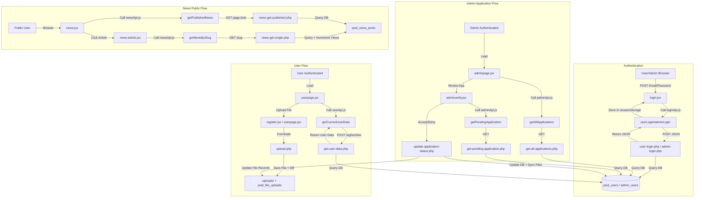
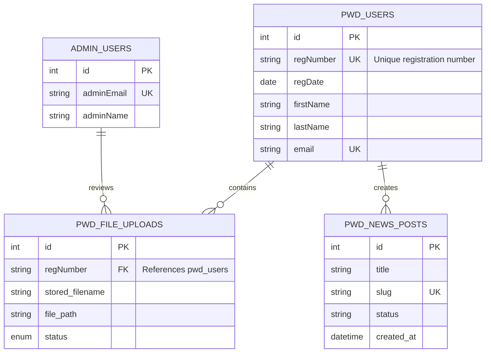

# PWD Automated Application System - Documentation Index

> **Version:** 2.1  
> **Backend:** PHP/MySQL (XAMPP)  
> **Frontend:** React 19 + Vite 7  
> **Last Updated:** January 14, 2026

## Quick Reference Guide

This document serves as a comprehensive index to all technical documentation for the PWD Automated Application System project. The system has been migrated from SheetDB to a production-ready PHP/MySQL backend.

---

## Core Documentation Files

### 1. **🟢 Init Documentation** (`init-documentation.md`) - START HERE
Complete project overview, setup guide, and architecture documentation.

**Contains:**
- Project overview and tech stack
- Current production stack (PHP/MySQL)
- Architecture diagrams
- Complete project structure
- Setup instructions (React + XAMPP)
- Dependencies and installation
- Development lifecycle documentation
- Migration history

**When to use:**
- **First-time setup** - Setting up development environment
- Understanding project architecture
- Installing dependencies
- Learning about the tech stack

---

### 2. **🟢 Database Documentation** (`database-documentation.md`)
Complete MySQL database schema, setup, and management guide.

**Contains:**
- Database overview and ER diagrams
- All 3 table schemas (pwd_users, admin_users, pwd_file_uploads)
- Column descriptions and data types
- Foreign keys and indexes
- SQL scripts reference
- Setup instructions
- Migration guide
- Troubleshooting

**When to use:**
- Setting up the database
- Understanding data relationships
- Writing SQL queries
- Database migrations
- Troubleshooting database issues

---

### 3. **🟢 PHP API Documentation** (`php-api-documentation.md`)
Comprehensive documentation of all 19 PHP backend endpoints.

**Contains:**
- All 19 API endpoints with examples
- Authentication APIs (user/admin login)
- User management APIs (registration, profile)
- Admin management APIs (applications, verification)
- File management APIs (upload, download)
- Request/response formats
- Error handling
- Frontend integration guide

**When to use:**
- Implementing new API calls
- Understanding API contracts
- Debugging backend issues
- Adding new endpoints
- Testing with Postman

---

### 4. **🟢 Function Documentation** (`function-documentation.md`)
Detailed documentation of all React functions and components.

**Contains:**
- Current PHP/MySQL implementations (v2.1)
- Vite-based component structure
- Login functions (login.jsx)
- Registration functions (register.jsx)
- User dashboard functions (userpage.jsx)
- Admin dashboard functions (adminpage.jsx)
- Shared utility functions
- Legacy code archive (deprecated SheetDB functions)

**When to use:**
- Understanding React component behavior
- Implementing new features with Vite
- Debugging form submissions
- Learning project patterns
- Refactoring code

---

### 5. **API Documentation** (`api-documentation.md`)
API integration overview with migration reference.

**Contains:**
- PHP/MySQL API overview (current)
- Frontend integration summary
- Migration from SheetDB reference
- Legacy SheetDB documentation (deprecated)
- Endpoint reference table

**When to use:**
- Quick API reference
- Understanding migration path
- Comparing old vs new implementations

---

## Feature-Specific Documentation

### 6. **File Upload Feature** (`file-upload-feature-documentation.md`)
Complete guide to the document upload system.

**Contains:**
- Feature overview and architecture
- Frontend implementation (register.jsx, userpage.jsx)
- Backend PHP endpoints (upload.php, files.php)
- Database schema (pwd_file_uploads table)
- File validation rules
- Testing checklist
- Troubleshooting guide
- Admin file review features

**When to use:**
- Working with file uploads
- Debugging upload issues
- Understanding document workflow
- Implementing similar features

---

### 7. **QR Code Feature** (`qrcode-feature-documentation.md`)
Documentation for PWD ID card QR code generation.

**Contains:**
- Feature overview and implementation
- QRCodeSVG component usage
- Data structure and encoding
- Accessibility features
- Styling and customization
- Installation guide

**When to use:**
- Working with QR codes
- Understanding ID card system
- Implementing scannable features

---

### 8. **News & Announcements Feature** (`news-feature-documentation.md`) 🆕
Complete guide to the news management system.

**Contains:**
- Feature overview and architecture diagrams
- Public news page (news.jsx, news-article.jsx)
- Admin CRUD dashboard (admin-news.jsx)
- API wrapper (newsApi.js)
- 7 PHP backend endpoints
- Database schema (pwd_news_posts table)
- Image upload support
- Status management (draft/published/archived)
- Server-side pagination
- Quick setup guide
- Troubleshooting

**When to use:**
- Working with news/announcements
- Adding content management features
- Understanding admin dashboards
- Implementing CRUD interfaces
- Working with image uploads

---

## Build Tool & Configuration

### **🟢 Vite Comprehensive Guide** (`vite-comprehensive-guide.md`) 🆕
Complete setup, configuration, and troubleshooting guide for Vite build tool.

**Contains:**
- Quick start (5 minutes)
- Why Vite (performance benefits)
- Complete installation guide
- Environment variable setup (VITE_ prefix)
- Configuration reference (vite.config.js, index.html, src/main.jsx)
- Path aliases for clean imports
- Common issues and solutions
- Troubleshooting checklist
- Advanced configuration examples
- Deployment instructions

**Key Topics:**
- ✅ Environment variables: `import.meta.env.VITE_*` (not `process.env.REACT_APP_*`)
- ✅ File structure: `index.html` at root (not in `public/`)
- ✅ Commands: `npm run dev` (not `npm start`)
- ✅ Build output: `dist/` folder (not `build/`)
- ✅ HMR: Hot Module Replacement for instant feedback
- ✅ Path aliases: `@api`, `@components`, `@assets`, etc.

**When to use:**
- Setting up development environment
- Understanding Vite configuration
- Troubleshooting Vite issues
- Working with environment variables
- Understanding build process
- Deployment procedures

---

## Technical Reference

### 9. **Backend Migration Documentation** (`backend-migration-documentation.md`)
Complete guide for SheetDB to PHP/MySQL migration.

**Contains:**
- Architecture comparison
- Project structure strategies
- XAMPP setup guide
- Database schema design
- PHP endpoint code samples
- React code modifications
- Testing procedures

**When to use:**
- Understanding migration decisions
- Learning backend integration
- Reference for similar migrations

---

### 10. **Backend Documentation** (`backend-documentation.md`)
Overview of backend migration progress.

**Contains:**
- Migration checklist
- Files changed reference
- Quick start commands
- API mode switching
- Key benefits

**When to use:**
- Quick migration reference
- Checking migration status

---

### 11. **UTF-8 Collation Fix** (`utf8-collation-fix.md`)
Documentation for character encoding issue resolution.

**Contains:**
- Problem description (login failures)
- Root cause analysis
- SQL fix scripts
- Verification procedures
- Prevention guidelines

**When to use:**
- Troubleshooting encoding issues
- Setting up new databases
- Understanding collation problems

---

### 12. **Contribution Guide** (`contribution_guide-documentation.md`)
Git workflow and collaboration best practices.

**Contains:**
- Creating feature branches
- Merging strategies
- Pull request workflow
- Merge conflict resolution
- Best practices for collaboration
- Troubleshooting

**When to use:**
- Creating new branches
- Resolving merge conflicts
- Making pull requests
- Team collaboration

---

### 13. **Documentation Reorganization** (`DOCUMENTATION-REORGANIZATION-COMPLETE.md`)
Summary of v2.0 documentation updates.

**Contains:**
- Phase-by-phase completion checklist
- Documentation statistics
- File structure overview
- Migration reference tables
- Deprecation tracking

**When to use:**
- Understanding documentation structure
- Tracking deprecated features
- Migration reference

---

## Quick Start Guide

### For New Developers

1. **Start Here:** Read `init-documentation.md` for project overview and setup
2. **Setup Vite:** Follow `vite-comprehensive-guide.md` Section 1 (5 minutes)
3. **Database Setup:** Follow `database-documentation.md` to create MySQL database
4. **Complete Setup:** Follow `SETUP-GUIDE.md` for full project setup
5. **Learn APIs:** Review `php-api-documentation.md` for backend endpoints
6. **Study Code:** Read `function-documentation.md` for React implementation patterns
7. **Git Workflow:** Check `contribution_guide-documentation.md` for collaboration

### For Feature Development

1. **Setup Environment:** Follow `vite-comprehensive-guide.md` for Vite setup
2. **Check Existing:** `function-documentation.md` - See if similar functionality exists
3. **Review Database:** `database-documentation.md` - Understand data structure
4. **Plan APIs:** `php-api-documentation.md` - Use established patterns
5. **Implement:** Follow conventions in `init-documentation.md`
6. **Document:** Update relevant documentation files

### For Troubleshooting

1. **Vite Issues:** See `vite-comprehensive-guide.md` Section 5-6
2. **Identify Component:** Use `function-documentation.md` index
3. **Check Database:** Review `database-documentation.md` for data issues
4. **Verify API:** Test with `php-api-documentation.md` examples
5. **Common Issues:** Check `utf8-collation-fix.md` for known database problems

---

## Documentation by Feature

### Authentication (Login/Logout)
- **Database:** `database-documentation.md` → pwd_users & admin_users tables
- **API:** `php-api-documentation.md` → user-login.php, admin-login.php
- **Functions:** `function-documentation.md` → handleUserLogin(), handleAdminLogin()
- **Frontend:** login.jsx component

### Registration Form
- **Database:** `database-documentation.md` → pwd_users table schema
- **API:** `php-api-documentation.md` → register.php, check-email.php, check-regnumber.php
- **Functions:** `function-documentation.md` → Registration Functions (register.jsx)
- **Frontend:** register.jsx component

### File Upload System
- **Database:** `database-documentation.md` → pwd_file_uploads table
- **API:** `php-api-documentation.md` → upload.php, files.php, file-download.php
- **Feature Docs:** `file-upload-feature-documentation.md` → Complete guide
- **Functions:** `function-documentation.md` → File upload handlers
- **Frontend:** register.jsx, userpage.jsx components

### Admin Dashboard
- **Database:** `database-documentation.md` → All tables with relationships
- **API:** `php-api-documentation.md` → get-all-applications.php, update-application-status.php
- **Functions:** `function-documentation.md` → Admin Dashboard Functions
- **Frontend:** adminpage.jsx, adminverify.jsx components

### User Dashboard
- **Database:** `database-documentation.md` → pwd_users, pwd_file_uploads
- **API:** `php-api-documentation.md` → get-user-data.php, update-profile.php, files.php
- **Functions:** `function-documentation.md` → User Dashboard Functions
- **Frontend:** userpage.jsx component

### QR Code Feature
- **Feature Docs:** `qrcode-feature-documentation.md` → Complete guide
- **Frontend:** register-result.jsx, userpage.jsx components

### News System (Planned v2.1)
- **Status:** Not yet implemented
- **Frontend:** news.jsx (currently static content)

---

## Common Tasks

### How to add a new page/component?
**See:** `init-documentation.md` → Project Structure & Component Creation

### How to create a new API endpoint?
**See:** `php-api-documentation.md` → Endpoint examples + patterns

### How to add a database table?
**See:** `database-documentation.md` → Table Definitions + SQL examples

### How to make an API call from React?
**See:** `function-documentation.md` → API integration examples

### How to handle file uploads?
**See:** `file-upload-feature-documentation.md` → Complete implementation guide

### How to resolve merge conflicts?
**See:** `contribution_guide-documentation.md` → Conflict Resolution Guide

### How to fix login issues?
**See:** `utf8-collation-fix.md` → Common encoding problems

---

## Documentation Statistics

| Category | Files | Status |
|----------|-------|--------|
| Core Documentation | 5 | ✅ Complete |
| Feature Documentation | 3 | ✅ Complete |
| Technical Reference | 5 | ✅ Complete |
| **Total** | **13** | **Production Ready** |

---

## Version History

| Version | Date | Changes |
|---------|------|---------|
| v2.0 | Dec 13, 2025 | PHP/MySQL migration complete, comprehensive documentation overhaul |
| v1.5 | Dec 12, 2025 | File upload feature, QR codes, database documentation |
| v1.0 | Nov 2025 | React migration complete, SheetDB backend |
| v0.5 | Oct 2025 | Pre-React HTML/CSS/JS implementation |

---

## System Architecture

### Application Flow

---

## Database Schema

### Entity Relationship Diagram

### Database Tables (project schema)

#### `pwd_users` — Applicant records

|Column|Type|Constraints|Description|
|---|---|---|---|
|id|INT|PRIMARY KEY, AUTO_INCREMENT|Unique user identifier|
|regNumber|VARCHAR(20)|NOT NULL, UNIQUE|Registration number|
|regDate|DATE|NOT NULL|Registration date|
|lastName|VARCHAR(100)|NOT NULL|Applicant last name|
|firstName|VARCHAR(100)|NOT NULL|Applicant first name|
|middleName|VARCHAR(100)||Applicant middle name|
|disability|VARCHAR(100)|NOT NULL|Type of disability|
|street|VARCHAR(200)|NOT NULL|Street address|
|barangay|VARCHAR(100)|NOT NULL|Barangay|
|municipality|VARCHAR(100)|NOT NULL|Municipality|
|province|VARCHAR(100)|NOT NULL|Province|
|region|VARCHAR(50)|NOT NULL|Region|
|tel|VARCHAR(20)||Telephone number|
|mobile|VARCHAR(20)|NOT NULL|Mobile number|
|email|VARCHAR(150)|NOT NULL, UNIQUE|Email (login)
|dob|DATE|NOT NULL|Date of birth|
|sex|VARCHAR(10)|NOT NULL|Gender|
|nationality|VARCHAR(50)||Nationality|
|blood|VARCHAR(5)||Blood type|
|civil|VARCHAR(20)|NOT NULL|Civil status|
|emergencyName|VARCHAR(150)|NOT NULL|Emergency contact name|
|emergencyPhone|VARCHAR(20)|NOT NULL|Emergency contact phone|
|emergencyRelationship|VARCHAR(50)|NOT NULL|Relationship to emergency contact|
|proofIdentity|VARCHAR(200)||Legacy identity filename|
|proofDisability|VARCHAR(200)||Legacy disability filename|
|password|VARCHAR(100)|NOT NULL|Authentication password (consider hashing)
|status|VARCHAR(20)|NOT NULL, DEFAULT 'pending'|Application status|
|rejectionReason|TEXT||Rejection reason (v2.0)
|createdAt|DATETIME|DEFAULT CURRENT_TIMESTAMP|Record creation timestamp|
|updatedAt|DATETIME|DEFAULT CURRENT_TIMESTAMP ON UPDATE CURRENT_TIMESTAMP|Last update timestamp|

**Indexes:** `idx_status`, `idx_regDate`, `idx_email`

---

#### `admin_users` — Administrators

|Column|Type|Constraints|Description|
|---|---|---|---|
|id|INT|PRIMARY KEY, AUTO_INCREMENT|Unique admin identifier|
|adminEmail|VARCHAR(150)|NOT NULL, UNIQUE|Admin login email|
|adminPassword|VARCHAR(255)|NOT NULL|Admin password (store hashed in production)|
|adminName|VARCHAR(100)||Admin display name|
|createdAt|TIMESTAMP|DEFAULT CURRENT_TIMESTAMP|Account creation timestamp|

**Default account:** `admin@dasma.gov.ph` / `admin123` (change in production)

---

#### `pwd_file_uploads` — Uploaded documents

|Column|Type|Constraints|Description|
|---|---|---|---|
|id|INT|PRIMARY KEY, AUTO_INCREMENT|Unique file identifier|
|regNumber|VARCHAR(20)|FOREIGN KEY → `pwd_users.regNumber`|Links to applicant|
|file_type|ENUM|('medical_certificate','identity_proof')|Document type|
|original_filename|VARCHAR(255)|NOT NULL|Original upload filename|
|stored_filename|VARCHAR(255)|NOT NULL|Server-stored filename|
|file_path|VARCHAR(500)|NOT NULL|Full file path on server|
|file_size|INT|NOT NULL|File size in bytes|
|mime_type|VARCHAR(100)|NOT NULL|MIME type|
|uploaded_at|TIMESTAMP|DEFAULT CURRENT_TIMESTAMP|Upload timestamp|
|status|ENUM|DEFAULT 'pending'|File review status|
|admin_notes|TEXT||Admin comments/rejection reason (v2.0)
|reviewed_by|VARCHAR(100)||Admin who reviewed (v2.0)
|reviewed_at|TIMESTAMP||Review timestamp (v2.0)

**Foreign Key:** `FOREIGN KEY (regNumber) REFERENCES pwd_users(regNumber) ON DELETE CASCADE`

**Indexes:** `idx_regNumber`, `idx_status`, `idx_file_type`, `idx_uploaded_at`

---

#### `pwd_news_posts` — News & announcements

|Column|Type|Constraints|Description|
|---|---|---|---|
|id|INT|PRIMARY KEY, AUTO_INCREMENT|Unique post identifier|
|title|VARCHAR(255)|NOT NULL|Post title|
|excerpt|TEXT|NOT NULL|Short summary|
|content|LONGTEXT|NOT NULL|Full HTML content|
|slug|VARCHAR(255)|UNIQUE, NOT NULL|SEO-friendly slug|
|image_path|VARCHAR(500)||Optional image path|
|image_alt|VARCHAR(255)||Image alt text|
|status|ENUM|('draft','published','archived')|Publishing status|
|published_at|DATETIME||Publish timestamp|
|category|VARCHAR(100)|DEFAULT 'announcement'|Category/tag|
|created_by|VARCHAR(100)|NOT NULL|Creator (admin email)
|created_at|TIMESTAMP|DEFAULT CURRENT_TIMESTAMP|Creation timestamp|
|updated_by|VARCHAR(100)||Last editor
|updated_at|TIMESTAMP|DEFAULT CURRENT_TIMESTAMP ON UPDATE CURRENT_TIMESTAMP|Last update timestamp|
|view_count|INT|DEFAULT 0|View counter for analytics|

**Indexes:** `idx_status`, `idx_published_at`, `idx_created_at`, `idx_slug`

---

## Learning Path

### Day 1-3: Setup & Basics
1. Read `init-documentation.md` (project overview)
2. Set up XAMPP + React environment
3. Run `database-documentation.md` SQL scripts
4. Test login with sample data

### Day 4-6: Understanding Backend
1. Study `database-documentation.md` (tables & relationships)
2. Review `php-api-documentation.md` (all endpoints)
3. Test APIs with Postman
4. Trace API calls in browser DevTools

### Day 7-9: Frontend Development
1. Study `function-documentation.md` (React patterns)
2. Explore registration flow (register.jsx)
3. Understand state management
4. Practice creating components

### Day 10-12: Advanced Features
1. Study `file-upload-feature-documentation.md`
2. Review `qrcode-feature-documentation.md`
3. Practice implementing similar features

---

## Need Help?

1. **Check documentation** - Search relevant files above
2. **Review examples** - All docs include code samples
3. **Check troubleshooting** - Most docs have troubleshooting sections
4. **Ask the team** - Use GitHub issues or pull request comments

---

**Last Updated:** December 14, 2025  
**Maintained by:** Development Team  
**Repository:** [PWD-Automated-Application-System](https://github.com/Keonbe/PWD-Automated-Application-System)

