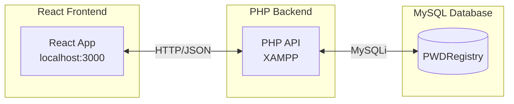
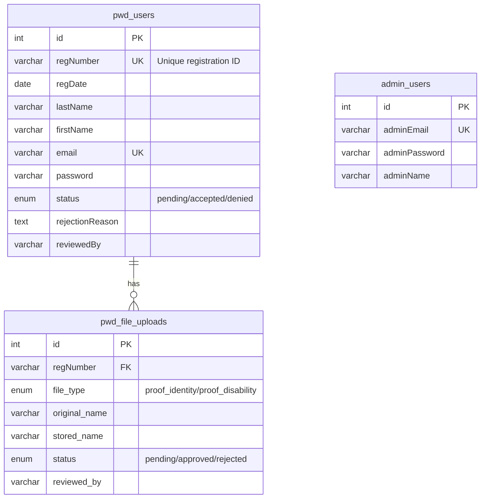
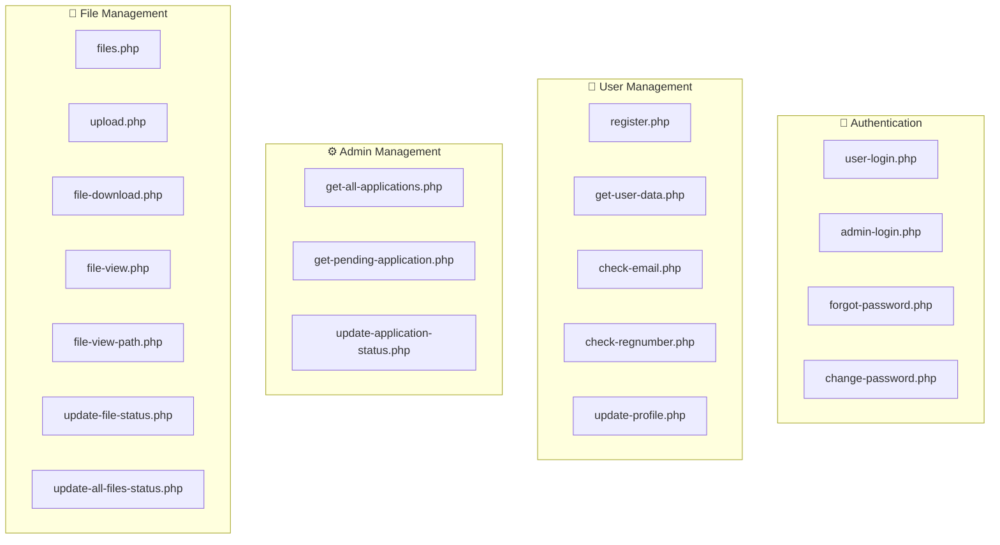

# Backend Documentation

> **Version:** 2.0 (Production)  
> **Status:** ✅ Complete  
> **Stack:** PHP 8.2 + MySQL on XAMPP

---

## Overview

The PWD Automated Application System uses a **PHP/MySQL backend** running on XAMPP. This replaced the earlier Google Sheets (SheetDB) prototype used during development.



---

## Project Structure

```
Post-React-Migration/
├── pwd-application-system/          # React Frontend
│   └── src/
│       └── api/
│           ├── axiosConfig.js       # Axios base configuration
│           ├── config.js            # API mode settings
│           ├── adminApi.js          # Admin API functions
│           ├── loginApi.js          # Authentication API
│           ├── registrationApi.js   # Registration API
│           └── userApi.js           # User data API
│
└── xampp-php-mysql-files/           # PHP Backend
    ├── config.php                   # Database connection
    ├── master-setup.sql             # Database initialization
    ├── api/                         # 18 PHP endpoints
    │   ├── admin-login.php
    │   ├── change-password.php
    │   ├── check-email.php
    │   ├── check-regnumber.php
    │   ├── file-download.php
    │   ├── file-view-path.php
    │   ├── file-view.php
    │   ├── files.php
    │   ├── forgot-password.php
    │   ├── get-all-applications.php
    │   ├── get-pending-application.php
    │   ├── get-user-data.php
    │   ├── register.php
    │   ├── update-all-files-status.php
    │   ├── update-application-status.php
    │   ├── update-file-status.php
    │   ├── update-profile.php
    │   ├── upload.php
    │   └── user-login.php
    └── uploads/                     # File storage directory
```

---

## Database Schema

### Database: `PWDRegistry`



| Table | Purpose | Records |
|-------|---------|---------|
| `pwd_users` | PWD applicant information | User profiles & applications |
| `admin_users` | Administrator accounts | Admin credentials |
| `pwd_file_uploads` | Uploaded document metadata | File tracking |

### pwd_users Table

```sql
CREATE TABLE pwd_users (
  id INT AUTO_INCREMENT PRIMARY KEY,
  regNumber VARCHAR(20) NOT NULL UNIQUE,
  regDate DATE NOT NULL,
  lastName VARCHAR(50) NOT NULL,
  firstName VARCHAR(50) NOT NULL,
  middleName VARCHAR(50),
  disability VARCHAR(100) NOT NULL,
  street VARCHAR(100),
  barangay VARCHAR(50) NOT NULL,
  municipality VARCHAR(50) DEFAULT 'Dasmariñas',
  province VARCHAR(50) DEFAULT 'Cavite',
  region VARCHAR(20) DEFAULT 'IV-A',
  tel VARCHAR(20),
  mobile VARCHAR(20) NOT NULL,
  email VARCHAR(100) NOT NULL UNIQUE,
  dob DATE NOT NULL,
  sex VARCHAR(10) NOT NULL,
  nationality VARCHAR(30) DEFAULT 'Filipino',
  blood VARCHAR(5),
  civil VARCHAR(20) NOT NULL,
  emergencyName VARCHAR(100) NOT NULL,
  emergencyPhone VARCHAR(20) NOT NULL,
  emergencyRelationship VARCHAR(50) NOT NULL,
  proofIdentity VARCHAR(255),
  proofDisability VARCHAR(255),
  password VARCHAR(255) NOT NULL,
  status ENUM('pending','accepted','denied') DEFAULT 'pending',
  rejectionReason TEXT,
  reviewedBy VARCHAR(100),
  reviewedAt DATETIME,
  created_at TIMESTAMP DEFAULT CURRENT_TIMESTAMP,
  updated_at TIMESTAMP DEFAULT CURRENT_TIMESTAMP ON UPDATE CURRENT_TIMESTAMP
);
```

### admin_users Table

```sql
CREATE TABLE admin_users (
  id INT AUTO_INCREMENT PRIMARY KEY,
  adminEmail VARCHAR(100) NOT NULL UNIQUE,
  adminPassword VARCHAR(255) NOT NULL,
  adminName VARCHAR(100) NOT NULL,
  created_at TIMESTAMP DEFAULT CURRENT_TIMESTAMP
);
```

### pwd_file_uploads Table

```sql
CREATE TABLE pwd_file_uploads (
  id INT AUTO_INCREMENT PRIMARY KEY,
  regNumber VARCHAR(20) NOT NULL,
  file_type ENUM('proof_identity','proof_disability') NOT NULL,
  original_name VARCHAR(255) NOT NULL,
  stored_name VARCHAR(255) NOT NULL,
  mime_type VARCHAR(100),
  file_size INT,
  status ENUM('pending','approved','rejected') DEFAULT 'pending',
  rejection_reason TEXT,
  reviewed_by VARCHAR(100),
  reviewed_at DATETIME,
  uploaded_at TIMESTAMP DEFAULT CURRENT_TIMESTAMP,
  FOREIGN KEY (regNumber) REFERENCES pwd_users(regNumber) ON DELETE CASCADE
);
```

---

## API Endpoints



### Authentication (4 endpoints)

| Endpoint | Method | Description |
|----------|--------|-------------|
| `user-login.php` | POST | User authentication |
| `admin-login.php` | POST | Admin authentication |
| `forgot-password.php` | POST | Password recovery |
| `change-password.php` | POST | Change user password |

### User Management (4 endpoints)

| Endpoint | Method | Description |
|----------|--------|-------------|
| `register.php` | POST | Create new PWD application |
| `get-user-data.php` | POST | Get user profile by regNumber |
| `check-email.php` | POST | Validate email uniqueness |
| `check-regnumber.php` | POST | Validate registration number |
| `update-profile.php` | POST | Update user contact info |

### Admin Management (3 endpoints)

| Endpoint | Method | Description |
|----------|--------|-------------|
| `get-all-applications.php` | GET | List all applications |
| `get-pending-application.php` | GET | Get oldest pending application |
| `update-application-status.php` | POST | Approve/deny application |

### File Management (7 endpoints)

| Endpoint | Method | Description |
|----------|--------|-------------|
| `files.php` | POST/GET | Upload file / Get user files |
| `upload.php` | POST | Alternative upload endpoint |
| `file-download.php` | GET | Download file |
| `file-view.php` | GET | View file inline |
| `file-view-path.php` | GET | Get file path for preview |
| `update-file-status.php` | POST | Update single file status |
| `update-all-files-status.php` | POST | Bulk update file status |

---

## Configuration

### Database Connection (`config.php`)

```php
<?php
$host = 'localhost';
$dbname = 'PWDRegistry';
$username = 'root';
$password = '';

$conn = new mysqli($host, $username, $password, $dbname);

if ($conn->connect_error) {
    die(json_encode([
        'success' => false,
        'message' => 'Database connection failed'
    ]));
}

$conn->set_charset("utf8mb4");
```

### Axios Configuration (`axiosConfig.js`)

```javascript
import axios from "axios";

const api = axios.create({
  baseURL: "http://localhost/webdev_finals/PWD-Automated-Application-System/Post-React-Migration/xampp-php-mysql-files/api",
  headers: {
    "Content-Type": "application/json",
  },
});

export default api;
```

### API Mode (`config.js`)

```javascript
export const API_MODE = 'php';  // Production mode

export const PHP_BASE_URL = 'http://localhost/webdev_finals/PWD-Automated-Application-System/Post-React-Migration/xampp-php-mysql-files/api';

export const isPhpMode = () => API_MODE === 'php';
```

---

## Quick Start

### 1. Start XAMPP Services

1. Open **XAMPP Control Panel**
2. Start **Apache** (port 80)
3. Start **MySQL** (port 3306)

### 2. Initialize Database

```sql
-- In phpMyAdmin (http://localhost/phpmyadmin)
CREATE DATABASE IF NOT EXISTS PWDRegistry
CHARACTER SET utf8mb4 COLLATE utf8mb4_unicode_ci;

-- Then import master-setup.sql
```

### 3. Start React Development Server (Vite)

```bash
cd Post-React-Migration/pwd-application-system
npm install
npm run dev  # Uses Vite (faster than Create React App)
```

**Note:** This project uses **Vite** instead of Create React App. The dev server will start at http://localhost:3000 with Hot Module Replacement (HMR).

### 4. Test API Connection

```bash
# Test user login endpoint
curl -X POST http://localhost/webdev_finals/PWD-Automated-Application-System/Post-React-Migration/xampp-php-mysql-files/api/user-login.php \
  -H "Content-Type: application/json" \
  -d '{"email":"test@example.com","password":"test123"}'
```

---

## Security Features

| Feature | Implementation |
|---------|----------------|
| **SQL Injection Prevention** | MySQLi prepared statements |
| **CORS Headers** | Configured for localhost development |
| **Input Validation** | Server-side validation on all endpoints |
| **File Upload Security** | MIME type validation, size limits (5MB) |
| **Error Handling** | Structured JSON error responses |

### CORS Headers (All Endpoints)

```php
header("Access-Control-Allow-Origin: *");
header("Access-Control-Allow-Headers: Content-Type");
header("Access-Control-Allow-Methods: POST, GET, OPTIONS");
header("Content-Type: application/json");
```

---

## Frontend-Backend Integration

### API Wrapper Files

| File | Functions | Endpoints Used |
|------|-----------|----------------|
| `loginApi.js` | `userLogin()`, `adminLogin()`, `forgotPassword()` | user-login, admin-login, forgot-password |
| `registrationApi.js` | `submitRegistration()`, `checkEmailExists()` | register, check-email |
| `userApi.js` | `getCurrentUserData()`, `changeUserPassword()`, `updateUserProfile()` | get-user-data, change-password, update-profile |
| `adminApi.js` | `getAllApplications()`, `getPendingApplication()`, `updateApplicationStatus()` | get-all-applications, get-pending-application, update-application-status |

### Response Format

**Success:**
```json
{
  "success": true,
  "message": "Operation successful",
  "user": { /* data */ }
}
```

**Error:**
```json
{
  "success": false,
  "message": "Error description"
}
```

---

## Related Documentation

| Document | Description |
|----------|-------------|
| [PHP API Documentation](php-api-documentation.md) | Complete API reference with code examples |
| [Database Documentation](database-documentation.md) | Schema details and ER diagram |
| [File Upload Documentation](file-upload-feature-documentation.md) | Upload system implementation |
| [Init Documentation](init-documentation.md) | Complete project setup guide |

---

## Migration History

The system was migrated from Google Sheets (SheetDB) to PHP/MySQL:

| Phase | Status | Description |
|-------|--------|-------------|
| Environment Setup | ✅ | XAMPP installed, CORS configured |
| Database Creation | ✅ | PWDRegistry with 3 tables |
| PHP API Development | ✅ | 18 endpoints implemented |
| React Integration | ✅ | All API wrappers updated |
| File Upload System | ✅ | Upload, download, preview working |
| Testing | ✅ | All user flows verified |

### Legacy Reference (Deprecated)

SheetDB endpoints are no longer used but kept for reference:
- User Data: `https://sheetdb.io/api/v1/ljqq6umrhu60o`
- Admin Data: `https://sheetdb.io/api/v1/duayfvx2u7zh9`

---

*Last Updated: December 14, 2025*
