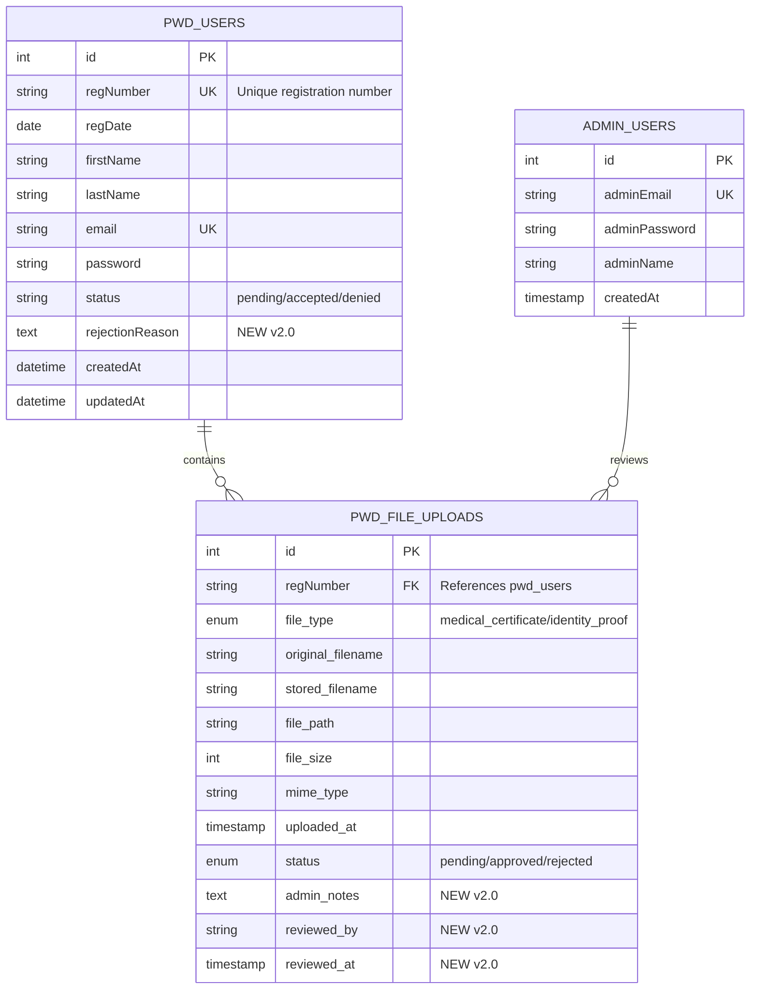

# PWD Automated Application System - Database Documentation

> **Database System:** MySQL (XAMPP)  
> **Database Name:** PWDRegistry  
> **Version:** 2.0  
> **Last Updated:** December 12, 2025  
> **Character Set:** utf8mb4  
> **Collation:** utf8mb4_unicode_ci

---

## Table of Contents

1. [Database Overview](#database-overview)
2. [Database Schema](#database-schema)
3. [Table Definitions](#table-definitions)
4. [SQL Scripts Reference](#sql-scripts-reference)
5. [Setup Instructions](#setup-instructions)
6. [Migration Guide](#migration-guide)
7. [Troubleshooting](#troubleshooting)

---

## Database Overview

The PWDRegistry database manages the complete lifecycle of PWD (Persons with Disabilities) applications, including:

- **User Registration & Authentication** - Applicant account management
- **Admin Authentication** - Administrative access control
- **Application Processing** - Status tracking and review workflow
- **Document Management** - File upload and review system
- **Rejection Tracking** - Detailed rejection reasons and admin notes

### Database Architecture



---

## Database Schema

### Overview Statistics

| Component | Count | Description |
|-----------|-------|-------------|
| **Tables** | 3 | Main data tables |
| **Columns** | 50+ | Total columns across all tables |
| **Indexes** | 12 | Performance optimization indexes |
| **Foreign Keys** | 1 | Data integrity constraint |
| **Sample Records** | 10+ | Test data for development |

---

## Table Definitions

### 1. `pwd_users` Table

**Purpose:** Stores PWD applicant information, authentication credentials, and application status.

**Table Structure:**

| Column | Type | Constraints | Description |
|--------|------|-------------|-------------|
| `id` | INT | PRIMARY KEY, AUTO_INCREMENT | Unique user identifier |
| `regNumber` | VARCHAR(20) | NOT NULL, UNIQUE | Registration number (unique per applicant) |
| `regDate` | DATE | NOT NULL | Registration date |
| `lastName` | VARCHAR(100) | NOT NULL | Applicant's last name |
| `firstName` | VARCHAR(100) | NOT NULL | Applicant's first name |
| `middleName` | VARCHAR(100) | NULL | Applicant's middle name |
| `disability` | VARCHAR(100) | NOT NULL | Type of disability |
| `street` | VARCHAR(200) | NOT NULL | Street address |
| `barangay` | VARCHAR(100) | NOT NULL | Barangay |
| `municipality` | VARCHAR(100) | NOT NULL, DEFAULT 'Dasmariñas' | Municipality |
| `province` | VARCHAR(100) | NOT NULL, DEFAULT 'Cavite' | Province |
| `region` | VARCHAR(50) | NOT NULL, DEFAULT 'IV-A' | Region |
| `tel` | VARCHAR(20) | NULL | Telephone number |
| `mobile` | VARCHAR(20) | NOT NULL | Mobile number |
| `email` | VARCHAR(150) | NOT NULL, UNIQUE | Email address (login credential) |
| `dob` | DATE | NOT NULL | Date of birth |
| `sex` | VARCHAR(10) | NOT NULL | Gender |
| `nationality` | VARCHAR(50) | NOT NULL, DEFAULT 'Filipino' | Nationality |
| `blood` | VARCHAR(5) | NULL | Blood type |
| `civil` | VARCHAR(20) | NOT NULL | Civil status |
| `emergencyName` | VARCHAR(150) | NOT NULL | Emergency contact name |
| `emergencyPhone` | VARCHAR(20) | NOT NULL | Emergency contact phone |
| `emergencyRelationship` | VARCHAR(50) | NOT NULL | Relationship to emergency contact |
| `proofIdentity` | VARCHAR(200) | NULL | Legacy: Identity proof filename |
| `proofDisability` | VARCHAR(200) | NULL | Legacy: Disability proof filename |
| `password` | VARCHAR(100) | NOT NULL | Authentication password |
| `status` | VARCHAR(20) | NOT NULL, DEFAULT 'pending' | Application status (pending/accepted/denied) |
| `rejectionReason` | TEXT | NULL | **[NEW v2.0]** Reason for denial |
| `createdAt` | DATETIME | DEFAULT CURRENT_TIMESTAMP | Record creation timestamp |
| `updatedAt` | DATETIME | DEFAULT CURRENT_TIMESTAMP ON UPDATE | Last update timestamp |

**Indexes:**
- `idx_status` - Fast status filtering
- `idx_regDate` - Date-based sorting
- `idx_email` - Email lookup for authentication

**Sample Query:**
```sql
SELECT regNumber, firstName, lastName, email, status, rejectionReason
FROM pwd_users 
WHERE status = 'denied'
ORDER BY updatedAt DESC;
```

---

### 2. `admin_users` Table

**Purpose:** Stores administrator accounts for system management and application review.

**Table Structure:**

| Column | Type | Constraints | Description |
|--------|------|-------------|-------------|
| `id` | INT | PRIMARY KEY, AUTO_INCREMENT | Unique admin identifier |
| `adminEmail` | VARCHAR(150) | NOT NULL, UNIQUE | Admin email (login credential) |
| `adminPassword` | VARCHAR(255) | NOT NULL | Admin password |
| `adminName` | VARCHAR(100) | NULL | Admin full name (displayed in reviews) |
| `createdAt` | TIMESTAMP | DEFAULT CURRENT_TIMESTAMP | Account creation timestamp |

**Indexes:**
- `idx_email` - Fast email lookup

**Default Admin Account:**
- Email: `admin@dasma.gov.ph`
- Password: `admin123` ⚠️ **Change in production Can be hashed**
- Name: `System Administrator`

**Sample Query:**
```sql
SELECT id, adminEmail, adminName, createdAt
FROM admin_users
WHERE adminEmail = 'admin@dasma.gov.ph';
```

---

### 3. `pwd_file_uploads` Table

**Purpose:** Manages uploaded documents (medical certificates, identity proofs) with admin review workflow.

**Table Structure:**

| Column | Type | Constraints | Description |
|--------|------|-------------|-------------|
| `id` | INT | PRIMARY KEY, AUTO_INCREMENT | Unique file identifier |
| `regNumber` | VARCHAR(50) | FOREIGN KEY → pwd_users.regNumber | Links to applicant |
| `file_type` | ENUM | 'medical_certificate', 'identity_proof' | Document type |
| `original_filename` | VARCHAR(255) | NOT NULL | Original upload filename |
| `stored_filename` | VARCHAR(255) | NOT NULL | Server-stored filename |
| `file_path` | VARCHAR(500) | NOT NULL | Full file path on server |
| `file_size` | INT | NOT NULL | File size in bytes |
| `mime_type` | VARCHAR(100) | NOT NULL | MIME type (image/png, etc.) |
| `uploaded_at` | TIMESTAMP | DEFAULT CURRENT_TIMESTAMP | Upload timestamp |
| `status` | ENUM | DEFAULT 'pending' | File review status (pending/approved/rejected) |
| `admin_notes` | TEXT | NULL | **[NEW v2.0]** Admin comments/rejection reason |
| `reviewed_by` | VARCHAR(100) | NULL | **[NEW v2.0]** Admin name who reviewed |
| `reviewed_at` | TIMESTAMP | NULL | **[NEW v2.0]** Review timestamp |

**Foreign Key:**
- `FOREIGN KEY (regNumber) REFERENCES pwd_users(regNumber) ON DELETE CASCADE`
  - Deleting a user automatically deletes their uploaded files

**Indexes:**
- `idx_regNumber` - Fast applicant file lookup
- `idx_status` - Status filtering
- `idx_file_type` - Document type filtering
- `idx_uploaded_at` - Date-based sorting

**Sample Query:**
```sql
SELECT pf.regNumber,
       CONCAT(pu.firstName, ' ', pu.lastName) as fullName,
       pf.file_type,
       pf.status,
       pf.admin_notes,
       pf.reviewed_by,
       pf.reviewed_at
FROM pwd_file_uploads pf
INNER JOIN pwd_users pu ON pf.regNumber = pu.regNumber
WHERE pf.status = 'rejected'
ORDER BY pf.reviewed_at DESC;
```

---

## 📝 SQL Scripts Reference

### Legacy SQL Scripts (Original Development)

These scripts were used during the initial development phase and have been consolidated into the master-setup.sql:

#### 1. `sql-scripts.sql` ⚠️ **DEPRECATED**
- **Purpose:** Original database creation and stored procedures
- **Status:** Legacy - Use master-setup.sql instead
- **Contains:**
  - Database creation (PWDRegistry)
  - Table definitions (pwd_users, admin_users)
  - Debug queries for testing
  - Stored procedures (not actively used)
- **Note:** Missing rejectionReason column and file upload tables

#### 2. `sql-generate-data.sql` ⚠️ **DEPRECATED**
- **Purpose:** Sample test data insertion
- **Status:** Legacy - Incorporated into master-setup.sql
- **Contains:**
  - 5+ sample user records
  - Various application statuses
  - Test credentials
- **Note:** Data now included in master-setup.sql Section 4

#### 3. `sql-file-uploads.sql` ✅ **INTEGRATED**
- **Purpose:** File upload feature tables
- **Status:** Integrated into master-setup.sql v2.0
- **Contains:**
  - pwd_file_uploads table definition
  - Admin review fields (admin_notes, reviewed_by, reviewed_at)
  - Indexes and foreign keys
- **Integration:** Section 2 of master-setup.sql

#### 4. `sql-add-rejection-reason.sql` ✅ **INTEGRATED**
- **Purpose:** Add rejection tracking to pwd_users
- **Status:** Integrated into master-setup.sql v2.0
- **Contains:**
  - ALTER TABLE to add rejectionReason column
  - Index on status column
- **Integration:** Section 2 of master-setup.sql

#### 5. `sql-sync-file-reviews.sql` ✅ **INTEGRATED**
- **Purpose:** Sync historical admin review data
- **Status:** Integrated into master-setup.sql v2.0
- **Contains:**
  - UPDATE query to sync pwd_users status to pwd_file_uploads
  - Copy rejection reasons to admin_notes
  - Set reviewed_by and reviewed_at timestamps
- **Integration:** Section 6 of master-setup.sql

#### 6. `sql-utf8-fix.sql` ✅ **INTEGRATED**
- **Purpose:** Fix character encoding issues
- **Status:** Integrated into master-setup.sql v2.0
- **Contains:**
  - ALTER DATABASE charset conversion
  - ALTER TABLE charset conversion for all tables
  - TRUNCATE and re-insert instructions
- **Integration:** Section 9 of master-setup.sql (commented)

---

### Master Setup Script (Current - v2.0)

**File:** `master-setup.sql`  
**Status:** ✅ **PRODUCTION READY**  
**Last Updated:** December 12, 2025

#### Script Structure

The master-setup.sql is organized into 9 chronological sections:

##### **SECTION 1: Database Creation**
Creates the PWDRegistry database with UTF-8 support.

```sql
CREATE DATABASE IF NOT EXISTS PWDRegistry
CHARACTER SET utf8mb4
COLLATE utf8mb4_unicode_ci;
```

**Features:**
- UTF-8 character set for international support
- Unicode collation for proper text comparison
- IF NOT EXISTS prevents errors on re-run

---

##### **SECTION 2: Main Tables Creation**
Creates all three main tables with complete schema.

**Tables Created:**
1. `pwd_users` - With rejectionReason column
2. `admin_users` - Admin authentication
3. `pwd_file_uploads` - Document management with review fields

**New in v2.0:**
- ✅ `rejectionReason TEXT` in pwd_users
- ✅ `admin_notes TEXT` in pwd_file_uploads
- ✅ `reviewed_by VARCHAR(100)` in pwd_file_uploads
- ✅ `reviewed_at TIMESTAMP` in pwd_file_uploads

---

##### **SECTION 3: Default Data Insertion**
Inserts the default system administrator account.

```sql
INSERT INTO admin_users (adminEmail, adminPassword, adminName) 
VALUES ('admin@dasma.gov.ph', 'admin123', 'System Administrator');
```

---

##### **SECTION 4: Sample User Data (FOR TESTING)**
Inserts 5 test users with different statuses:

| Reg Number | Name | Email | Status | Password |
|-----------|------|-------|--------|----------|
| 371771933783 | John De La Salle | john.delasalle@email.com | Pending | password123 |
| 409853541380 | Michel Montaigne | michel.montaigne@email.com | Pending | password123 |
| 863143528975 | Shinji Ikari | shinji.ikari@email.com | Pending | password123 |
| 973821289541 | Juan Dela Cruz | juan.delacruz@email.com | Accepted | 12345678 |
| 973821289540 | Ivan Karamazov | ivan@email.com | Denied | 83185255 |

**Note:** User 5 (Ivan) includes a sample `rejectionReason`: "Incomplete or incorrect documents"

---

##### **SECTION 5: Sample File Upload Data**
Inserts 6 file upload records (2 files each for 3 users):

- User 1: Medical certificate + Identity proof (pending)
- User 2: Medical certificate + Identity proof (pending)
- User 3: Medical certificate + Identity proof (pending)

**File Storage Pattern:**
```
uploads/
  ├── certificates/
  │   └── medical_certificate_[timestamp]_[random].png
  └── identity/
      └── identity_proof_[timestamp]_[random].png
```

---

##### **SECTION 6: Sync Historical Data** ⭐ **IMPORTANT**
Automatically syncs admin review data from pwd_users to pwd_file_uploads.

**What it does:**
1. Updates file status to match application status
   - `denied` → `rejected`
   - `accepted` → `approved`
2. Copies rejectionReason to admin_notes
3. Sets reviewed_by to 'System Administrator'
4. Sets reviewed_at from updatedAt timestamp

**When to use:**
- ✅ Running master-setup.sql on a fresh database (safe)
- ✅ Migrating from old schema to v2.0 (recommended)
- ❌ Daily operations (only needed once)

```sql
UPDATE pwd_file_uploads pf
INNER JOIN pwd_users pu ON pf.regNumber = pu.regNumber
SET 
    pf.status = CASE 
        WHEN pu.status = 'denied' THEN 'rejected'
        WHEN pu.status = 'accepted' THEN 'approved'
        ELSE pf.status
    END,
    -- ... (copies rejection reasons and review data)
WHERE pu.status IN ('denied', 'accepted') 
  AND pf.reviewed_by IS NULL;
```

---

##### **SECTION 7: Verification Queries**
Queries to verify successful setup.

**Queries included:**
1. Check database charset
2. List all tables
3. Count records in each table
4. View sample user data with rejection reasons
5. View file upload summary with approval/rejection counts
6. View file review details

**Run these in phpMyAdmin:**
Navigate to: `Server: 127.0.0.1` → `Database: pwdregistry`  
**Important:** Run queries at database level, NOT inside individual tables.

---

##### **SECTION 8: Useful Maintenance Queries**
Commented-out utility queries for ongoing maintenance.

**Available queries:**
- Application statistics by status
- Recent applications (last 10)
- Users with incomplete file uploads
- Denied applications with rejection reasons
- File upload statistics

**Usage:** Uncomment specific queries as needed for maintenance tasks.

---

##### **SECTION 9: UTF-8 Collation Fix**
Emergency fix for character encoding issues.

**When to use:**
- Login authentication fails despite correct credentials
- Special characters display incorrectly
- Database was created with wrong charset

**Steps:**
1. Uncomment the ALTER DATABASE and ALTER TABLE commands
2. Run the queries in phpMyAdmin
3. TRUNCATE all tables (⚠️ deletes all data!)
4. Re-run Sections 3, 4, and 5 to re-insert data

---

## Setup Instructions

### Prerequisites

- ✅ XAMPP installed (Apache + MySQL + PHP)
- ✅ Apache and MySQL services running
- ✅ phpMyAdmin accessible at `http://localhost/phpmyadmin`

### Fresh Installation (Recommended)

**Step 1: Access phpMyAdmin**
1. Open browser: `http://localhost/phpmyadmin`
2. Click on "SQL" tab at the top

**Step 2: Execute Master Setup Script**
1. Open `master-setup.sql` in a text editor
2. Copy the **entire file content**
3. Paste into the SQL query box in phpMyAdmin
4. Click **"Go"** button to execute
5. Wait for completion (green success message)

**Step 3: Verify Installation**
1. Check left sidebar for "pwdregistry" database
2. Click on it to expand
3. Verify 3 tables are present:
   - `admin_users`
   - `pwd_file_uploads`
   - `pwd_users`

**Step 4: Run Verification Queries**
1. Click on database name "pwdregistry" (not a table)
2. Click "SQL" tab
3. Copy queries from Section 7 of master-setup.sql
4. Run each query to verify data

**Expected Results:**
- ✅ 1 admin user
- ✅ 5 test users
- ✅ 6 file upload records
- ✅ UTF-8 character set confirmed

---

### Upgrading from Old Schema (v1.0 → v2.0)

If you have an existing database from the old scripts:

**Option A: Fresh Install (Recommended)**
1. ⚠️ **Backup your data first!**
2. Drop existing database: `DROP DATABASE PWDRegistry;`
3. Follow "Fresh Installation" steps above

**Option B: Schema Migration (Advanced)**
1. Backup database: Export via phpMyAdmin
2. Add missing columns:
   ```sql
   ALTER TABLE pwd_users 
   ADD COLUMN rejectionReason TEXT DEFAULT NULL 
   AFTER status;
   
   ALTER TABLE pwd_file_uploads 
   ADD COLUMN admin_notes TEXT AFTER status;
   
   ALTER TABLE pwd_file_uploads 
   ADD COLUMN reviewed_by VARCHAR(100) AFTER admin_notes;
   
   ALTER TABLE pwd_file_uploads 
   ADD COLUMN reviewed_at TIMESTAMP NULL AFTER reviewed_by;
   ```
3. Run Section 6 from master-setup.sql to sync data
4. Verify with Section 7 queries

---

## 📚 Migration Guide

### From SheetDB to MySQL

If you're migrating from the original SheetDB implementation:

**Data Export from Google Sheets:**
1. Open your Google Sheet
2. File → Download → CSV
3. Save user data and admin data separately

**Data Import to MySQL:**
1. Create database using master-setup.sql (Sections 1-3)
2. In phpMyAdmin, select `pwd_users` table
3. Click "Import" tab
4. Choose CSV file
5. Map columns correctly
6. Click "Go"

**Important Field Mappings:**
- SheetDB uses exact column names matching MySQL schema
- Status values: keep as `pending`, `accepted`, `denied`
- Dates: Format as `YYYY-MM-DD`
- RegNumber: Must be unique

**Post-Migration:**
1. Verify record count matches source
2. Test login with sample users
3. Test admin login
4. Check file upload functionality

---

## Troubleshooting

### Common Issues

#### Issue 1: "Table already exists" Error

**Symptom:** Error when running master-setup.sql
```
ERROR 1050: Table 'pwd_users' already exists
```

**Solution:**
- Script uses `CREATE TABLE IF NOT EXISTS` - shouldn't happen
- If it does, tables exist from previous attempt
- Option 1: Drop database and retry
- Option 2: Comment out Section 2, run Sections 3-7 only

---

#### Issue 2: Login Authentication Fails

**Symptom:** Correct credentials rejected by login form

**Possible Causes:**
1. **Character Encoding Mismatch**
   - Database: `latin1_swedish_ci` (wrong)
   - React: `UTF-8` (correct)
   
   **Solution:** Run Section 9 (UTF-8 Collation Fix)

2. **Password Mismatch**
   - Check exact password in database
   - Passwords are case-sensitive
   - No extra spaces

   **Solution:** 
   ```sql
   SELECT email, password FROM pwd_users 
   WHERE email = 'your-test-email@example.com';
   ```

3. **Email Case Sensitivity**
   - Some old data may have uppercase
   - Login form converts to lowercase
   
   **Solution:** Update email to lowercase:
   ```sql
   UPDATE pwd_users 
   SET email = LOWER(email);
   ```

---

#### Issue 3: Foreign Key Constraint Error

**Symptom:** Cannot delete user or insert file upload

```
ERROR 1451: Cannot delete or update a parent row: 
a foreign key constraint fails
```

**Cause:** pwd_file_uploads has foreign key to pwd_users.regNumber

**Solutions:**
- To delete user: Delete their files first
- Or use: `DELETE FROM pwd_users WHERE regNumber = '...'` 
  - CASCADE will auto-delete files
- To insert file: User must exist first

---

#### Issue 4: File Status Not Updating

**Symptom:** Files show "Pending" even after application accepted/denied

**Cause:** Section 6 (Sync) only runs once during setup

**Solution:** Manually run sync query:
```sql
UPDATE pwd_file_uploads pf
INNER JOIN pwd_users pu ON pf.regNumber = pu.regNumber
SET 
    pf.status = CASE 
        WHEN pu.status = 'denied' THEN 'rejected'
        WHEN pu.status = 'accepted' THEN 'approved'
        ELSE pf.status
    END,
    pf.admin_notes = CASE 
        WHEN pu.status = 'denied' AND pu.rejectionReason IS NOT NULL 
        THEN pu.rejectionReason
        ELSE pf.admin_notes
    END,
    pf.reviewed_by = CASE 
        WHEN pu.status IN ('denied', 'accepted') AND pf.reviewed_by IS NULL 
        THEN 'System Administrator'
        ELSE pf.reviewed_by
    END,
    pf.reviewed_at = CASE 
        WHEN pu.status IN ('denied', 'accepted') AND pf.reviewed_at IS NULL 
        THEN pu.updatedAt
        ELSE pf.reviewed_at
    END
WHERE pu.status IN ('denied', 'accepted') 
  AND pf.reviewed_by IS NULL;
```

**Prevention:** 
- Use update-application-status.php API
- It automatically updates both tables
- Includes adminName from session

---

#### Issue 5: Cannot Upload Files

**Symptom:** File upload fails or files not saved

**Checklist:**
1. ✅ `uploads/` directory exists in xampp-php-mysql-files
2. ✅ `uploads/certificates/` subdirectory exists
3. ✅ `uploads/identity/` subdirectory exists
4. ✅ `uploads/thumbnails/` subdirectory exists (if using)
5. ✅ Directories have write permissions
6. ✅ PHP `upload_max_filesize` is sufficient (2MB default)

**Create Directories:**
```bash
cd xampp-php-mysql-files
mkdir -p uploads/certificates
mkdir -p uploads/identity
mkdir -p uploads/thumbnails
```

**Windows:**
```cmd
cd xampp-php-mysql-files
mkdir uploads\certificates
mkdir uploads\identity
mkdir uploads\thumbnails
```

---

## Database Statistics

### Current Schema (v2.0)

| Metric | Value |
|--------|-------|
| Total Tables | 3 |
| Total Columns | 52 |
| Total Indexes | 12 |
| Foreign Keys | 1 |
| Character Set | utf8mb4 |
| Default Storage Engine | InnoDB |
| Sample Test Users | 5 |
| Sample Files | 6 |

### Storage Estimates

**Per User Record:** ~2-3 KB  
**Per File Record:** ~500 bytes (metadata only)  
**Actual Files:** Varies by document (typically 100KB - 2MB each)

**For 1,000 users:**
- User records: ~3 MB
- File records: ~1 MB
- Actual files: ~200-400 MB (2 files per user)
- **Total:** ~400 MB

---

## Security Considerations

### Production Recommendations

1. **Change Default Admin Password**
   ```sql
   UPDATE admin_users 
   SET adminPassword = 'your-strong-password-here'
   WHERE adminEmail = 'admin@dasma.gov.ph';
   ```

2. **Use Password Hashing**
   - Current: Plain text (development only!)
   - Production: Use PHP `password_hash()` function
   - Update all PHP files accordingly

3. **Enable SSL/HTTPS**
   - Use HTTPS in production
   - Protects credentials in transit
   - Enable in XAMPP or use reverse proxy

4. **Database User Permissions**
   - Don't use root user in production
   - Create dedicated user with limited permissions:
   ```sql
   CREATE USER 'pwd_app'@'localhost' 
   IDENTIFIED BY 'secure-password';
   
   GRANT SELECT, INSERT, UPDATE, DELETE 
   ON PWDRegistry.* 
   TO 'pwd_app'@'localhost';
   ```

5. **Backup Strategy**
   - Daily automated backups
   - Export database from phpMyAdmin
   - Store backups off-server
   - Test restore procedure regularly

---

## Support & Resources

### Documentation Links

- [Backend Migration Documentation](./backend-migration-documentation.md)
- [API Documentation](./api-documentation.md)
- [File Upload Feature Documentation](./file-upload-feature-documentation.md)
- [UTF-8 Collation Fix](./utf8-collation-fix.md)

### Useful Queries Cheat Sheet

```sql
-- Count applications by status
SELECT status, COUNT(*) as count 
FROM pwd_users 
GROUP BY status;

-- Find user by email
SELECT * FROM pwd_users 
WHERE email = 'user@example.com';

-- List all files for a user
SELECT * FROM pwd_file_uploads 
WHERE regNumber = '123456789';

-- Reset file statuses to pending
UPDATE pwd_file_uploads 
SET status = 'pending', 
    admin_notes = NULL, 
    reviewed_by = NULL, 
    reviewed_at = NULL;

-- Delete all test data (⚠️ Use with caution!)
DELETE FROM pwd_users 
WHERE email LIKE '%@email.com';
```

---

## 📝 Changelog

### Version 2.0 (December 12, 2025)
- ✅ Added `rejectionReason` column to pwd_users
- ✅ Added admin review fields to pwd_file_uploads
  - `admin_notes` - Detailed rejection reasons
  - `reviewed_by` - Admin name who reviewed
  - `reviewed_at` - Review timestamp
- ✅ Created master-setup.sql consolidating all scripts
- ✅ Added historical data sync (Section 6)
- ✅ Integrated UTF-8 fix instructions
- ✅ Enhanced verification queries

### Version 1.0 (November 2025)
- Initial database creation using `sheetdb`
- pwd_users and admin_users tables (seperate sheets)
- Basic authentication system
- Sample data generation
- Stored procedures (deprecated)

---

## ✅ Checklist for New Developers

Setup checklist for new team members:

- [ ] Install XAMPP
- [ ] Start Apache and MySQL services
- [ ] Access phpMyAdmin (http://localhost/phpmyadmin)
- [ ] Run master-setup.sql (complete file)
- [ ] Verify 3 tables created
- [ ] Run Section 7 verification queries
- [ ] Test admin login (admin@dasma.gov.ph / admin123)
- [ ] Test user login (john.delasalle@email.com / password123)
- [ ] Check file upload directory exists
- [ ] Review API documentation
- [ ] Clone repository
- [ ] Configure config.php with DB credentials
- [ ] Test React frontend connection

---

**Last Updated:** December 12, 2025  
**Maintained By:** PWD Application System Development Team  
**Database Version:** 2.0
