# File Upload Feature Documentation

## Overview

The PWD Automated Application System includes a comprehensive file upload feature that allows users to submit required documents (Identity Proof and Medical Certificate) during registration and view their uploaded files in the user dashboard. Files are validated on both frontend and backend, uploaded to the server after successful registration, and stored with proper database relationships.

### Key Features

- **Dual Validation**: Frontend validation for immediate feedback + backend MIME type and extension validation
- **Secure Upload**: Files linked to users via `regNumber` foreign key, preventing orphan files
- **Automatic Directory Management**: Upload directories created automatically if missing
- **Database Tracking**: Complete audit trail with file metadata, status, and review information
- **User Dashboard Integration**: "My Documents" section for viewing uploaded files and their status
- **Download Support**: Secure file download with proper headers and content types


---

## Visual Overview: File Upload System

### System Architecture Diagram

```mermaid
flowchart TB
    subgraph Frontend ["⚛️ React Frontend"]
        direction TB
        REG["📝 register.jsx<br/><a href='#1-state-management-registerjsx'>State Management</a>"]
        VAL["✅ validateFile()<br/><a href='#2-file-validation-functions'>Validation Logic</a>"]
        UPL["📤 uploadFileToServer()<br/><a href='#3-upload-function'>Upload Function</a>"]
        USR["👤 userpage.jsx<br/><a href='#user-dashboard-my-documents'>My Documents</a>"]
    end
    
    subgraph Backend ["🐘 PHP Backend"]
        direction TB
        UPLOAD["upload.php<br/><a href='#1-upload-endpoint-uploadphp'>POST /api/upload.php</a>"]
        FILES["files.php<br/><a href='#2-get-files-endpoint-filesphp'>GET /api/files.php</a>"]
        VIEW["file-view.php<br/><a href='#view-file-inline-by-id'>GET /api/file-view.php</a>"]
        DOWNLOAD["file-download.php<br/><a href='#3-download-endpoint-file-downloadphp'>GET /api/file-download.php</a>"]
    end
    
    subgraph Storage ["💾 Storage Layer"]
        direction LR
        FS[("📁 File System<br/>uploads/certificates/<br/>uploads/identity/")]
        DB[("🗄️ MySQL<br/>pwd_file_uploads<br/><a href='#database-schema'>Schema</a>")]
    end
    
    REG -->|"1. Select file"| VAL
    VAL -->|"2. Store in memory"| REG
    REG -->|"3. After registration"| UPL
    UPL -->|"4. POST FormData"| UPLOAD
    UPLOAD -->|"5. Save file"| FS
    UPLOAD -->|"6. Insert record"| DB
    USR -->|"7. Fetch files"| FILES
    FILES -->|"8. Query"| DB
    USR -->|"9. View/Download"| VIEW
    USR -->|"9. View/Download"| DOWNLOAD
    VIEW -->|"10. Read file"| FS
    DOWNLOAD -->|"10. Read file"| FS
```



### Upload Flow Sequence Diagram

```mermaid
sequenceDiagram
    autonumber
    participant U as 👤 User
    participant R as ⚛️ React<br/>(register.jsx)
    participant API as 🐘 PHP API<br/>(upload.php)
    participant FS as 📁 File System
    participant DB as 🗄️ MySQL

    rect rgb(230, 245, 255)
    Note over U,DB: Phase 1: File Selection & Validation
    U->>R: Select file (JPG/PNG/PDF)
    R->>R: validateFile() - check size ≤5MB
    R->>R: validateFile() - check MIME type
    alt Validation Failed
        R-->>U: ❌ Show error message
    else Validation Passed
        R->>R: Store file in selectedFiles state
        R-->>U: ✅ "Ready: filename"
    end
    end

    rect rgb(255, 245, 230)
    Note over U,DB: Phase 2: Registration & Upload
    U->>R: Submit registration form
    R->>API: POST /api/register.php
    API-->>R: Success + regNumber
    R->>R: uploadFileToServer() called
    R->>API: POST /api/upload.php (FormData)
    API->>API: finfo_file() MIME check
    API->>API: Extension fallback check
    alt Backend Validation Failed
        API-->>R: 400 + error JSON
    else Validation Passed
        API->>FS: move_uploaded_file()
        API->>DB: INSERT pwd_file_uploads
        DB-->>API: Return insert_id
        API-->>R: ✅ Success + fileId
    end
    end

    rect rgb(230, 255, 230)
    Note over U,DB: Phase 3: View Documents
    U->>R: Navigate to "My Documents"
    R->>API: GET /api/files.php?regNumber=xxx
    API->>DB: SELECT * FROM pwd_file_uploads
    DB-->>API: Return file records
    API-->>R: JSON files array
    R-->>U: Display documents table
    end
```



### Validation Logic Flowchart

```mermaid
flowchart TD
    A["📄 File Selected"] --> B{"📏 Size ≤ 5MB?"}
    B -->|"❌ No"| C["🚫 Reject: File too large"]
    B -->|"✅ Yes"| D["🔍 finfo_file() detection"]
    D --> E{"MIME in allowed list?<br/>pdf, jpeg, png, jpg"}
    E -->|"✅ Yes"| I["✅ Accept File"]
    E -->|"❌ No"| F["📎 Get file extension"]
    F --> G{"Extension valid?<br/>.pdf, .jpg, .jpeg, .png"}
    G -->|"✅ Yes"| H["⚠️ Accept (extension fallback)"]
    G -->|"❌ No"| J["🚫 Reject: Invalid type"]
    
    style I fill:#90EE90,stroke:#228B22
    style H fill:#FFE4B5,stroke:#FF8C00
    style C fill:#FFB6C1,stroke:#DC143C
    style J fill:#FFB6C1,stroke:#DC143C
```



### API Endpoints Overview

```mermaid
flowchart LR
    subgraph Create ["📤 CREATE"]
        UP["upload.php<br/>POST"]
    end
    
    subgraph Read ["📖 READ"]
        FI["files.php<br/>GET ?regNumber="]
        VW["file-view.php<br/>GET ?fileId="]
        VP["file-view-path.php<br/>GET ?path="]
        DL["file-download.php<br/>GET ?fileId="]
    end
    
    subgraph Update ["✏️ UPDATE"]
        US["update-file-status.php<br/>POST"]
        UA["update-all-files-status.php<br/>POST"]
    end
    
    UP --> DB[(pwd_file_uploads)]
    FI --> DB
    US --> DB
    UA --> DB
    VW --> FS[(File System)]
    VP --> FS
    DL --> FS
```



### Database Entity Relationship


### Quick Navigation

| Section | Description | Jump To |
|---------|-------------|---------|
| 🎯 **Frontend Validation** | File size & type checks in React | [validateFile()](#2-file-validation-functions) |
| 📤 **Upload Function** | FormData POST to PHP | [uploadFileToServer()](#3-upload-function) |
| 🐘 **PHP Upload API** | Server-side validation & storage | [upload.php](#1-upload-endpoint-uploadphp) |
| 📋 **Files List API** | Retrieve user's uploaded files | [files.php](#2-get-files-endpoint-filesphp) |
| 👁️ **View File API** | Inline viewing in browser | [file-view.php](#view-file-inline-by-id) |
| 📥 **Download API** | File download with headers | [file-download.php](#3-download-endpoint-file-downloadphp) |
| 🗄️ **Database Schema** | pwd_file_uploads table structure | [Schema](#database-schema) |
| ✅ **Validation Rules** | Frontend + Backend rules | [Validation Rules](#file-validation-rules) |

---

## For Collaborators: Getting Started

### Prerequisites

Before working with this feature, ensure you have:
- XAMPP installed with Apache + MySQL running
- Node.js (v16 or higher) and npm installed
- The React project cloned locally
- MySQL database `PWDRegistry` created

### Installation

After cloning the repository, set up the file upload feature:

```bash
# Navigate to the React project directory
cd Post-React-Migration/pwd-application-system

# Install all dependencies
npm install
```

### Database Setup

Create the file uploads table by running the SQL migration:

```bash
# Option A: Using MySQL command line
mysql -u root PWDRegistry < ../xampp-php-mysql-files/sql-file-uploads.sql

# Option B: Using phpMyAdmin
1. Open http://localhost/phpmyadmin
2. Select PWDRegistry database
3. Go to SQL tab
4. Paste content from sql-file-uploads.sql
5. Execute
```

### Directory Setup

Verify upload directories exist:

```
xampp-php-mysql-files/
├── uploads/
│   ├── certificates/   (medical certificates)
│   ├── identity/       (government IDs)
│   └── thumbnails/     (future: resized images)
```

If not created, run in PowerShell:
```powershell
mkdir "xampp-php-mysql-files/uploads/certificates"
mkdir "xampp-php-mysql-files/uploads/identity"
mkdir "xampp-php-mysql-files/uploads/thumbnails"
```

---

## Feature Locations

The file upload feature is implemented in three locations:

| Location | File | Purpose |
|----------|------|---------|
| Registration | `src/pages/homepage/register.jsx` | Upload documents during registration |
| User Dashboard | `src/pages/userpage/userpage.jsx` | View uploaded files in "My Documents" |
| PHP Backend | `xampp-php-mysql-files/api/` | Handle upload, retrieval, and download |

---

## How It Works

> 📊 **See [Visual Overview](#visual-overview-file-upload-system) above for interactive Mermaid diagrams** showing the complete system architecture, sequence flow, validation logic, and database relationships.

### Step-by-Step Process

1. **USER SELECTS FILE**
   - `handleFileSelect()` validates file (size ≤5MB, type PDF/JPG/PNG)
   - Shows "Ready: filename" ✓
   - File stored in memory (NOT uploaded yet)

2. **USER SUBMITS REGISTRATION**
   - `handleFormSubmit()` sends form data to registration API
   - API creates user and returns regNumber (e.g., PWD-2025-00001)

3. **AFTER REGISTRATION SUCCESS**
   - `uploadFileToServer()` uploads each file WITH regNumber
   - Files saved to `uploads/identity/` or `uploads/certificates/`
   - Database records created with proper foreign key

4. **USER REDIRECTED TO RESULT PAGE**
   - Files now visible in "My Documents" section of dashboard

**Why this approach?**
- Files are linked to users via `regNumber` foreign key
- No orphan files from abandoned registrations
- Database integrity maintained

---

## Frontend Implementation

### 1. State Management (register.jsx)

```jsx
// State for selected files (stored in memory until registration succeeds)
const [selectedFiles, setSelectedFiles] = useState({
  identity_proof: null,
  medical_certificate: null
});

// State for file validation feedback
const [fileValidation, setFileValidation] = useState({
  identity_proof: { valid: false, message: '' },
  medical_certificate: { valid: false, message: '' }
});
```

### 2. File Validation Functions

The actual implementation uses a separate `validateFile()` function called by `handleFileSelect()`:

```jsx
/**
 * @summary Validates file size and type before selection.
 * @param {File} file - The file object to validate.
 * @returns {Object} Validation result with valid flag and error message.
 */
const validateFile = (file) => {
  const MAX_SIZE = 5 * 1024 * 1024; // 5MB
  // Note: Backend also accepts 'image/jpg' for compatibility
  const ALLOWED_TYPES = ['application/pdf', 'image/jpeg', 'image/png'];

  if (file.size > MAX_SIZE) {
    return { 
      valid: false, 
      error: `File too large. Max: 5MB, Your file: ${(file.size / 1024 / 1024).toFixed(2)}MB` 
    };
  }

  if (!ALLOWED_TYPES.includes(file.type)) {
    return { 
      valid: false, 
      error: 'Only PDF, JPG, PNG allowed' 
    };
  }

  return { valid: true };
};

/**
 * @summary Handles file selection and validation (does NOT upload yet).
 * @param {Event} e - Change event from file input.
 * @param {string} fileType - Type of file being selected (identity_proof or medical_certificate).
 */
const handleFileSelect = (e, fileType) => {
  const file = e.target.files[0];
  if (!file) {
    setSelectedFiles(prev => ({ ...prev, [fileType]: null }));
    setFileValidation(prev => ({ ...prev, [fileType]: { valid: false, message: '' } }));
    return;
  }

  const validation = validateFile(file);
  if (!validation.valid) {
    setSelectedFiles(prev => ({ ...prev, [fileType]: null }));
    setFileValidation(prev => ({ 
      ...prev, 
      [fileType]: { valid: false, message: validation.error } 
    }));
    return;
  }

  // Store the file object for later upload
  setSelectedFiles(prev => ({ ...prev, [fileType]: file }));
  setFileValidation(prev => ({ 
    ...prev, 
    [fileType]: { valid: true, message: `Ready: ${file.name}` } 
  }));
};
```

### 3. Upload Function

```jsx
const uploadFileToServer = async (file, fileType, regNumber) => {
  const formData = new FormData();
  formData.append('file', file);
  formData.append('fileType', fileType);
  formData.append('regNumber', regNumber);
  
  try {
    const response = await fetch(
      'http://localhost/webdev_finals/.../api/upload.php',
      {
        method: 'POST',
        body: formData
      }
    );
    const result = await response.json();
    return result;
  } catch (error) {
    console.error('Upload error:', error);
    return { success: false, error: error.message };
  }
};
```

### 4. Form Submit Handler (relevant portion)

```jsx
const handleFormSubmit = async (event) => {
  event.preventDefault();
  
  // 1. Submit registration form first
  const registrationResult = await submitRegistration(formData);
  
  if (registrationResult.success) {
    const regNumber = formData.regNumber;
    
    // 2. Upload files AFTER registration succeeds (using Promise.all for parallel uploads)
    const uploadPromises = [];
    
    if (selectedFiles.identity_proof) {
      uploadPromises.push(
        uploadFileToServer(selectedFiles.identity_proof, 'identity_proof', regNumber)
      );
    }
    
    if (selectedFiles.medical_certificate) {
      uploadPromises.push(
        uploadFileToServer(selectedFiles.medical_certificate, 'medical_certificate', regNumber)
      );
    }
    
    // Wait for all uploads to complete
    if (uploadPromises.length > 0) {
      const uploadResults = await Promise.all(uploadPromises);
      console.log('[File Upload] All uploads completed:', uploadResults);
    }
    
    // 3. Redirect to success page
    navigate('/register-result', { state: registrationResult });
  }
};
```

---

## User Dashboard: My Documents

### State and Effect Hook (userpage.jsx)

```jsx
const [userFiles, setUserFiles] = useState([]);
const [filesLoading, setFilesLoading] = useState(false);
const [filesError, setFilesError] = useState(null);

// View document in new tab
const handleViewDocument = (fileId) => {
  const viewUrl = `http://localhost/.../api/file-view.php?fileId=${fileId}`;
  window.open(viewUrl, '_blank');
};

// Fetch files using useCallback for memoization
const fetchUserFiles = useCallback(async () => {
  if (!userData?.regNumber) return;
  
  setFilesLoading(true);
  setFilesError(null);
  try {
    const response = await fetch(
      `http://localhost/.../api/files.php?regNumber=${userData.regNumber}`
    );
    const data = await response.json();
    if (data.success) {
      setUserFiles(data.files);
    } else {
      setFilesError(data.error || 'Failed to load files');
    }
  } catch (error) {
    console.error('[UserPage] Error fetching files:', error);
    setFilesError('Could not load files');
  } finally {
    setFilesLoading(false);
  }
}, [userData?.regNumber]);

// Fetch files when userData loads
useEffect(() => {
  if (userData?.regNumber) {
    fetchUserFiles();
  }
}, [userData?.regNumber, fetchUserFiles]);
```

### Navigation Section (activeNav === 4)

```jsx
{activeNav === 4 && (
  <div className="user-documents-section">
    <h3>My Documents</h3>
    
    {/* Upload Status Summary */}
    <div className="upload-summary">
      <span className="badge bg-secondary">Total: {userFiles.length}</span>
      <span className="badge bg-success">
        Approved: {userFiles.filter(f => f.status === 'approved').length}
      </span>
      <span className="badge bg-warning">
        Pending: {userFiles.filter(f => f.status === 'pending').length}
      </span>
      <span className="badge bg-danger">
        Rejected: {userFiles.filter(f => f.status === 'rejected').length}
      </span>
    </div>
    
    {/* Documents Table */}
    <table className="table">
      <thead>
        <tr>
          <th>Type</th>
          <th>Filename</th>
          <th>Size</th>
          <th>Status</th>
          <th>Uploaded</th>
          <th>Actions</th>
        </tr>
      </thead>
      <tbody>
        {userFiles.map(file => (
          <tr key={file.id}>
            <td>
              <i className={`fas me-2 ${
                file.type === 'medical_certificate' 
                  ? 'fa-file-medical text-danger' 
                  : 'fa-id-card text-primary'
              }`}></i>
              {file.type === 'medical_certificate' ? 'Medical Certificate' : 'Identity Proof'}
            </td>
            <td><small>{file.originalFilename}</small></td>
            <td><small>{(file.size / 1024).toFixed(1)} KB</small></td>
            <td>
              <span className={`badge bg-${
                file.status === 'approved' ? 'success' :
                file.status === 'rejected' ? 'danger' : 'warning'
              }`}>
                {file.status.charAt(0).toUpperCase() + file.status.slice(1)}
              </span>
            </td>
            <td><small>{new Date(file.uploadedAt).toLocaleDateString()}</small></td>
            <td>
              <button onClick={() => handleViewDocument(file.id)} className="btn btn-sm btn-outline-info">
                <i className="fas fa-eye"></i>
              </button>
              <a href={`/api/file-download.php?fileId=${file.id}`} className="btn btn-sm btn-outline-primary">
                <i className="fas fa-download"></i>
              </a>
            </td>
          </tr>
        ))}
      </tbody>
    </table>
  </div>
)}
```

---

## Backend Implementation (PHP)

### 1. Upload Endpoint (upload.php)

```php
<?php
header('Content-Type: application/json');
header('Access-Control-Allow-Origin: *');
header('Access-Control-Allow-Methods: POST, OPTIONS');

// Handle preflight
if ($_SERVER['REQUEST_METHOD'] == 'OPTIONS') {
    exit(0);
}

require_once '../config.php';

// Constants
define('MAX_FILE_SIZE', 5 * 1024 * 1024); // 5MB
define('ALLOWED_MIME_TYPES', [
    'application/pdf', 
    'image/jpeg', 
    'image/png',
    'image/jpg'  // Some systems report this
]);
define('ALLOWED_EXTENSIONS', ['pdf', 'jpg', 'jpeg', 'png']);

// Create uploads directory if not exists
$uploadBaseDir = __DIR__ . '/../uploads/';
$uploadSubDir = $_POST['fileType'] == 'medical_certificate' ? 'certificates/' : 'identity/';
$uploadDir = $uploadBaseDir . $uploadSubDir;

if (!file_exists($uploadDir)) {
    mkdir($uploadDir, 0755, true);
}

// Main upload logic (validation is inline, not in separate function)
if ($_SERVER['REQUEST_METHOD'] == 'POST' && isset($_FILES['file'])) {
    $file = $_FILES['file'];
    $fileType = $_POST['fileType'] ?? 'identity_proof';
    $regNumber = $_POST['regNumber'] ?? 'UNKNOWN';
    
    // Validate file size
    if ($file['size'] > MAX_FILE_SIZE) {
        http_response_code(400);
        echo json_encode([
            'success' => false,
            'error' => 'File too large. Maximum 5MB allowed.'
        ]);
        exit;
    }
    
    // Verify MIME type using finfo
    $finfo = finfo_open(FILEINFO_MIME_TYPE);
    $mime = finfo_file($finfo, $file['tmp_name']);
    finfo_close($finfo);
    
    // Also check file extension as backup
    $extension = strtolower(pathinfo($file['name'], PATHINFO_EXTENSION));
    
    // Accept if MIME type matches OR extension is valid (some files have incorrect MIME detection)
    $mimeValid = in_array($mime, ALLOWED_MIME_TYPES);
    $extValid = in_array($extension, ALLOWED_EXTENSIONS);
    
    if (!$mimeValid && !$extValid) {
        http_response_code(400);
        echo json_encode([
            'success' => false,
            'error' => 'Invalid file type. Only PDF, JPG, PNG allowed.',
            'debug' => [
                'detected_mime' => $mime,
                'extension' => $extension
            ]
        ]);
        exit;
    }
    
    // Generate unique filename: fileType_timestamp_random.ext
    $timestamp = time();
    $random = substr(str_shuffle('0123456789abcdefghijklmnopqrstuvwxyz'), 0, 6);
    $storedName = $fileType . '_' . $timestamp . '_' . $random . '.' . $extension;
    $destination = $uploadDir . $storedName;
    
    // Move uploaded file
    if (move_uploaded_file($file['tmp_name'], $destination)) {
        // Save to database using MySQLi (uses $conn from config.php)
        $filePath = 'uploads/' . $uploadSubDir . $storedName;
    
    $stmt = $conn->prepare(
        "INSERT INTO pwd_file_uploads 
        (regNumber, file_type, original_filename, stored_filename, file_path, file_size, mime_type) 
        VALUES (?, ?, ?, ?, ?, ?, ?)"
    );
    
    $stmt->bind_param(
        'sssssss',
        $regNumber,
        $fileType,
        $file['name'],
        $storedName,
        $filePath,
        $file['size'],
        $mime
    );
    
    if ($stmt->execute()) {
        echo json_encode([
            'success' => true,
            'fileId' => $conn->insert_id,
            'filename' => $storedName,
            'filePath' => $filePath,
            'size' => $file['size'],
            'message' => 'File uploaded successfully'
        ]);
    } else {
        echo json_encode(['success' => false, 'error' => 'Database error']);
    }
    
    $stmt->close();
    $conn->close();
}
?>
```

### 2. Get Files Endpoint (files.php)

```php
<?php
header('Content-Type: application/json');
header('Access-Control-Allow-Origin: *');

require_once '../config.php';

$regNumber = $_GET['regNumber'] ?? null;

if (!$regNumber) {
    http_response_code(400);
    echo json_encode(['success' => false, 'error' => 'No registration number provided']);
    exit;
}

$stmt = $conn->prepare(
    "SELECT id, file_type, original_filename, stored_filename, file_path, file_size, mime_type, status, admin_notes, uploaded_at, reviewed_at, reviewed_by 
    FROM pwd_file_uploads 
    WHERE regNumber = ? 
    ORDER BY uploaded_at DESC"
);

$stmt->bind_param('s', $regNumber);
$stmt->execute();
$result = $stmt->get_result();

$files = [];
while ($row = $result->fetch_assoc()) {
    $files[] = [
        'id' => $row['id'],
        'type' => $row['file_type'],
        'originalFilename' => $row['original_filename'],
        'storedFilename' => $row['stored_filename'],
        'filePath' => $row['file_path'],
        'size' => $row['file_size'],
        'mimeType' => $row['mime_type'],
        'status' => $row['status'],
        'adminNotes' => $row['admin_notes'],
        'uploadedAt' => $row['uploaded_at'],
        'reviewedAt' => $row['reviewed_at'],
        'reviewedBy' => $row['reviewed_by']
    ];
}

echo json_encode(['success' => true, 'files' => $files]);

$stmt->close();
$conn->close();
?>
```

### 3. Download Endpoint (file-download.php)

```php
<?php
require_once '../config.php';

$fileId = $_GET['fileId'] ?? null;

if (!$fileId) {
    http_response_code(400);
    exit('No file ID provided');
}

// Get file info from database using MySQLi
$stmt = $conn->prepare("SELECT file_path, original_filename, mime_type FROM pwd_file_uploads WHERE id = ?");
$stmt->bind_param('i', $fileId);
$stmt->execute();
$result = $stmt->get_result();

if ($result->num_rows === 0) {
    http_response_code(404);
    exit('File not found');
}

$row = $result->fetch_assoc();
$filePath = __DIR__ . '/../' . $row['file_path'];

if (!file_exists($filePath)) {
    http_response_code(404);
    exit('File not found on server');
}

// Serve the file
header('Content-Type: ' . $row['mime_type']);
header('Content-Length: ' . filesize($filePath));
header('Content-Disposition: attachment; filename="' . $row['original_filename'] . '"');

readfile($filePath);

$stmt->close();
$conn->close();
?>
```

---

## Database Schema

### Table: pwd_file_uploads

```sql
CREATE TABLE IF NOT EXISTS pwd_file_uploads (
    id INT AUTO_INCREMENT PRIMARY KEY,
    regNumber VARCHAR(50),
    file_type ENUM('medical_certificate', 'identity_proof'),
    original_filename VARCHAR(255),
    stored_filename VARCHAR(255),
    file_path VARCHAR(500),
    file_size INT,
    mime_type VARCHAR(100),
    uploaded_at TIMESTAMP DEFAULT CURRENT_TIMESTAMP,
    status ENUM('pending', 'approved', 'rejected') DEFAULT 'pending',
    admin_notes TEXT,
    reviewed_by VARCHAR(100),
    reviewed_at TIMESTAMP NULL,
    
    FOREIGN KEY (regNumber) REFERENCES pwd_users(regNumber) ON DELETE CASCADE,
    INDEX idx_regNumber (regNumber),
    INDEX idx_status (status),
    INDEX idx_file_type (file_type)
) ENGINE=InnoDB DEFAULT CHARSET=utf8mb4 COLLATE=utf8mb4_unicode_ci;
```

### Column Descriptions

| Column | Type | Description |
|--------|------|-------------|
| `id` | INT | Auto-increment primary key |
| `regNumber` | VARCHAR(50) | Foreign key to pwd_users.regNumber |
| `file_type` | ENUM | Either 'medical_certificate' or 'identity_proof' |
| `original_filename` | VARCHAR(255) | User's original filename |
| `stored_filename` | VARCHAR(255) | Server-generated unique filename |
| `file_path` | VARCHAR(500) | Relative path to file on disk |
| `file_size` | INT | File size in bytes |
| `mime_type` | VARCHAR(100) | MIME type (e.g., 'application/pdf') |
| `uploaded_at` | TIMESTAMP | When file was uploaded |
| `status` | ENUM | 'pending', 'approved', or 'rejected' |
| `admin_notes` | TEXT | Admin feedback (for rejections) |
| `reviewed_by` | VARCHAR(100) | Admin who reviewed the file |
| `reviewed_at` | TIMESTAMP | When file was reviewed |

---

## API Endpoints Reference

### Upload File

```
POST /api/upload.php

Form Data:
- file: (binary file content)
- fileType: 'identity_proof' or 'medical_certificate'
- regNumber: 'PWD-2025-00001'

Success Response:
{
  "success": true,
  "fileId": 123,
  "filename": "identity_proof_1702251234_abc123.jpg",
  "filePath": "uploads/identity/identity_proof_1702251234_abc123.jpg",
  "size": 245670,
  "message": "File uploaded successfully"
}

Error Response (file too large):
{
  "success": false,
  "error": "File too large. Maximum 5MB allowed."
}

Error Response (invalid type with debug info):
{
  "success": false,
  "error": "Invalid file type. Only PDF, JPG, PNG allowed.",
  "debug": {
    "detected_mime": "application/octet-stream",
    "extension": "exe"
  }
}
```

### Get User Files

```
GET /api/files.php?regNumber=PWD-2025-00001

Success Response:
{
  "success": true,
  "files": [
    {
      "id": 1,
      "type": "identity_proof",
      "originalFilename": "ID_card.jpg",
      "storedFilename": "identity_proof_1702251234_abc123.jpg",
      "filePath": "uploads/identity/identity_proof_1702251234_abc123.jpg",
      "size": 245670,
      "mimeType": "image/jpeg",
      "status": "approved",
      "adminNotes": "ID verified successfully",
      "uploadedAt": "2025-12-11 10:30:45",
      "reviewedAt": "2025-12-12 14:20:00",
      "reviewedBy": "admin@dasma.gov.ph"
    }
  ]
}
```

### Download File

```
GET /api/file-download.php?fileId=123

Response: Binary file with headers:
- Content-Type: application/pdf (or image/jpeg, etc.)
- Content-Disposition: attachment; filename="original_filename.pdf"
```

### View File (Inline by ID)

```
GET /api/file-view.php?fileId=123

Response: Binary file served inline (for browser viewing)
- Content-Type: application/pdf (or image/jpeg, etc.)
- Content-Disposition: inline; filename="original_filename.pdf"
- CORS: http://localhost:3000 (React dev server)
```

### View File (Inline by Path)

```
GET /api/file-view-path.php?path=certificates/medical_certificate_1702251234_abc123.pdf

Security Features:
- Directory traversal prevention (../ stripped)
- Path must be within uploads/ directory
- realpath() validation

Response: Binary file served inline (for browser viewing)
- Content-Type: (auto-detected via finfo)
- Content-Disposition: inline; filename="stored_filename.pdf"
- CORS: http://localhost:3000
```

---

## File Validation Rules

### Frontend Validation

| Rule | Value | Error Message |
|------|-------|---------------|
| Max Size | 5MB | "File too large (max 5MB)" |
| Allowed Types | PDF, JPG, PNG | "Only PDF, JPG, PNG allowed" |

### Backend Validation

| Rule | Implementation | Purpose |
|------|----------------|---------|
| Size Check | `$file['size'] > MAX_FILE_SIZE` | Prevent large uploads (max 5MB) |
| MIME Check | `in_array($mime, ALLOWED_MIME_TYPES)` | Verify actual file type using finfo signature |
| Extension Check | `in_array($ext, ALLOWED_EXTENSIONS)` | Fallback validation + safe filename generation |
| Dual Validation | MIME OR Extension must match | Handle files with incorrect MIME detection |
| Directory Check | `file_exists()` + `mkdir(0755, true)` | Auto-create upload directories recursively |
| SQL Injection Protection | MySQLi `bind_param()` | Secure database operations |
| Path Traversal Prevention | `str_replace(['../', '..\\'])` | Prevent directory escape in file-view-path.php |

### Directory Structure

```
xampp-php-mysql-files/
├── uploads/
│   ├── certificates/           # Medical certificates
│   │   └── medical_certificate_1702251234_abc123.pdf
│   ├── identity/               # Government IDs
│   │   └── identity_proof_1702251234_def456.jpg
│   └── thumbnails/             # Future: resized images
└── api/
    ├── upload.php              # POST - Upload files
    ├── files.php               # GET - List user files
    ├── file-download.php       # GET - Download as attachment
    ├── file-view.php           # GET - View inline (by fileId)
    └── file-view-path.php      # GET - View inline (by path)
```

### Filename Convention

```
[file_type]_[timestamp]_[random_hash].[extension]

Examples:
- identity_proof_1702251234_a1b2c3d4e5f6g7h8.jpg
- medical_certificate_1702251234_z9y8x7w6v5u4t3s2.pdf
```

---

## Testing Checklist

### Registration Upload Test
- [ ] Go to `/register` page
- [ ] Fill form until "Required Documents" section
- [ ] Click "Upload ID Document"
- [ ] Select a JPG/PNG file (< 5MB)
- [ ] Verify "Ready: filename" message appears
- [ ] Upload Medical Certificate (PDF/JPG/PNG)
- [ ] Complete and submit registration
- [ ] Verify files uploaded successfully

### View Documents Test
- [ ] Log in to user account
- [ ] Click "My Documents" in sidebar
- [ ] Verify documents table appears
- [ ] Check status shows "pending"
- [ ] Test download button works

### Error Handling Test
- [ ] Try uploading file > 5MB → Should show error
- [ ] Try uploading .exe file → Should show error
- [ ] Try accessing files.php without regNumber → Should return error

---

## Troubleshooting

### Issue: "Table doesn't exist" error
**Solution:** Run the SQL migration file
```bash
mysql -u root PWDRegistry < sql-file-uploads.sql
```

### Issue: Upload fails with "File too large"
**Solution:** Ensure file is under 5MB. Also check PHP settings:
```ini
; php.ini
upload_max_filesize = 10M
post_max_size = 10M
```

### Issue: Upload fails with "Invalid file type"
**Solution:** Only PDF, JPG, PNG files are allowed

### Issue: "My Documents" section not visible
**Solution:** Check sidebar navigation has item with `activeNav === 4`

### Issue: Files not appearing in table
**Solution:** Verify regNumber matches in database query

### Issue: Download returns 404
**Solution:** Check file exists at the path stored in database

---

## Current Implementation Status

### ✅ Completed Features (Production Ready)

**File Upload & Validation:**
- ✅ File upload during registration with validation (size + type)
- ✅ Dual validation: MIME type detection + file extension fallback
- ✅ Automatic upload directory creation
- ✅ Database integration with `pwd_file_uploads` table
- ✅ MySQLi prepared statements for security
- ✅ Debug information in error responses
- ✅ CORS headers for React integration

**User Features:**
- ✅ User dashboard "My Documents" section
- ✅ File download functionality
- ✅ File status tracking (pending/approved/rejected)
- ✅ View uploaded documents with status indicators

**Admin Features:**
- ✅ Admin file review functionality in adminverify.jsx
- ✅ Admin can view uploaded documents (`handleViewDocument()`)
- ✅ Admin approval/rejection workflow with status updates
- ✅ Individual file status update API (`update-file-status.php`)
- ✅ Batch file status updates API (`update-all-files-status.php`)
- ✅ Admin notes for rejection reasons
- ✅ Reviewer tracking (reviewed_by, reviewed_at fields)

### 🚧 Features Not Yet Implemented

The following are planned but NOT yet applied:

- ❌ Image thumbnail generation for faster previews
- ❌ Re-upload functionality for rejected files
- ❌ File versioning system
- ❌ Inline PDF viewer modal (currently opens in new tab)
- ❌ Bulk file operations in admin dashboard
- ❌ File history audit log

---

## API Integration Notes

### Frontend API Calls

The file upload feature integrates with the PHP backend through direct fetch calls:

```javascript
// Upload API endpoint
const API_BASE = 'http://localhost/webdev_finals/PWD AUTOMATED APPLICATION SYSTEM/PWD-Automated-Application-System/Post-React-Migration/xampp-php-mysql-files/api';

// Upload file after registration
await fetch(`${API_BASE}/upload.php`, {
  method: 'POST',
  body: formData // Contains file, fileType, regNumber
});

// Fetch user files
await fetch(`${API_BASE}/files.php?regNumber=${regNumber}`);

// Download file
window.open(`${API_BASE}/file-download.php?fileId=${fileId}`);
```

### Error Handling

The API returns detailed error messages for debugging:

```json
{
  "success": false,
  "error": "Invalid file type. Only PDF, JPG, PNG allowed.",
  "debug": {
    "detected_mime": "application/octet-stream",
    "extension": "pdf"
  }
}
```

## Related Files

### Frontend Components
| File | Description |
|------|-------------|
| `src/pages/homepage/register.jsx` | Registration with file upload (lines 500-540) |
| `src/pages/userpage/userpage.jsx` | User dashboard with My Documents section |
| `src/pages/adminpage/adminverify.jsx` | Admin verification page with file review |

### Backend API Endpoints
| File | Description |
|------|-------------|
| `xampp-php-mysql-files/api/upload.php` | File upload endpoint with dual validation |
| `xampp-php-mysql-files/api/files.php` | Get user files endpoint |
| `xampp-php-mysql-files/api/file-view.php` | View file inline in browser (by fileId) |
| `xampp-php-mysql-files/api/file-view-path.php` | View file inline in browser (by path) |
| `xampp-php-mysql-files/api/file-download.php` | Download file endpoint |
| `xampp-php-mysql-files/api/update-file-status.php` | Update individual file status |
| `xampp-php-mysql-files/api/update-all-files-status.php` | Batch update all files for a user |

### Database & Documentation
| File | Description |
|------|-------------|
| `xampp-php-mysql-files/sql-file-uploads.sql` | Database migration for file uploads table |
| `documentation/php-api-documentation.md` | Complete PHP API reference (19 endpoints) |
| `documentation/database-documentation.md` | Database schema with ER diagrams |

---

## Changelog

| Date | Change |
|------|--------|
| 2024-12-09 | Initial file upload feature implementation |
| 2024-12-10 | Added register.jsx file selection and validation |
| 2024-12-11 | Created PHP upload, files, and download endpoints |
| 2024-12-11 | Added userpage.jsx "My Documents" section |
| 2024-12-11 | Created database migration sql-file-uploads.sql |
| 2025-12-12 | Updated upload.php with improved MIME type validation |
| 2025-12-12 | Added extension fallback for files with incorrect MIME detection |
| 2025-12-12 | Enhanced file upload error messages with debug information |
| 2025-12-12 | Added file-view.php and file-view-path.php for inline viewing |
| 2025-12-13 | Documentation updated with current production implementation |
| 2025-12-14 | Fixed documentation to use MySQLi (not PDO), updated CORS headers |
| 2025-12-14 | Added Visual Overview section with 5 Mermaid diagrams at top |
| 2025-12-14 | Added system architecture, sequence, flowchart, API, and ER diagrams |
| 2025-12-14 | Added Quick Navigation table with anchor links to all sections |
| 2025-12-14 | Documented file-view.php and file-view-path.php endpoints |
| 2025-12-14 | Fixed state variable names (snake_case: identity_proof, medical_certificate) |
| 2025-12-14 | Fixed fetchUserFiles to show useCallback implementation |
