# PWD Automated Application System
A **PWD Automated Application System** built using **React**, **HTML, CSS, & Javascript** for midterm, and later on for the final term **Laravel**, structured for academic purposes. In partial fulfillment to ***ITWB311 “Web Development” subject***

---

## Table of Contents
- [PWD Automated Application System](#pwd-automated-application-system)
  - [Table of Contents](#table-of-contents)
  - [Overview](#overview)
  - [Tech Stack](#tech-stack)
    - [Current Production Stack (v2.0)](#current-production-stack-v20)
    - [Architecture Diagram](#architecture-diagram)
  - [Project Structure (Partial Example)](#project-structure-partial-example)
  - [Setup Instructions](#setup-instructions)
    - [⚠️ About node\_modules](#️-about-node_modules)
    - [1. Clone and Navigate to React Project](#1-clone-and-navigate-to-react-project)
    - [2. Install Dependencies](#2-install-dependencies)
    - [3. Project Configuration](#3-project-configuration)
      - [package.json (Example)](#packagejson-example)
    - [4. Key React Files Structure (Example)](#4-key-react-files-structure-example)
      - [src/App.js](#srcappjs)
      - [src/components/common/Header.js](#srccomponentscommonheaderjs)
      - [src/pages/Homepage.js](#srcpageshomepagejs)
    - [5. Start Development Server](#5-start-development-server)
    - [6. Build for Production](#6-build-for-production)
  - [Migration Strategy](#migration-strategy)
    - [Phase 1: Component Creation](#phase-1-component-creation)
    - [Phase 2: Styling Migration](#phase-2-styling-migration)
    - [Phase 3: State Management \& Frontend API Integration](#phase-3-state-management--frontend-api-integration)
    - [Phase 4: Backend Implementation with PHP/MySQL](#phase-4-backend-implementation-with-phpmysql)
    - [Migration Flow Diagram](#migration-flow-diagram)
  - [Dependencies Installed](#dependencies-installed)
    - [Frontend (React) Dependencies](#frontend-react-dependencies)
    - [Backend (PHP) Requirements](#backend-php-requirements)
    - [Installed Package Versions (package.json)](#installed-package-versions-packagejson)
    - [Optional (Not Currently Used)](#optional-not-currently-used)
  - [Development Life Cycle Documentation](#development-life-cycle-documentation)
    - [All Team Members involved](#all-team-members-involved)
    - [Background](#background)
    - [Midterm](#midterm)
      - [Project Setup \& Initial Development (September-October 2025)](#project-setup--initial-development-september-october-2025)
    - [Final Term](#final-term)
      - [Backend Integration \& PHP/MySQL Implementation (October-December 2025)](#backend-integration--phpmysql-implementation-october-december-2025)
  - [🔴 \[DEPRECATED\] Legacy (HTML/CSS/JS) to React JS Migration Guide ⛔](#-deprecated-legacy-htmlcssjs-to-react-js-migration-guide-)
    - [Status: ARCHIVED - Reference Only](#status-archived---reference-only)
    - [Complete React Migration Guide (ARCHIVED)](#complete-react-migration-guide-archived)
      - [Phase 1: Routing \& Navigation Setup](#phase-1-routing--navigation-setup)
        - [1.1 Initial Route Configuration](#11-initial-route-configuration)
        - [1.2 Header Navigation Updates (`src/components/header.jsx`)](#12-header-navigation-updates-srccomponentsheaderjsx)
        - [1.3 Footer Navigation Updates (`src/components/footer.jsx`)](#13-footer-navigation-updates-srccomponentsfooterjsx)
        - [1.4 Asset Path Corrections](#14-asset-path-corrections)
        - [1.5 Verification Results](#15-verification-results)
      - [Phase 2: HTML to JSX Conversion Rules](#phase-2-html-to-jsx-conversion-rules)
        - [2.1 Attribute Transformations](#21-attribute-transformations)
        - [2.2 Event Handler Conversions](#22-event-handler-conversions)
        - [2.3 Link and Navigation Conversions](#23-link-and-navigation-conversions)
        - [2.4 Form Element Conversions](#24-form-element-conversions)
        - [2.5 Style Attribute Conversions](#25-style-attribute-conversions)
        - [2.6 Image and Asset Handling](#26-image-and-asset-handling)
        - [2.7 Script and External Library Integration](#27-script-and-external-library-integration)
        - [2.8 Conditional Rendering](#28-conditional-rendering)
        - [2.9 Dangerous HTML (innerHTML equivalent)](#29-dangerous-html-innerhtml-equivalent)
      - [Phase 3: SPA Navigation Best Practices](#phase-3-spa-navigation-best-practices)
        - [3.1 Why Avoid `window.location.href` in React](#31-why-avoid-windowlocationhref-in-react)
        - [3.2 Correct Navigation Patterns](#32-correct-navigation-patterns)
        - [3.3 Hash Links and Anchor Scrolling](#33-hash-links-and-anchor-scrolling)
        - [3.4 External Navigation (When `window.location` is OK)](#34-external-navigation-when-windowlocation-is-ok)
        - [3.5 Navigation History Management](#35-navigation-history-management)
        - [3.6 Navigation with Loading States](#36-navigation-with-loading-states)
        - [3.7 Migration Checklist](#37-migration-checklist)
        - [3.8 Common Navigation Mistakes to Avoid](#38-common-navigation-mistakes-to-avoid)
      - [Phase 4: Common Migration Issues \& Solutions](#phase-4-common-migration-issues--solutions)
        - [4.1 CSS and Styling Issues](#41-css-and-styling-issues)
        - [4.2 Asset Path Issues](#42-asset-path-issues)
        - [4.3 Bootstrap and JavaScript Issues](#43-bootstrap-and-javascript-issues)
        - [4.4 Link and Navigation Issues](#44-link-and-navigation-issues)
        - [4.5 Form Handling Issues](#45-form-handling-issues)
        - [4.6 Accessibility Issues](#46-accessibility-issues)
        - [4.7 State Management Issues](#47-state-management-issues)
        - [4.8 Troubleshooting Checklist](#48-troubleshooting-checklist)
      - [Phase 5: Testing \& Verification](#phase-5-testing--verification)
        - [5.1 Build Verification](#51-build-verification)
        - [5.2 Development Server Testing](#52-development-server-testing)
        - [5.3 Console Error Check](#53-console-error-check)
        - [5.4 Route Testing](#54-route-testing)
        - [5.5 Asset Loading Verification](#55-asset-loading-verification)
        - [5.6 Responsive Design Testing](#56-responsive-design-testing)
        - [5.7 Browser Compatibility Testing](#57-browser-compatibility-testing)
        - [5.8 Performance Verification](#58-performance-verification)
        - [5.9 Automated Testing (Optional)](#59-automated-testing-optional)
        - [5.10 Pre-Deployment Checklist](#510-pre-deployment-checklist)
        - [5.11 Post-Migration Follow-Ups](#511-post-migration-follow-ups)
        - [5.12 Common Test Failures \& Solutions](#512-common-test-failures--solutions)
        - [5.13 Monitoring Production Issues](#513-monitoring-production-issues)
  - [Follow-Up Resources](#follow-up-resources)
    - [Official Documentation](#official-documentation)
    - [Migration Tools](#migration-tools)
    - [Additional Libraries](#additional-libraries)
    - [Troubleshooting Commands](#troubleshooting-commands)
    - [Quick Reference Card](#quick-reference-card)
    - [Getting Help](#getting-help)

## Overview
This system is designed to:
* PWD Accessible website for ease of application process
* Separate user views for Admin/Employees and User

---

## Tech Stack

### Current Production Stack (v2.0)
* **Frontend:** `ReactJS 18+`, `Bootstrap 5`, `HTML5`/`CSS3`/`JavaScript`
* **Backend:** `PHP 8.2` on XAMPP with MySQLi
* **Database:** `MySQL` (PWDRegistry database with utf8mb4 collation)
* **Tools:** `Visual Studio Code`, `Chrome DevTools`, `Postman` for API Testing

### Architecture Diagram


## Project Structure (Partial Example)

```
PWD-AUTOMATED-APPLICATION/
├── Post-React-Migration/          # React Application (Current)
│   ├── node_modules/
│   ├── public/
│   │   ├── dasma-logo-only.png   # Favicon
│   │   ├── index.html
│   │   ├── manifest.json
│   │   └── robots.txt
│   ├── src/
│   │   ├── components/            # Reusable React components
│   │   │   └── common/
│   │   │       ├── public-header.jsx
│   │   │       ├── public-footer.jsx
│   │   │       └── user-sidebar.jsx
│   │   ├── pages/                 # Page components
│   │   │   ├── adminpage/
│   │   │   │   └── adminpage.jsx
│   │   │   ├── homepage/
│   │   │   │   ├── consent.jsx
│   │   │   │   ├── contact.jsx
│   │   │   │   ├── faq.jsx
│   │   │   │   ├── news.jsx
│   │   │   │   ├── register.jsx
│   │   │   │   └── resources.jsx
│   │   │   ├── userpage/
│   │   │   │   └── userpage.jsx
│   │   │   ├── homepage.jsx
│   │   │   └── login.jsx
│   │   ├── assets/                # Assets
│   │   │   ├── images/             # Media (Images/Videos)
│   │   │   │   ├── dasma-logo-only.png
│   │   │   │   └── dasmarinas-holder.jpg
│   │   │   └── styles/                 # CSS Styling
│   │   │   │   ├── contact-styles.css
│   │   │   │   ├── faq-styles.css
│   │   │   │   ├── footer.css
│   │   │   │   ├── header.css
│   │   │   │   ├── index-styles.css
│   │   │   │   ├── news-styles.css
│   │   │   │   ├── resources-styles.css
│   │   │   │   └── userpage-styles.css
│   │   ├── utils/                 # Helper functions
│   │   │   ├── api.js
│   │   │   └── validation.js
│   │   ├── App.js
│   │   ├── App.css
│   │   ├── index.js
│   │   └── index.css
│   ├── .gitignore      # React Project Git Ignore (node_modules and build)
│   ├── package.json
│   ├── package-lock.json
│   └── README.md
├── Pre-React-Migration/           # Legacy HTML/CSS/JS
│   ├── assets/
│   │   ├── images/
│   │   └── styles/
│   │   │   ├── contact-styles.css
│   │   │   ├── faq-styles.css
│   │   │   ├── index-styles.css
│   │   │   ├── news-styles.css
│   │   │   ├── resource-styles.css
│   ├── pages/
│   │   ├── homepage/
│   │   │   ├── Index.html
│   │   │   ├── consent.html
│   │   │   ├── contact.html
│   │   │   ├── faq.html
│   │   │   ├── news.html
│   │   │   ├── register.html
│   │   │   └── resources.html
│   │   └── user/
│   │       └── userLogin.html
│   ├── templates/
│   │   ├── styles.css
│   │   └── template.html
├── documentation/
│   ├── api-documentation # Documentation for API
│   ├── function-documentation # Documentation for Function
│   ├── init-documentation.md # Documentation for Developers and development
│   └── README.md # Documentation for `documentation/` folder
├── README.md     # Github Readme.md
└── .gitignore    # Project Git Ignore
```

## Setup Instructions

### ⚠️ About node_modules

**Do NOT commit the** `node_modules` **folder to Git**. This is standard practice because:

- **File Size:** `node_modules` can be hundreds of megabytes
- **Platform Specific:** Dependencies may differ across operating systems
- **Dependency Management:** `package.json` + `package-lock.json` ensure consistent installations
- **Auto-generated:** The folder is automatically created when running `npm install`
  
**Prerequisites**
- `Node.js` (version 23 or higher)
- `npm` (comes with Node.js)
- `Git`

### 1. Clone and Navigate to React Project

```bash
# Clone the repository
git clone <your-repository-url>
cd PWD-AUTOMATED-APPLICATION-SYSTEM # Change directory to the cloned repository

# Navigate to React project folder
cd Post-React-Migration # Change directory to the react project folder
cd pwd-application-system # Change directory to the react folder


# Quick Navigation and Run React (Change file $PATH)
cd "/c/Users/user_name/Documents/folder_name/PWD AUTOMATED APPLICATION SYSTEM/PWD-Automated-Application-System/Post-React-Migration/pwd-application-system" && npm run build 
# Navigates to the React Project (pwd-application-system, where react files are stored). Creates production build and The build folder will contain optimized production files

cd "/c/Users/user_name/Documents/folder_name/PWD AUTOMATED APPLICATION SYSTEM/PWD-Automated-Application-System/Post-React-Migration/pwd-application-system" && npm start 
# Navigates to the React Project (pwd-application-system, where react files are stored). Starts the development server
```

### 2. Install Dependencies

```bash
# Install all project dependencies from package.json
npm install

# This command will automatically install:
# - React and React DOM
# - React Router DOM (for navigation)
# - React Bootstrap and Bootstrap (for UI components)
# - All other dependencies specified in package.json

# If you need specific additional dependencies:
npm install react-router-dom # Library that provides routing capabilities for React applications.
npm react-bootstrap bootstrap # React-Bootstrap replaces the Bootstrap JavaScript.
```

Kindly refer to [Dependencies Installed](#dependencies-installed) for specific dependencies used for this project

### 3. Project Configuration

#### package.json (Example)
```json
{
  "name": "pwd-application-system",
  "version": "0.1.0",
  "description": "PWD Automated Application System - React Frontend",
  "private": true,
  "dependencies": {
    "@testing-library/dom": "^10.4.1",
    "@testing-library/jest-dom": "^6.9.1",
    "@testing-library/react": "^16.3.0",
    "@testing-library/user-event": "^13.5.0",
    "bootstrap": "^5.3.8",
    "react": "^19.2.0",
    "react-bootstrap": "^2.10.10",
    "react-dom": "^19.2.0",
    "react-router-dom": "^7.9.3",
    "react-router-hash-link": "^2.4.3",
    "react-scripts": "5.0.1",
    "web-vitals": "^2.1.4"
  },
  "scripts": {
    "start": "react-scripts start",
    "build": "react-scripts build",
    "test": "react-scripts test",
    "eject": "react-scripts eject"
  }
}
```

### 4. Key React Files Structure (Example)

#### src/App.js
```jsx
import React from 'react';
import { BrowserRouter as Router, Routes, Route } from 'react-router-dom'; // .js
import 'bootstrap/dist/css/bootstrap.min.css'; // .jsx
import './App.css';

// Import components
import UserHeader from './components/public-header';
import UserFooter from './components/public-footer';
import HomePage from './pages/homepage';
import News from './pages/homepage/news';
import FAQ from './pages/homepage/faq';
import Resources from './pages/homepage/resources';
import Contact from './pages/homepage/contact';
import Consent from './pages/homepage/consent';
import Register from './pages/homepage/register';
import Login from './pages/login';
import RegisterResult from './pages/homepage/register-result';
import UserPage from './pages/userpage/userpage';
import AdminPage from './pages/adminpage/adminpage';
import './App.css';

function App() { 
  return (
    <BrowserRouter>
      <div className="app">
        <Routes>
          {/* Public routes with public header and footer */}
          <Route element={<PublicLayout />}>
            <Route path="/" element={<HomePage />} />
            <Route path="/news" element={<News />} />
            <Route path="/faq" element={<FAQ />} />
            <Route path="/resources" element={<Resources />} />
            <Route path="/contact" element={<Contact />} />
            <Route path="/consent" element={<Consent />} />
            <Route path="/register" element={<Register />} />
            <Route path="/register/result" element={<RegisterResult />} />
            <Route path="/login" element={<Login />} />
          </Route>

          {/* Authenticated user routes (no public header/footer) */}
          {/* Kean: User, Marqus: Admin */}
          <Route element={<AuthenticatedLayout />}>
            <Route path="/userpage" element={<UserPage />} />
            <Route path="/user" element={<UserPage />} />
            <Route path="/user/*" element={<UserPage />} />
            <Route path="/adminpage" element={<AdminPage />} />
          </Route>

          {/* Catch-all 404 must be last */}
          <Route path="*" element={<h1>404 - Page Not Found</h1>} />
        </Routes>
      </div>
    </BrowserRouter>
  );
}

//Layout for public pages (public header and footer)
function PublicLayout() {
  return (
    <>
      <UserHeader />
      <main className="main-content">
        <Outlet />
      </main>
      <UserFooter />
    </>
  );
}

//Layout for authenticated user pages (specialized header/footer if needed)
function AuthenticatedLayout() {
  return <Outlet />;
}

```

#### src/components/common/Header.js
```jsx
import React from 'react';
import { Navbar, Nav, Container } from 'react-bootstrap';
import { Link } from 'react-router-dom';

const Header = () => {
  return (
    <Navbar bg="success" variant="dark" expand="lg" fixed="top">
      <Container>
        <Navbar.Brand as={Link} to="/">
          
          City of Dasmariñas — PWD Services Portal
        </Navbar.Brand>
        
        <Navbar.Toggle aria-controls="basic-navbar-nav" />
        <Navbar.Collapse id="basic-navbar-nav">
          <Nav className="ms-auto">
            <Nav.Link as={Link} to="/">Home</Nav.Link>
            <Nav.Link as={Link} to="/news">News</Nav.Link>
            <Nav.Link as={Link} to="/faq">FAQ</Nav.Link>
            <Nav.Link as={Link} to="/resources">Resources</Nav.Link>
            <Nav.Link as={Link} to="/contact">Contact</Nav.Link>
            <Nav.Link as={Link} to="/login" className="btn btn-warning text-dark ms-2">
              Login
            </Nav.Link>
          </Nav>
        </Navbar.Collapse>
      </Container>
    </Navbar>
  );
};

export default Header;
```

#### src/pages/Homepage.js
```jsx
import React from 'react';
import { Container, Row, Col, Button, Card } from 'react-bootstrap';
import { Link } from 'react-router-dom';
import '../styles/homepage.css';

const Homepage = () => {
  return (
    <div className="homepage">
      {/* Hero Section */}
      <section className="hero-section">
        <Container>
          <Row className="align-items-center">
            <Col lg={6}>
              <h1>City of Dasmariñas <span className="text-accent">PWD Application Portal</span></h1>
              <p className="lead">A dedicated platform for Persons with Disabilities to access services and support provided by the City of Dasmariñas.</p>
              <div className="d-grid gap-2 d-md-flex mt-4">
                <Button as={Link} to="/register" variant="primary" size="lg" className="me-md-2">
                  Apply Now
                </Button>
                <Button as={Link} to="/resources" variant="outline-light" size="lg">
                  Learn More
                </Button>
              </div>
            </Col>
            <Col lg={6} className="text-center">
              
            </Col>
          </Row>
        </Container>
      </section>

      {/* Services Section */}
      <section className="services-section">
        <Container>
          <h2 className="section-title">PWD Services</h2>
          <Row>
            <Col md={4} className="mb-4">
              <Card className="service-card h-100 text-center">
                <Card.Body>
                  <div className="service-icon">♿</div>
                  <Card.Title>Accessibility Programs</Card.Title>
                  <Card.Text>Programs to improve accessibility in public spaces and transportation.</Card.Text>
                </Card.Body>
              </Card>
            </Col>
            {/* Add more service cards */}
          </Row>
        </Container>
      </section>
    </div>
  );
};

export default Homepage;
```

### 5. Start Development Server

```bash
# Start the development server
npm start
```

The application will open at `http://localhost:3000`

### 6. Build for Production

```bash
# Create production build
npm run build

# The build folder will contain optimized production files
```

## Migration Strategy

### Phase 1: Component Creation
1. Create reusable components (Header, Footer, Navigation)
2. Convert HTML pages to React components
3. Implement React Router for navigation

### Phase 2: Styling Migration
1. Convert CSS to CSS Modules or Styled Components
2. Integrate Bootstrap with React-Bootstrap
3. Ensure responsive design

### Phase 3: State Management & Frontend API Integration
1. Add form handling with validation
2. Implement API integration with backend
3. Add client-side state management (sessionStorage for non-sensitive data)

### Phase 4: Backend Implementation with PHP/MySQL
1. **Database Setup:** MySQL database with optimized schema (PWDRegistry)
   - ✅ `pwd_users` table for user registrations with profile data
   - ✅ `admin_users` table for admin accounts and verification
   - ✅ `pwd_file_uploads` table for document tracking with status workflow
   - ✅ UTF-8mb4 collation fix for proper character encoding
   - ✅ master-setup.sql v2.0 created for complete database initialization

2. **PHP/XAMPP API Development:** 18 production-ready endpoints completed
   - ✅ **Authentication:** `user-login.php`, `admin-login.php`, `forgot-password.php`
   - ✅ **User Management:** `register.php`, `get-user-data.php`, `update-profile.php`, `change-password.php`
   - ✅ **Admin Functions:** `get-all-applications.php`, `get-pending-application.php`, `update-application-status.php`
   - ✅ **File Operations:** `files.php`, `file-upload.php`, `file-view.php`, `file-download.php`
   - ✅ **Utilities:** `check-email.php`, `check-regnumber.php`, `update-all-files-status.php`

3. **Security Implementation:** COMPLETED
   - ✅ Prepared statements for SQL injection prevention (MySQLi)
   - ✅ Input validation and sanitization on all endpoints
   - ✅ Admin name tracking with timestamps for audit trail
   - ✅ File access controls and integrity verification
   - ✅ Session management with server-side PHP `$_SESSION`

4. **Frontend-to-Backend Connection:** COMPLETED
   - ✅ Updated React API modules to call PHP endpoints
   - ✅ `loginApi.js` → PHP authentication endpoints
   - ✅ `registrationApi.js` → `register.php` with backend validation
   - ✅ `userApi.js` → MySQL-based user data retrieval
   - ✅ `adminApi.js` → Full admin application management workflow
   - ✅ Added loading states, error handling, and user feedback
   - ✅ Implemented `useCallback` hook for performance optimization
   - ✅ Added Refresh button for manual data reload

5. **Documentation:** COMPLETED
   - ✅ `database-documentation.md` - MySQL schema with ER diagram
   - ✅ `php-api-documentation.md` - All 18 endpoints documented
   - ✅ `api-documentation.md` - Updated with PHP overview
   - ✅ `function-documentation.md` - Reorganized with current/legacy separation
   - ✅ `DOCUMENTATION-REORGANIZATION-COMPLETE.md` - Complete summary

### Migration Flow Diagram

```mermaid
graph LR
    A["Phase 1:<br/>Components<br/>(Sept 2025)"] --> B["Phase 2:<br/>Styling<br/>(Sept 2025)"]
    B --> C["Phase 3:<br/>Frontend API<br/>(Oct 2025)"]
    C --> D["Phase 4:<br/>Backend PHP/MySQL<br/>(Oct-Dec 2025)"]
    D --> E["Phase 5:<br/>Testing & Docs<br/>(Dec 2025)"]
    E --> F["✅ Production<br/>Ready<br/>(v2.0)"]
    
    style A fill:#61dafb,stroke:#333,color:#000
    style B fill:#61dafb,stroke:#333,color:#000
    style C fill:#61dafb,stroke:#333,color:#000
    style D fill:#4CAF50,stroke:#333,color:#fff
    style E fill:#4CAF50,stroke:#333,color:#fff
    style F fill:#2196F3,stroke:#333,color:#fff
```


## Dependencies Installed

### Frontend (React) Dependencies

**Note:** Make sure you `cd` to the React project before running `npm install`. Dependencies install to that directory.

```bash
# Core React (v18.3.1)
npm install react react-dom

# Routing - React Router v6 (v6.20.0+)
npm install react-router-dom

# UI Framework - Bootstrap 5 with React-Bootstrap (v5.3.3 / v2.10.7)
npm install react-bootstrap bootstrap

# Hash link/Anchor scrolling (Smooth scroll to sections)
npm install react-router-hash-link

# Icons - Font Awesome 6 Free
npm install @fortawesome/fontawesome-free --save

# Charts & Data Visualization - Recharts
npm install recharts

# Axios (HTTP client - alternative to fetch)
npm install axios
```

### Backend (PHP) Requirements

**Server Stack:**
- **XAMPP 8.2.12** (Apache 2.4 + PHP 8.2 + MySQL)
- **PHP 8.2** with MySQLi extension enabled
- **MySQL 8.0+** with utf8mb4 collation support
- **Node.js 23+** and npm (for frontend development)

**PHP Extensions Required:**
```
✅ mysqli (MySQLi - enabled by default)
✅ json (enabled by default)
✅ file_get_contents() support (enabled)
✅ session support (enabled)
```

### Installed Package Versions (package.json)

```json
{
  "dependencies": {
    "react": "^18.3.1",
    "react-dom": "^18.3.1",
    "react-router-dom": "^6.20.0",
    "react-bootstrap": "^2.10.7",
    "bootstrap": "^5.3.3",
    "react-router-hash-link": "^2.4.3",
    "@fortawesome/fontawesome-free": "^6.5.1",
    "recharts": "^2.10.0"
  },
  "devDependencies": {
    "react-scripts": "5.0.1"
  }
}
```

### Optional (Not Currently Used)

```bash
# Redux (state management - if complex app scaling needed)
npm install @reduxjs/toolkit react-redux

# Form handling (Advanced form management)
npm install react-hook-form

# Date utilities
npm install date-fns

# Toast notifications
npm install react-hot-toast

# Type checking (TypeScript - optional)
npm install typescript @types/react @types/react-dom
```

---

## Development Life Cycle Documentation

### All Team Members involved
<!-- Grid of all contributors -->


- ***Keanu M. Bembo***
- ***Marqus Borromeo***

### Background
The PWD Automated Application System was chosen out of 3 titles presented to our professor in the subject ITWB311. In theory, Our *PWD Application System App* aims to streamline the application process for Persons with Disabilities (PWD) in Dasmariñas City. The project aims to create an accessible, user-friendly web platform that simplifies the registration and application process while providing administrative tools for efficient management.

### Midterm

#### Project Setup & Initial Development (September-October 2025)

**1. Repository & Branch Management**
- Created GitHub repository: `PWD-Automated-Application-System`
- Established `pre-react-migration` branch for sepertate codebase from when we are about to migrate our code to react
- Set up project structure with Pre-React-Migration and Post-React-Migration folders

**2. Repository & Branch Management**
- Established `react-migration` branch for React development
- Migrate legacy HTML/CSS/JS code to React components
- Implement routing and navigation with React Router
- Set up React-Bootstrap for UI components
- Created reusable components (Header, Footer, Sidebar)
- Implemented initial pages in `.jsx` (Home, News, FAQ, Resources, Contact, Consent, Register, Login, User Dashboard, Admin Dashboard).

**3. Migration from Legacy HTML/CSS/JS**
- Successfully migrated from static HTML to React SPA:
  - Converted all HTML pages to JSX components
  - Transformed inline onclick handlers to React event handlers
  - Replaced anchor tags with React Router `<Link>` components
  - Updated asset paths for React public folder structure
  - Implemented proper state management patterns


**4. React Application Bootstrap**
- Initialized React project using Create-React-App
- Configured `package.json` with necessary dependencies:
  - React & React DOM (v18.3.1)
  - React Router DOM (v6.28.0) for SPA routing
  - React Bootstrap & Bootstrap (v2.10.7 / v5.3.3) for UI components

**5. Project Architecture & Routing**
- Implemented comprehensive routing structure with React Router:
  - **Public Routes** (with header/footer):
    - `/` - Homepage
    - `/news` - News & Updates
    - `/faq` - Frequently Asked Questions
    - `/resources` - Resources Page
    - `/contact` - Contact Information
    - `/consent` - Consent Form
    - `/register` - Registration Form
    - `/register/result` - Registration Result Page
  - **Authenticated Routes** (without public header/footer):
    - `/login` - User/Admin Login
    - `/userpage`, `/user`, `/user/*` - User Dashboard & Sub-routes
    - `/adminpage` - Admin Dashboard
    - `/admin/adminverify` - Admin Verification
  - 404 catch-all route for undefined paths

**6. Component Architecture**
- Created reusable component structure:
  - **Common Components:**
    - `public-header.jsx` - Public-facing header with navigation
    - `public-footer.jsx` - Footer with contact info and social links
    - `adminsidebar.jsx` - Admin navigation sidebar
    - `statuschart.jsx` - Application status visualization
  - **Page Components:**
    - Homepage module with multiple sub-pages
    - User page module for applicant dashboard
    - Admin page module for management interface

**7. Layout System Implementation**
- Developed conditional rendering logic for headers/footers:
  - `AppWrapper` component with location-based rendering
  - `AuthenticatedLayout` for user/admin pages (no public header/footer)
  - Dynamic header/footer visibility based on route patterns
  - Support for nested authenticated routes

**8. API Integration Setup**
- Created API service layer:
  - `registrationApi.js` - Registration form submission handlers
  - `userApi.js` - User authentication and data management
- Prepared for SheetDB integration as temporary database solution

**9. Asset Management**
- Organized assets structure:
  - `/assets/images/` - Logo, banners, and UI images
  - `/assets/styles/` - Component-specific CSS modules:
    - `adminpage.css` - Admin interface styles
    - `contact-styles.css` - Contact page styles
    - `faq-styles.css` - FAQ page styles
    - `footer.css` - Footer component styles
    - `header.css` - Header component styles
    - `index-styles.css` - Homepage styles
    - `login-styles.css` - Login page styles
    - `news-styles.css` - News page styles
    - `register-styles.css` - Registration form styles
    - `register_result-styles.css` - Registration result styles
    - `resources-styles.css` - Resources page styles
    - `userpage-styles.css` - User dashboard styles

**10. Documentation**
- Created comprehensive documentation:
  - `api-documentation.md` - API endpoints and usage
  - `function-documentation.md` - Function references
  - `init-documentation.md` - Setup and migration guide
  - `README.md` - Project overview

**11. Responsive Design & Accessibility**
- Ensured mobile-responsive layouts using Bootstrap
- Implemented accessible navigation patterns
- Added proper semantic HTML
- Optimized for PWD accessibility requirements

**12. Branch Merging & Feature Integration**
- Successfully merged features from `borromeobranch` into `react-migration`:
  - **Merge Commit:** `dabfe1f` - "Merge remote-tracking branch 'origin/borromeobranch' into react-migration"
  - Resolved routing conflicts in `App.js`
  - Integrated user and admin dashboard features
  - Combined authentication systems
  - Unified API service layers

**13. User Dashboard Implementation**
- Developed comprehensive user dashboard (`userpage.jsx`):
  - **User Profile Display:**
    - Fetches user data from SheetDB via registration number
    - Displays personal information, disability details, and contact info
    - Shows emergency contact information
    - Displays uploaded document filenames
  - **Application Status Tracking:**
    - Real-time status display (Pending/Accepted/Denied)
    - Color-coded status badges (Yellow/Green/Red)
    - Progress bar visualization (0%, 60%, 100%)
    - Status-based messaging
  - **Navigation Features:**
    - Dashboard view with quick actions
    - Help modal with user guide
    - Logout functionality with session cleanup
  - **Session Management:**
    - Auto-redirect if not authenticated
    - Stores `userId` (registration number) as primary key
    - Fallback to demo data if API unavailable

**14. Admin Dashboard Implementation**
- Created admin management interface (`adminpage.jsx`):
  - **Statistics Dashboard:**
    - Total applicants count
    - Accepted applications count
    - Pending applications count
    - Rejected applications count
  - **Data Visualization:**
    - Recharts bar chart for application status overview
    - Color-coded bars (Green/Yellow/Red/Gray)
    - Real-time data from SheetDB
  - **Status Normalization:**
    - Handles multiple status variants (Accept/Accepted, Deny/Denied/Rejected)
    - Case-insensitive matching
    - Unknown status fallback
  - **Application Management:**
    - Full list of all applications
    - Formatted full names (Last, First Middle)
    - Status-based filtering capabilities

**15. Enhanced Authentication System**
- Implemented dual authentication in `login.jsx`:
  - **User Login:**
    - Email-based authentication (case-insensitive)
    - Password verification via SheetDB API
    - Stores multiple session keys: `userId`, `loggedInUser`, `userData`
    - Auto-redirect to user dashboard on success
    - Loading states with spinner icons
    - Comprehensive error messages
  - **Admin Login:**
    - React-Bootstrap modal interface
    - Separate admin credentials (`adminEmail`, `adminPassword`)
    - "Remember Me" functionality (localStorage vs sessionStorage)
    - Separate SheetDB endpoint for admin authentication
    - Modal state management with form cleanup
  - **Auto-Authentication Check:**
    - useEffect hook checks existing session on page load
    - Redirects authenticated users to appropriate dashboard
    - Supports both user and admin sessions

**16. API Service Layer Development**
- **User API Module (`userApi.js`):**
  - `getCurrentUserData()` - Fetches user profile by registration number
    - Searches SheetDB by `regNumber` parameter
    - Returns normalized user data with all fields
    - Comprehensive error handling and logging
    - Supports dual storage (sessionStorage and localStorage)
  - `logoutUser()` - Clears all session data
    - Removes userId, loggedInUser, userData
    - Clears entire sessionStorage
    - Prepares for clean re-authentication
  
- **Registration API Enhancements (`registrationApi.js`):**
  - `submitRegistration()` improvements:
    - Duplicate registration number checking before submission
    - Sheet structure verification with debug logging
    - Default status changed from "Denied" to "Pending"
    - Password field support (generated or custom)
    - Enhanced error responses with detailed messages
  - `checkEmailExists()` - Validates email uniqueness

**17. Data Management & Normalization**
- **Status Normalization System:**
  - Standardizes status values across the application
  - Handles variants: "Accept"→"accepted", "Pending"→"pending", "Deny"→"rejected"
  - Unknown status fallback for edge cases
  
- **Session Storage Strategy:**
  - **User Session Keys:**
    - `userId` - Primary identifier (registration number)
    - `loggedInUser` - Email for legacy support
    - `userData` - Full user object (JSON stringified)
  - **Admin Session Keys:**
    - `adminLoggedIn` - Admin email
    - Storage choice: localStorage (remember) or sessionStorage
  
- **Color Coding System:**
  - Status colors: Accepted (Green #198754), Pending (Yellow #ffc107), Rejected (Red #dc3545), Unknown (Gray #6c757d)
  - Applied consistently across user and admin interfaces

**18. UI/UX Enhancements**
- **User Dashboard Features:**
  - Responsive sidebar navigation with mobile toggle
  - Status-based progress indicators
  - Help modal with user guide and contact information
  - Quick action buttons (View Status, Update Info)
  - Application guide with step-by-step instructions
  
- **Admin Dashboard Features:**
  - Summary cards with FontAwesome icons
  - Interactive bar chart with hover tooltips
  - Responsive grid layout
  - Admin sidebar with navigation links
  
- **Login Page Features:**
  - Tabbed interface concept (User/Admin)
  - Modal-based admin login for better UX
  - Loading spinners during authentication
  - Inline error/success messages
  - Accessibility features (ARIA labels, form descriptions)

**19. Documentation Updates**
- **API Documentation (`api-documentation.md`):**
  - Documented `getCurrentUserData()` and `logoutUser()` functions
  - Enhanced login API documentation (user and admin)
  - Admin dashboard data fetching API details
  - Registration API enhancements
  - Session storage strategies
  - Status normalization rules
  - Branch merge summary with commit history
  
- **Function Documentation (`function-documentation.md`):**
  - Added "Merged Features Function Documentation" section
  - User dashboard functions (loadUserData, getStatusInfo, handleNavClick, etc.)
  - Admin dashboard functions (fetchData, normalizeStatus, getColor)
  - Enhanced login functions (handleUserLogin, handleAdminLogin, modal handlers)
  - Session management functions with auto-redirect logic
  - Branch merge impact summary

**Current Status:**
- ✅ React application fully functional
- ✅ All public and authenticated routes working
- ✅ Component architecture established
- ✅ User dashboard with real-time data fetching
- ✅ Admin dashboard with statistics and visualization
- ✅ Dual authentication system (user and admin)
- ✅ API service layer fully implemented
- ✅ Session management with auto-redirect
- ✅ Status tracking and normalization
- ✅ Build system optimized for production
- ✅ Comprehensive documentation (3 documentation files updated)
- ⚠️ Backend (Laravel) integration pending
- ⚠️ Database implementation pending (currently using SheetDB)
- ⚠️ File upload storage solution pending
- ⚠️ Password hashing and security enhancements pending

**Key Features Summary:**

| Feature | Status | Description |
|---------|--------|-------------|
| User Registration | ✅ Complete | Form with validation, file uploads, auto-generated passwords |
| User Login | ✅ Complete | Email-based authentication with session management |
| Admin Login | ✅ Complete | Modal-based login with "Remember Me" functionality |
| User Dashboard | ✅ Complete | Profile display, status tracking, help modal, logout |
| Admin Dashboard | ✅ Complete | Statistics, bar chart visualization, application list |
| Status Tracking | ✅ Complete | Color-coded badges, progress bars, normalized statuses |
| Routing System | ✅ Complete | Public/authenticated layouts, 11+ routes, 404 handling |
| API Integration | ✅ Complete | SheetDB for user/admin data, registration, authentication |
| Session Management | ✅ Complete | Dual storage strategy, auto-redirect, logout functionality |
| Documentation | ✅ Complete | API docs, function docs, setup guide, merge summary |

**For Detailed Documentation:**
- **API Endpoints & Usage:** See `api-documentation.md`
- **Function Implementations:** See `function-documentation.md`

### Final Term

#### Backend Integration & PHP/MySQL Implementation (October-December 2025)

**1. Database Schema Migration to MySQL**
- Migrated from SheetDB API to MySQL (PWDRegistry database)
- Implemented 3 core tables: `pwd_users`, `admin_users`, `pwd_file_uploads`
- UTF-8 collation fix applied for proper character encoding
- Created comprehensive master-setup.sql (v2.0) with 9 sections for complete database initialization

**2. PHP/XAMPP Backend Implementation**
- Deployed PHP 8.2 backend on XAMPP with MySQLi for database connectivity
- Created 18 production-ready API endpoints:
  - **Authentication:** `user-login.php`, `admin-login.php`, `forgot-password.php`
  - **User Management:** `register.php`, `get-user-data.php`, `update-profile.php`, `change-password.php`
  - **Admin Functions:** `get-all-applications.php`, `get-pending-application.php`, `update-application-status.php`, `check-email.php`, `check-regnumber.php`
  - **File Operations:** `files.php`, `file-upload.php`, `file-view.php`, `file-download.php`, `update-all-files-status.php`
- All endpoints use prepared statements for SQL injection prevention
- Comprehensive error handling and response formatting

**3. Admin Review Tracking Implementation**
- Fixed null values issue in `admin_notes`, `reviewed_by`, `reviewed_at` columns
- Modified `update-application-status.php` to accept and store admin name with timestamp
- Created `sql-sync-file-reviews.sql` to backfill 6 historical records with proper audit data
- Implemented complete audit trail for all admin verification activities

**4. Frontend-to-Backend API Integration**
- Updated React components to call PHP endpoints instead of SheetDB:
  - `login.jsx` → `user-login.php` / `admin-login.php`
  - `register.jsx` → `register.php` with validation
  - `userpage.jsx` → `get-user-data.php`, `files.php`, `file-download.php`
  - `adminpage.jsx` → `get-all-applications.php`, `update-application-status.php`
- Added `useCallback` hook to prevent unnecessary re-renders
- Implemented Refresh button for manual data reload in user dashboard
- Fixed React Hook dependency warnings

**5. Session Management & Security**
- Implemented server-side PHP `$_SESSION` for authenticated users
- Client-side sessionStorage used for temporary UI state (non-sensitive)
- Admin name properly tracked from session storage to backend
- Prepared foundation for future HTTP-only secure cookies

**6. API Wrapper Module Updates**
- **loginApi.js** - Updated for PHP backend authentication
- **registrationApi.js** - Connected to `register.php` with backend validation
- **userApi.js** - Modified for MySQL-based user data retrieval
- **adminApi.js** - Implemented full admin application management workflow
- All modules use async/await pattern with proper error handling

**7. File Upload & Management System**
- Created `pwd_file_uploads` table tracking all user documents
- Implemented file status workflow: Pending → Under Review → Accepted/Rejected
- Files stored on server with proper access controls
- File download functionality with integrity verification
- Admin ability to view and update file status with review comments

**8. Comprehensive Documentation Updates**
- **database-documentation.md** - MySQL schema with Mermaid ER diagram, setup guide, troubleshooting
- **php-api-documentation.md** - All 18 endpoints with request/response examples and frontend integration mapping
- **api-documentation.md** - Updated with PHP/MySQL overview, SheetDB marked [DEPRECATED] ⛔
- **function-documentation.md** - Reorganized with current implementations on top, legacy code archived with deprecation markers
- **DOCUMENTATION-REORGANIZATION-COMPLETE.md** - Complete project summary and status

**9. Legacy Code Deprecation & Documentation**
- Marked 25+ legacy SheetDB functions with [DEPRECATED] ⛔ emoji
- Created clear migration path from SheetDB to PHP/MySQL
- Preserved all legacy code for historical reference
- Added cross-references linking deprecated functions to current equivalents
- All documentation now clearly separates current (v2.0) from legacy code

**10. Code Quality & Testing**
- Fixed all React Hook warnings and ESLint errors
- Validated all 18 PHP endpoints with proper request/response handling
- Tested file upload and download workflows
- Verified admin review tracking and timestamp recording
- Confirmed proper session management across user and admin flows

**11. Production Readiness**
- master-setup.sql v2.0 ready for fresh database initialization
- All PHP endpoints validated and documented
- React frontend properly integrated with backend
- Error handling implemented across all API calls
- Session management secured with authentication checks

**Current Status (Final Term Completion):**
- ✅ MySQL database fully implemented and optimized
- ✅ 18 PHP API endpoints production-ready
- ✅ React frontend fully integrated with PHP backend
- ✅ Admin review tracking with audit trail
- ✅ File upload/download system operational
- ✅ Session management implemented server-side
- ✅ Complete documentation (6 major doc files)
- ✅ All legacy code identified and archived
- ✅ Security foundations in place (prepared statements, input validation)
- ⏳ Future: HTTP-only secure cookies migration

**Key Achievements Summary:**

| Category | Achievement | Status |
|----------|------------|--------|
| Database | MySQL with 3 optimized tables | ✅ Complete |
| Backend | 18 PHP endpoints with full validation | ✅ Complete |
| Frontend | React SPA fully integrated | ✅ Complete |
| API Integration | Frontend → PHP → MySQL workflow | ✅ Complete |
| Admin Features | Review tracking with audit trail | ✅ Complete |
| File Management | Upload/download/status tracking | ✅ Complete |
| Documentation | 6 comprehensive doc files | ✅ Complete |
| Code Quality | All warnings fixed, tested | ✅ Complete |
| Security | Prepared statements, input validation | ✅ Complete |

**Migration Completion:**
- **From:** SheetDB API + sessionStorage → **To:** PHP/MySQL + Server Sessions
- **Code Status:** All current functions documented and working; Legacy code archived
- **Team Readiness:** Full documentation available for new developers
- **Deployment Ready:** Yes - XAMPP setup and master-setup.sql v2.0 tested

**For Detailed Information:**
- **API Reference:** See `documentation/php-api-documentation.md`
- **Database Setup:** See `documentation/database-documentation.md`
- **Function Guide:** See `documentation/function-documentation.md`
- **Complete Summary:** See `documentation/DOCUMENTATION-REORGANIZATION-COMPLETE.md`

---

## 🔴 [DEPRECATED] Legacy (HTML/CSS/JS) to React JS Migration Guide ⛔

### Status: ARCHIVED - Reference Only

> **⚠️ DEPRECATED:** This section documents the Pre-React to React migration completed in Midterm (September-October 2025). This information is preserved for historical reference and understanding the project evolution. 
>
> **Current Implementation:** See [Final Term - Backend Integration & PHP/MySQL Implementation](#backend-integration--phpmysql-implementation-october-december-2025) for the current production system.
>
> **Current Documentation:** 
> - Frontend functions: [function-documentation.md](function-documentation.md) (top sections)
> - Backend APIs: [php-api-documentation.md](php-api-documentation.md)
> - Database setup: [database-documentation.md](database-documentation.md)

### Complete React Migration Guide (ARCHIVED)

This section documents the migration process from legacy HTML/CSS/JS pages to a React single-page application (SPA), completed during Midterm phase. The frontend is now fully integrated with PHP/MySQL backend as of Final Term.

---

#### Phase 1: Routing & Navigation Setup

**Branch:** react-migration

##### 1.1 Initial Route Configuration

**Changes Made to `src/App.js`:**
```jsx
import { BrowserRouter, Routes, Route } from 'react-router-dom';

function App() {
  return (
    <BrowserRouter>
      <Header />
      <Routes>
        <Route path="/" element={<HomePage />} />
        <Route path="/news" element={<News />} />
        <Route path="/faq" element={<FAQ />} />
        <Route path="/resources" element={<Resources />} />
        <Route path="/contact" element={<Contact />} />
        <Route path="/login" element={<UserLogin />} />
      </Routes>
      <Footer />
    </BrowserRouter>
  );
}
```

##### 1.2 Header Navigation Updates (`src/components/header.jsx`)

**Before (HTML):**
```html
<a href="/" class="navbar-brand">City of Dasmariñas</a>
<a href="/news.html" class="nav-link">News</a>
<button onclick="location.href='/login.html'">Login</button>
```

**After (React):**
```jsx
import { Link, useNavigate } from 'react-router-dom';

function Header() {
  const navigate = useNavigate();
  
  return (
    <>
      <Link to="/" className="navbar-brand">City of Dasmariñas</Link>
      <Link to="/news" className="nav-link">News</Link>
      <button onClick={() => navigate('/login')}>Login</button>
    </>
  );
}
```

##### 1.3 Footer Navigation Updates (`src/components/footer.jsx`)

**Converted Links:**
- `<a href="/index.html#services">` → `<Link to="/#services">`
- `<a href="/faq.html">` → `<Link to="/faq">`
- `<a href="/resources.html">` → `<Link to="/resources">`
- `<a href="#">Application Status</a>` → `<Link to="#">Application Status</Link>` (placeholder)

**Note:** Hash links (`#services`) require additional setup for smooth scrolling (see Phase 3.3).

##### 1.4 Asset Path Corrections

**Fixed Import Paths:**
```jsx
// Before
import '../assets/styles/userlogin-styles.css';
import '../assets/images/dasmarinas-holder.jpg';

// After (corrected relative paths)
import '../../assets/styles/userlogin-styles.css';
import '../../assets/images/dasmarinas-holder.jpg';
```

##### 1.5 Verification Results

**Build Test:**
```bash
npm run build
# Result: ✓ Successful (ESLint warnings only, no errors)
```

**Runtime Test:**
```bash
npm start
# Result: ✓ In-app navigation works without page reloads
# Result: ✓ All routes render correctly
```

**Outstanding Items:**
- Several page components are empty (need content)
- Hash link scrolling not implemented
- ESLint accessibility warnings present (non-blocking)

---

#### Phase 2: HTML to JSX Conversion Rules

##### 2.1 Attribute Transformations

**Core Attribute Changes:**

| HTML Attribute | JSX Attribute | Example |
|----------------|---------------|---------|
| `class` | `className` | `<div className="container">` |
| `for` | `htmlFor` | `<label htmlFor="email">` |
| `onclick` | `onClick` | `<button onClick={handleClick}>` |
| `tabindex` | `tabIndex` | `<div tabIndex={-1}>` |
| `datetime` | `dateTime` | `<time dateTime="2025-10-08">` |
| `aria-*` | `aria-*` | Keep unchanged |
| `data-*` | `data-*` | Keep unchanged |

**Self-Closing Tags:**
```jsx
// HTML (optional closing)

<input type="text">
<br>

// JSX (must self-close)

<input type="text" />
<br />
```

##### 2.2 Event Handler Conversions

**Inline JavaScript to React Handlers:**

```jsx
// HTML
<button onclick="location.href='/login.html'">Login</button>
<button onclick="alert('Clicked')">Click</button>
<a href="#" onclick="showModal(); return false;">Open</a>

// React JSX
<button onClick={() => window.location.href = '/login.html'}>Login</button>
<button onClick={() => alert('Clicked')}>Click</button>
<button onClick={showModal}>Open</button>
```

**Using useNavigate for SPA Navigation:**
```jsx
import { useNavigate } from 'react-router-dom';

function Component() {
  const navigate = useNavigate();
  
  return (
    <button onClick={() => navigate('/login')}>Login</button>
  );
}
```

##### 2.3 Link and Navigation Conversions

**Internal Navigation (within SPA):**

```jsx
// HTML - External links (causes full reload)
<a href="/news.html">News</a>
<a href="/faq.html">FAQ</a>

// React - SPA navigation (no reload)
import { Link } from 'react-router-dom';

<Link to="/news">News</Link>
<Link to="/faq">FAQ</Link>
```

**External Links (outside SPA):**
```jsx
// Keep as regular anchors with security attributes
<a 
  href="https://external-site.com" 
  target="_blank" 
  rel="noopener noreferrer"
>
  External Link
</a>
```

**Hash Links with Smooth Scrolling:**
```jsx
// Install: npm install react-router-hash-link
import { HashLink } from 'react-router-hash-link';

<HashLink to="/#services" smooth>PWD Services</HashLink>
<HashLink to="/about#team" smooth>Our Team</HashLink>
```

**Download Links:**
```jsx
// Direct file downloads (keep as regular anchors)
<a href="/files/application-form.pdf" download>
  Download Form
</a>
```

##### 2.4 Form Element Conversions

**Labels and Inputs:**
```jsx
// HTML
<label for="email">Email</label>
<input type="email" id="email" class="form-control">

// JSX
<label htmlFor="email">Email</label>
<input type="email" id="email" className="form-control" />
```

**Invalid Label Usage (legacy code fix):**
```jsx
// HTML - Invalid: label used as clickable link
<label for="section" onclick="navigate()">Click here</label>

// JSX - Fixed: use button for actions
<button type="button" onClick={navigate}>Click here</button>

// JSX - Fixed: use anchor for links
<a href="/section">Click here</a>
```

##### 2.5 Style Attribute Conversions

**Inline Styles:**
```jsx
// HTML
<div style="color: red; margin-top: 10px;">Text</div>

// JSX (convert to object)
<div style={{ color: 'red', marginTop: '10px' }}>Text</div>
```

**CSS Class Handling:**
```jsx
// Keep original class names unchanged
// HTML
<div class="card shadow-sm mb-4">

// JSX
<div className="card shadow-sm mb-4">
```

##### 2.6 Image and Asset Handling

**Method 1: Import in Component (Bundled Assets)**
```jsx
// Recommended for images in src/assets/
import logo from '../assets/images/logo.png';
import bannerImg from '../assets/images/banner.jpg';


```

**Method 2: Public Folder (Static Assets)**
```jsx
// For assets in public/ folder
// File: public/assets/images/logo.png


```

##### 2.7 Script and External Library Integration

**Bootstrap JS:**
```jsx
// Option 1: Import in index.js (recommended)
import 'bootstrap/dist/js/bootstrap.bundle.min.js';

// Option 2: CDN in public/index.html
<script src="https://cdn.jsdelivr.net/npm/bootstrap@5.3.0/dist/js/bootstrap.bundle.min.js"></script>
```

**Font Awesome:**
```bash
# Install package
npm install @fortawesome/fontawesome-free --save

# Import in index.js
import '@fortawesome/fontawesome-free/css/all.min.css';
```

**Legacy Global Scripts:**
```jsx
// HTML - Global script
<script>
  document.addEventListener('DOMContentLoaded', function() {
    console.log('Page loaded');
  });
</script>

// React - Convert to useEffect
import { useEffect } from 'react';

function Component() {
  useEffect(() => {
    console.log('Component mounted');
  }, []); // Empty dependency array = run once on mount
}
```

##### 2.8 Conditional Rendering

**Display/Hide Elements:**
```jsx
// HTML with inline style
<div style="display: none;" id="modal">Content</div>

// React with conditional rendering
function Component() {
  const [showModal, setShowModal] = useState(false);
  
  return (
    <>
      {showModal && <div>Content</div>}
      <button onClick={() => setShowModal(!showModal)}>Toggle</button>
    </>
  );
}
```

##### 2.9 Dangerous HTML (innerHTML equivalent)

**When You Must Inject HTML:**
```jsx
// HTML
<div id="content"></div>
<script>
  document.getElementById('content').innerHTML = '<p>Dynamic content</p>';
</script>

// React (use cautiously - XSS risk)
function Component() {
  const htmlContent = '<p>Dynamic content</p>';
  
  return (
    <div dangerouslySetInnerHTML={{ __html: htmlContent }} />
  );
}
```

**⚠️ Security Warning:** Only use `dangerouslySetInnerHTML` with sanitized, trusted content. Prefer rendering structured JSX when possible.

---

#### Phase 3: SPA Navigation Best Practices

##### 3.1 Why Avoid `window.location.href` in React

**Problems with Full Page Reloads:**

1. **Performance Issues**
   - Forces browser to re-download all JS/CSS bundles
   - Re-initializes entire React application
   - Slower user experience compared to client-side routing

2. **State Loss**
   - All React component state cleared
   - Context providers reset
   - Redux/state management stores cleared
   - In-memory caches lost

3. **Poor User Experience**
   - Page flicker during reload
   - Loading indicators restart
   - Scroll position lost
   - Form data may be lost

4. **Development Complications**
   - Bypasses React Router's history management
   - Difficult to implement route guards/middleware
   - Hard to test navigation flows
   - Cannot use route transitions/animations

##### 3.2 Correct Navigation Patterns

**Pattern 1: Declarative Links (User-Driven Navigation)**

Best for: Navigation triggered by user clicks (menus, buttons, cards)

```jsx
import { Link } from 'react-router-dom';

// Basic link
<Link to="/about">About Us</Link>

// Link styled as button
<Link to="/login" className="btn btn-primary">
  Login
</Link>

// Link with state passing
<Link 
  to="/profile" 
  state={{ from: 'dashboard' }}
>
  View Profile
</Link>

// Link with search params
<Link to="/search?query=react">Search</Link>
```

**Pattern 2: Programmatic Navigation (Code-Driven)**

Best for: Navigation after events (form submit, API response, timeout)

```jsx
import { useNavigate } from 'react-router-dom';

function LoginForm() {
  const navigate = useNavigate();
  
  async function handleLogin(credentials) {
    try {
      await loginAPI(credentials);
      
      // Navigate after successful login
      navigate('/dashboard');
      
      // Or replace history (prevent back to login)
      navigate('/dashboard', { replace: true });
      
      // Pass state to next route
      navigate('/welcome', { 
        state: { username: credentials.username } 
      });
      
    } catch (error) {
      console.error('Login failed');
    }
  }
  
  return <form onSubmit={handleLogin}>...</form>;
}
```

**Pattern 3: Navigation in Effects**

Best for: Redirects based on conditions (auth checks, data loading)

```jsx
import { useEffect } from 'react';
import { useNavigate } from 'react-router-dom';

function ProtectedRoute() {
  const navigate = useNavigate();
  const isAuthenticated = checkAuth();
  
  useEffect(() => {
    if (!isAuthenticated) {
      navigate('/login', { replace: true });
    }
  }, [isAuthenticated, navigate]);
  
  return isAuthenticated ? <Dashboard /> : null;
}
```

**Pattern 4: Navigation with Confirmation**

Best for: Leaving forms with unsaved changes

```jsx
import { useNavigate, useBlocker } from 'react-router-dom';

function FormPage() {
  const navigate = useNavigate();
  const [hasUnsavedChanges, setHasUnsavedChanges] = useState(false);
  
  // Block navigation if unsaved changes
  useBlocker(
    ({ currentLocation, nextLocation }) =>
      hasUnsavedChanges &&
      currentLocation.pathname !== nextLocation.pathname
  );
  
  function handleSave() {
    saveData();
    setHasUnsavedChanges(false);
    navigate('/success');
  }
}
```

##### 3.3 Hash Links and Anchor Scrolling

**Problem:** React Router doesn't auto-scroll to hash anchors.

**Solution 1: Using react-router-hash-link**

```bash
npm install react-router-hash-link
```

```jsx
import { HashLink } from 'react-router-hash-link';

// Smooth scroll to element on same page
<HashLink to="#services" smooth>
  Our Services
</HashLink>

// Smooth scroll to element on different page
<HashLink to="/about#team" smooth>
  Meet Our Team
</HashLink>

// Custom scroll behavior
<HashLink 
  to="#contact"
  smooth
  scroll={el => el.scrollIntoView({ behavior: 'smooth', block: 'start' })}
>
  Contact Us
</HashLink>
```

**Solution 2: Custom useScrollToHash Hook**

```jsx
import { useEffect } from 'react';
import { useLocation } from 'react-router-dom';

function useScrollToHash() {
  const location = useLocation();
  
  useEffect(() => {
    if (location.hash) {
      const element = document.querySelector(location.hash);
      if (element) {
        element.scrollIntoView({ behavior: 'smooth' });
      }
    }
  }, [location]);
}

// Use in component
function App() {
  useScrollToHash();
  return <Routes>...</Routes>;
}
```

##### 3.4 External Navigation (When `window.location` is OK)

**Acceptable Use Cases:**

```jsx
// 1. External domains
<a href="https://external-site.com" target="_blank" rel="noopener noreferrer">
  External Site
</a>

// 2. File downloads
<a href="/files/document.pdf" download>Download PDF</a>

// 3. Mailto/tel links
<a href="mailto:info@example.com">Email Us</a>
<a href="tel:+1234567890">Call Us</a>

// 4. Intentional full refresh (rare)
function handleLogout() {
  clearAllData();
  window.location.href = '/login'; // Force complete app reset
}

// 5. Legacy system integration
function redirectToOldSystem() {
  window.location.href = 'https://legacy-system.com/dashboard';
}
```

##### 3.5 Navigation History Management

**Understanding History Stack:**

```jsx
import { useNavigate } from 'react-router-dom';

function Component() {
  const navigate = useNavigate();
  
  // Push new entry (default) - user can go back
  navigate('/page2'); // History: [page1, page2]
  
  // Replace current entry - user cannot go back
  navigate('/page2', { replace: true }); // History: [page2]
  
  // Go back
  navigate(-1); // Go back 1 page
  navigate(-2); // Go back 2 pages
  
  // Go forward
  navigate(1); // Go forward 1 page
}
```

**Best Practices:**

```jsx
// After successful login - prevent back to login page
navigate('/dashboard', { replace: true });

// After logout - clear history and prevent back
navigate('/login', { replace: true });

// After form submission - prevent duplicate submissions
navigate('/success', { replace: true });

// Multi-step forms - allow back navigation
navigate('/step2'); // Use default push
```

##### 3.6 Navigation with Loading States

```jsx
import { useState } from 'react';
import { useNavigate } from 'react-router-dom';

function DataPage() {
  const navigate = useNavigate();
  const [isNavigating, setIsNavigating] = useState(false);
  
  async function handleNavigate() {
    setIsNavigating(true);
    
    try {
      await saveData(); // Wait for async operation
      navigate('/success');
    } catch (error) {
      setIsNavigating(false);
      showError(error);
    }
  }
  
  return (
    <button onClick={handleNavigate} disabled={isNavigating}>
      {isNavigating ? 'Saving...' : 'Continue'}
    </button>
  );
}
```

##### 3.7 Migration Checklist

**Step-by-Step Navigation Migration:**

- [ ] **Search for `window.location.href`**
  ```bash
  grep -r "window.location.href" src/
  ```

- [ ] **Search for `href="#"` placeholders**
  ```bash
  grep -r 'href="#"' src/
  ```

- [ ] **Replace internal links with `<Link>`**
  - Change `<a href="/page">` to `<Link to="/page">`
  - Keep external links as `<a>`

- [ ] **Replace navigation redirects with `useNavigate`**
  - Change `window.location.href = '/page'` to `navigate('/page')`
  - Add `replace: true` after login/logout

- [ ] **Update routes in `App.js`**
  - Ensure all navigation paths have corresponding routes

- [ ] **Fix placeholder anchors**
  - Replace `<a href="#">` with buttons or proper links

- [ ] **Add hash link support**
  - Install `react-router-hash-link` if needed
  - Or implement custom scroll hook

- [ ] **Test navigation flows**
  - Verify no full page reloads on internal links
  - Check browser back/forward buttons work
  - Confirm state persists during navigation

- [ ] **Run build and fix lint errors**
  ```bash
  npm run build
  ```

##### 3.8 Common Navigation Mistakes to Avoid

❌ **Don't:**
```jsx
// Using window.location for internal navigation
onClick={() => window.location.href = '/dashboard'}

// Missing return value in route
<Route path="/" element={Dashboard} /> // Wrong - should be element={<Dashboard />}

// Using anchor for internal navigation
<a href="/about">About</a>

// Forgetting to prevent default on links
<a href="/page" onClick={handleClick}>Click</a> // Will cause full reload
```

✅ **Do:**
```jsx
// Use navigate for programmatic navigation
onClick={() => navigate('/dashboard')}

// Correct element prop
<Route path="/" element={<Dashboard />} />

// Use Link for internal navigation
<Link to="/about">About</Link>

// Prevent default when needed
<a href="/page" onClick={(e) => { e.preventDefault(); handleClick(); }}>
  Click
</a>
```

---

#### Phase 4: Common Migration Issues & Solutions

##### 4.1 CSS and Styling Issues

**Issue 1: `class` vs `className`**

❌ **Problem:**
```jsx
// HTML attribute in JSX
<div class="container">Content</div>
// Result: React warning, styles may not apply
```

✅ **Solution:**
```jsx
<div className="container">Content</div>
```

**Bulk Fix Command:**
```bash
# Search for class attributes (review before replacing)
grep -r 'class="' src/
```

**Issue 2: CSS `!important` Typo**

❌ **Problem:**
```css
/* Invalid CSS with space */
.element {
  color: red ! important;
}
```

✅ **Solution:**
```css
.element {
  color: red !important;
}
```

**Issue 3: CSS Import Order**

❌ **Problem:**
```jsx
// src/index.js - Wrong order
import './App.css'; // Your styles first
import 'bootstrap/dist/css/bootstrap.min.css'; // Bootstrap overrides your styles
```

✅ **Solution:**
```jsx
// src/index.js - Correct order
import 'bootstrap/dist/css/bootstrap.min.css'; // Framework first
import './index.css'; // Global styles
import './App.css'; // Component styles last (highest priority)
```

**Issue 4: Missing CSS Files**

**Verification Steps:**
```bash
# Check if CSS files exist
ls -la src/assets/styles/

# Verify CSS is imported
grep -r "import.*\.css" src/
```

##### 4.2 Asset Path Issues

**Issue: Broken Image/Asset Paths**

❌ **Problem:**
```jsx
// Component in src/pages/userpage/UserLogin.jsx
import '../assets/images/logo.png'; // Wrong - goes to src/assets
```

✅ **Solution:**
```jsx
// Correct relative path from nested component
import '../../assets/images/logo.png'; // Goes to src/assets
```

**Path Reference Guide:**
```
src/
├── pages/
│   └── userpage/
│       └── UserLogin.jsx  ← Your component
└── assets/
    └── images/
        └── logo.png       ← Target file

// From UserLogin.jsx to logo.png:
// ../ = go to pages/
// ../../ = go to src/
// ../../assets/images/logo.png = correct path
```

##### 4.3 Bootstrap and JavaScript Issues

**Issue 1: Bootstrap JS Not Working**

❌ **Problem:**
```jsx
// Bootstrap components (modals, dropdowns) don't work
```

✅ **Solution:**
```jsx
// Import Bootstrap bundle once in src/index.js
import 'bootstrap/dist/js/bootstrap.bundle.min.js';
```

**Issue 2: Duplicate Bootstrap Imports**

❌ **Problem:**
```jsx
// Multiple files importing Bootstrap JS
// index.js
import 'bootstrap/dist/js/bootstrap.bundle.min.js';
// Header.jsx
import 'bootstrap/dist/js/bootstrap.bundle.min.js'; // Duplicate!
```

✅ **Solution:**
```jsx
// Import Bootstrap JS ONLY ONCE in index.js
// Remove imports from individual components
```

**Issue 3: Global Script Dependencies**

❌ **Problem:**
```html
<!-- Legacy HTML with global script -->
<script>
  $(document).ready(function() {
    $('.dropdown').dropdown();
  });
</script>
```

✅ **Solution:**
```jsx
import { useEffect, useRef } from 'react';

function Component() {
  const dropdownRef = useRef(null);
  
  useEffect(() => {
    // Initialize Bootstrap dropdown
    const dropdown = new window.bootstrap.Dropdown(dropdownRef.current);
    
    return () => dropdown.dispose(); // Cleanup
  }, []);
  
  return <div ref={dropdownRef}>...</div>;
}
```

##### 4.4 Link and Navigation Issues

**Issue 1: `href="#"` Placeholders**

❌ **Problem:**
```jsx
<a href="#" onClick={handleClick}>Action</a>
// ESLint warning: anchor-is-valid
```

✅ **Solutions:**
```jsx
// For actions: use button
<button type="button" className="btn btn-link" onClick={handleClick}>
  Action
</button>

// For modal triggers
<button type="button" data-bs-toggle="modal" data-bs-target="#myModal">
  Open Modal
</button>

// For navigation
<Link to="/page">Go to Page</Link>
```

**Issue 2: External vs Internal Links**

❌ **Problem:**
```jsx
// External link without security attributes
<a href="https://example.com" target="_blank">External</a>
// Security risk: window.opener access
```

✅ **Solution:**
```jsx
// Always add rel attribute for external links
<a 
  href="https://example.com" 
  target="_blank" 
  rel="noopener noreferrer"
>
  External
</a>
```

##### 4.5 Form Handling Issues

**Issue: Legacy Form Submission**

❌ **Problem:**
```html
<form action="/submit" method="POST">
  <!-- Causes full page reload -->
</form>
```

✅ **Solution:**
```jsx
import { useState } from 'react';

function LoginForm() {
  const [formData, setFormData] = useState({ email: '', password: '' });
  
  function handleSubmit(e) {
    e.preventDefault(); // Prevent default form submission
    
    // Handle submission with API
    submitToAPI(formData);
  }
  
  return (
    <form onSubmit={handleSubmit}>
      <input 
        type="email"
        value={formData.email}
        onChange={(e) => setFormData({...formData, email: e.target.value})}
      />
      <button type="submit">Submit</button>
    </form>
  );
}
```

##### 4.6 Accessibility Issues

**Issue 1: Redundant Alt Text**

❌ **Problem:**
```jsx

// ESLint: img-redundant-alt (word "image" is redundant)
```

✅ **Solution:**
```jsx


```

**Issue 2: Invalid ARIA Attributes**

❌ **Problem:**
```jsx
<div aria-label="button" onClick={handleClick}>Click</div>
// Div has button behavior but wrong semantics
```

✅ **Solution:**
```jsx
<button type="button" aria-label="Close menu" onClick={handleClick}>
  Click
</button>
```

##### 4.7 State Management Issues

**Issue: Lost State on Navigation**

❌ **Problem:**
```jsx
// Using window.location causes state loss
onClick={() => window.location.href = '/dashboard'}
```

✅ **Solution:**
```jsx
import { useNavigate } from 'react-router-dom';

function Component() {
  const navigate = useNavigate();
  const [userData, setUserData] = useState(data);
  
  // Navigate while preserving state in context/Redux
  // Or pass state through navigation
  onClick={() => navigate('/dashboard', { state: { userData } })}
}
```

##### 4.8 Troubleshooting Checklist

**Component Not Rendering:**
- [ ] Check if component is imported correctly
- [ ] Verify route exists in `App.js`
- [ ] Check for JavaScript errors in console
- [ ] Ensure component returns JSX (not undefined)
- [ ] Look for CSS `display: none` hiding content

**Styles Not Applying:**
- [ ] Verify `className` (not `class`)
- [ ] Check CSS file is imported
- [ ] Confirm CSS import order (framework before custom)
- [ ] Look for `!important` typos
- [ ] Inspect element in DevTools to see computed styles

**Navigation Not Working:**
- [ ] Check if using `<Link>` for internal navigation
- [ ] Verify routes match navigation paths
- [ ] Ensure `BrowserRouter` wraps app
- [ ] Check for JavaScript errors preventing navigation
- [ ] Verify no `href` attributes on internal links

**Build Errors:**
- [ ] Run `npm install` to ensure dependencies
- [ ] Check for syntax errors (unclosed tags, missing commas)
- [ ] Verify all imports resolve correctly
- [ ] Look for `class` instead of `className`
- [ ] Check for self-closing tags (`` not ``)

---

#### Phase 5: Testing & Verification

##### 5.1 Build Verification

**Run Production Build:**
```bash
cd Post-React-Migration/pwd-application-system
npm run build
```

**Expected Results:**
```
✓ Build completed successfully
✓ No compilation errors
⚠ ESLint warnings (acceptable if accessibility-only)
✓ Build folder generated with optimized files
```

**Check Build Output:**
```bash
ls -la build/
# Should contain:
# - index.html
# - static/css/
# - static/js/
# - static/media/
```

##### 5.2 Development Server Testing

**Start Dev Server:**
```bash
npm start
# Opens http://localhost:3000
```

**Manual Testing Checklist:**

**Navigation Testing:**
- [ ] Click all header navigation links
- [ ] Click all footer links
- [ ] Verify no full page reloads (watch Network tab)
- [ ] Test browser back/forward buttons
- [ ] Verify URL updates correctly

**Component Rendering:**
- [ ] Homepage displays all sections
- [ ] All route pages render without errors
- [ ] Images load correctly
- [ ] CSS styling applies properly

**Interactive Elements:**
- [ ] Forms accept input
- [ ] Buttons trigger expected actions
- [ ] Modals open/close properly
- [ ] Dropdowns expand/collapse
- [ ] Mobile menu toggle works

**Accessibility:**
- [ ] Tab navigation works through elements
- [ ] Links have visible focus indicators
- [ ] Alt text present on images
- [ ] ARIA labels on interactive elements

##### 5.3 Console Error Check

**Open Browser DevTools:**
```
F12 or Right-click → Inspect → Console tab
```

**Verify:**
- [ ] No React errors (red messages)
- [ ] No 404 errors for assets
- [ ] No CSS parse errors
- [ ] No JavaScript runtime errors

**Common Errors to Fix:**
```
❌ Warning: Invalid DOM property `class`. Did you mean `className`?
   Fix: Replace class="..." with className="..."

❌ Warning: `<a>` tag missing `href` attribute
   Fix: Use <button> for actions or add valid href

❌ Error: Cannot find module '../assets/images/logo.png'
   Fix: Correct relative import path

❌ Warning: Each child in a list should have a unique "key" prop
   Fix: Add key={index} or key={item.id} to mapped elements
```

##### 5.4 Route Testing

**Test All Routes Manually:**

```bash
# Open each route in browser
http://localhost:3000/
http://localhost:3000/news
http://localhost:3000/faq
http://localhost:3000/resources
http://localhost:3000/contact
http://localhost:3000/login
```

**Verify:**
- [ ] Each route renders correct component
- [ ] No 404 errors
- [ ] Header/Footer appear on all pages
- [ ] Direct URL access works (not just navigation)

##### 5.5 Asset Loading Verification

**Check Network Tab:**
```
DevTools → Network tab → Reload page
```

**Verify:**
- [ ] All CSS files load (200 status)
- [ ] All images load (200 status)
- [ ] JavaScript bundles load
- [ ] No 404 errors for missing files

**Filter by type:**
```
Filter: CSS - Check all stylesheets load
Filter: Img - Check all images load
Filter: JS - Check all scripts load
```

##### 5.6 Responsive Design Testing

**Test Different Screen Sizes:**

```
DevTools → Toggle device toolbar (Ctrl+Shift+M)
```

**Test Breakpoints:**
- [ ] Mobile (320px - 480px)
- [ ] Tablet (768px - 1024px)
- [ ] Desktop (1200px+)

**Verify:**
- [ ] Mobile menu toggle works
- [ ] Layout adapts to screen size
- [ ] Images scale appropriately
- [ ] Text remains readable
- [ ] No horizontal scrolling

##### 5.7 Browser Compatibility Testing

**Test in Multiple Browsers:**
- [ ] Chrome/Edge (Chromium)
- [ ] Firefox
- [ ] Safari (if on Mac)

**Verify:**
- [ ] Consistent rendering across browsers
- [ ] No browser-specific errors
- [ ] CSS features supported

##### 5.8 Performance Verification

**Check Bundle Sizes:**

```bash
npm run build

# Review build output
File sizes after gzip:

  XX.XX kB  build/static/js/main.xxxxx.js
  X.XX kB   build/static/css/main.xxxxx.css
```

**Performance Metrics:**
- [ ] Initial page load < 3 seconds
- [ ] Route transitions instantaneous
- [ ] No layout shifts during load
- [ ] Images optimized/compressed

##### 5.9 Automated Testing (Optional)

**Basic Smoke Tests:**

```jsx
// src/App.test.js
import { render, screen } from '@testing-library/react';
import { BrowserRouter } from 'react-router-dom';
import App from './App';

test('renders header', () => {
  render(
    <BrowserRouter>
      <App />
    </BrowserRouter>
  );
  const headerElement = screen.getByText(/City of Dasmariñas/i);
  expect(headerElement).toBeInTheDocument();
});

test('renders footer', () => {
  render(
    <BrowserRouter>
      <App />
    </BrowserRouter>
  );
  const footerElement = screen.getByText(/PWD Services/i);
  expect(footerElement).toBeInTheDocument();
});
```

**Run Tests:**
```bash
npm test
```

##### 5.10 Pre-Deployment Checklist

**Code Quality:**
- [ ] No console.log statements in production code
- [ ] No commented-out code blocks
- [ ] Consistent code formatting
- [ ] Meaningful variable/function names

**Configuration:**
- [ ] Environment variables configured
- [ ] API endpoints updated for production
- [ ] Public URL set correctly in package.json

**Documentation:**
- [ ] README.md updated
- [ ] Setup instructions accurate
- [ ] Known issues documented

**Git:**
- [ ] All changes committed
- [ ] Branch up to date with main
- [ ] .gitignore includes node_modules and build

##### 5.11 Post-Migration Follow-Ups

**High Priority:**
1. **Hash Link Scrolling**
   ```bash
   npm install react-router-hash-link
   ```
   - Replace `Link to="/#services"` with `<HashLink to="/#services" smooth>`

2. **Accessibility Fixes**
   - Update all `alt` attributes (remove "image" wording)
   - Replace `href="#"` with buttons or valid links
   - Add ARIA labels where needed

3. **Empty Page Content**
   - Populate `news.jsx`, `faq.jsx`, etc. with actual content
   - Add placeholder content if final content not ready

**Medium Priority:**
4. **Form Validation**
   - Add client-side validation for all forms
   - Implement error message display
   - Add loading states during submission

5. **Error Boundaries**
   ```jsx
   // src/components/ErrorBoundary.jsx
   import React from 'react';
   
   class ErrorBoundary extends React.Component {
     constructor(props) {
       super(props);
       this.state = { hasError: false };
     }
     
     static getDerivedStateFromError(error) {
       return { hasError: true };
     }
     
     render() {
       if (this.state.hasError) {
         return <h1>Something went wrong.</h1>;
       }
       return this.props.children;
     }
   }
   ```

6. **Loading States**
   - Add spinners for route transitions
   - Implement skeleton screens for data loading

**Low Priority:**
7. **Code Splitting**
   ```jsx
   import { lazy, Suspense } from 'react';
   
   const News = lazy(() => import('./pages/News'));
   
   <Suspense fallback={<div>Loading...</div>}>
     <Routes>
       <Route path="/news" element={<News />} />
     </Routes>
   </Suspense>
   ```

8. **SEO Optimization**
   - Add React Helmet for meta tags
   - Implement sitemap
   - Configure robots.txt

9. **Analytics Integration**
   - Add Google Analytics or similar
   - Track route changes
   - Monitor user interactions

##### 5.12 Common Test Failures & Solutions

**Issue: "Cannot find module" Errors**

```bash
# Solution: Reinstall dependencies
rm -rf node_modules package-lock.json
npm install
```

**Issue: Tests Fail with Router Errors**

```jsx
// Problem: Components using useNavigate/useLocation outside Router

// Solution: Wrap test in BrowserRouter
import { BrowserRouter } from 'react-router-dom';
import { render } from '@testing-library/react';

render(
  <BrowserRouter>
    <ComponentUsingRouter />
  </BrowserRouter>
);
```

**Issue: CSS Not Loading in Tests**

```jsx
// Add to setupTests.js
import '@testing-library/jest-dom';
import 'bootstrap/dist/css/bootstrap.min.css';
```

##### 5.13 Monitoring Production Issues

**Set Up Error Tracking:**

```jsx
// Example with basic error logging
window.addEventListener('error', (event) => {
  console.error('Global error:', event.error);
  // Send to logging service
});

window.addEventListener('unhandledrejection', (event) => {
  console.error('Unhandled promise rejection:', event.reason);
  // Send to logging service
});
```

**User Feedback Mechanism:**
- Add feedback button in footer
- Implement bug report form
- Monitor console errors in production

---

## Follow-Up Resources

### Official Documentation
- [React Documentation](https://react.dev/)
- [React Router Documentation](https://reactrouter.com/)
- [Create React App Documentation](https://create-react-app.dev/)
- [Bootstrap React Documentation](https://react-bootstrap.github.io/)

### Migration Tools
- [React DevTools](https://react.dev/learn/react-developer-tools) - Browser extension for debugging
- [ESLint React Plugin](https://www.npmjs.com/package/eslint-plugin-react) - Code quality checks
- [Prettier](https://prettier.io/) - Code formatting

### Additional Libraries
```bash
# Form handling
npm install react-hook-form

# State management (if needed for complex apps)
npm install @reduxjs/toolkit react-redux

# API requests
npm install axios

# Date handling
npm install date-fns

# Toast notifications
npm install react-hot-toast
```

### Troubleshooting Commands

```bash
# Clear cache and reinstall
rm -rf node_modules package-lock.json
npm cache clean --force
npm install

# Check for outdated packages
npm outdated

# Update dependencies
npm update

# Audit for vulnerabilities
npm audit
npm audit fix

# Check bundle size
npm run build
npm install -g source-map-explorer
source-map-explorer 'build/static/js/*.js'
```

### Quick Reference Card

**Most Common Conversions:**
```
HTML              → JSX
──────────────────────────────────
class             → className
for               → htmlFor
onclick           → onClick
      → 
<a href="/page">  → <Link to="/page">
window.location   → navigate()
href="#"          → <button> or <Link>
```

**Most Common Imports:**
```jsx
import { Link, useNavigate } from 'react-router-dom';
import { useState, useEffect } from 'react';
import { HashLink } from 'react-router-hash-link';
import 'bootstrap/dist/css/bootstrap.min.css';
import 'bootstrap/dist/js/bootstrap.bundle.min.js';
```

---

### Getting Help

**Internal Documentation:**
- Check `documentation/` folder for project-specific guides
- Review Git commit history for migration context
- Refer to inline code comments

**Community Support:**
- [Stack Overflow - React](https://stackoverflow.com/questions/tagged/reactjs)
- [React Discord Community](https://discord.gg/react)
- [Reddit - r/reactjs](https://reddit.com/r/reactjs)

**Team Support:**
- Create issues in project repository
- Request code review for major changes
- Document solutions for future reference
