# News & Announcements Feature Documentation

## Overview

The PWD Automated Application System includes a comprehensive news and announcements feature that allows administrators to create, publish, and manage news posts that are displayed to the public. The system supports full CRUD operations, image uploads, draft/published/archived status management, and server-side pagination.

### Key Features

- **Full CRUD Operations**: Create, read, update, and delete news posts from admin dashboard
- **Status Management**: Draft, Published, and Archived status with easy toggling
- **Image Upload Support**: Featured images with 5MB limit and type validation (JPG, PNG, GIF, WebP)
- **SEO-Friendly Slugs**: Auto-generated URL-friendly slugs from titles
- **Server-Side Pagination**: Efficient loading with configurable page sizes
- **View Counter**: Track article popularity with automatic view count increment
- **Category Support**: Organize posts by category (Announcement, Event, etc.)
- **HTML Content**: Rich text support for article content
- **Responsive Design**: Mobile-friendly news cards and article views

---

## Visual Overview: News System Architecture

### System Architecture Diagram

```mermaid
flowchart TB
    subgraph Frontend ["⚛️ React Frontend"]
        direction TB
        NEWS["📰 news.jsx<br/>Public News List"]
        ART["📄 news-article.jsx<br/>Single Article View"]
        ADMIN["⚙️ admin-news.jsx<br/>Admin Management"]
        API_JS["📡 newsApi.js<br/>API Wrapper"]
    end
    
    subgraph Backend ["🐘 PHP Backend"]
        direction TB
        GET_PUB["news-get-published.php<br/>GET Published Posts"]
        GET_SINGLE["news-get-single.php<br/>GET Single Post"]
        GET_ALL["news-admin-get-all.php<br/>GET All Posts (Admin)"]
        CREATE["news-admin-create.php<br/>POST Create Post"]
        UPDATE["news-admin-update.php<br/>POST Update Post"]
        DELETE["news-admin-delete.php<br/>DELETE Post"]
        UPLOAD["news-upload-image.php<br/>POST Upload Image"]
    end
    
    subgraph Storage ["💾 Storage Layer"]
        direction LR
        FS[("📁 File System<br/>uploads/news/")]
        DB[("🗄️ MySQL<br/>pwd_news_posts")]
    end
    
    NEWS --> API_JS
    ART --> API_JS
    ADMIN --> API_JS
    
    API_JS -->|"Public"| GET_PUB
    API_JS -->|"Public"| GET_SINGLE
    API_JS -->|"Admin"| GET_ALL
    API_JS -->|"Admin"| CREATE
    API_JS -->|"Admin"| UPDATE
    API_JS -->|"Admin"| DELETE
    API_JS -->|"Admin"| UPLOAD
    
    GET_PUB --> DB
    GET_SINGLE --> DB
    GET_ALL --> DB
    CREATE --> DB
    UPDATE --> DB
    DELETE --> DB
    DELETE -.->|"Cleanup"| FS
    UPLOAD --> FS
```



### User Flow Sequence Diagram

```mermaid
sequenceDiagram
    autonumber
    participant U as 👤 Public User
    participant R as ⚛️ React<br/>(news.jsx)
    participant API as 🐘 PHP API
    participant DB as 🗄️ MySQL

    rect rgb(230, 245, 255)
    Note over U,DB: Phase 1: View News List
    U->>R: Navigate to /news
    R->>API: GET /news-get-published.php?page=1&limit=4
    API->>DB: SELECT published posts
    DB-->>API: Return posts array
    API-->>R: JSON with posts + pagination
    R-->>U: Display news cards grid
    end

    rect rgb(255, 245, 230)
    Note over U,DB: Phase 2: Read Article
    U->>R: Click "Read More" on card
    R->>R: Navigate to /news/:slug
    R->>API: GET /news-get-single.php?slug=xxx
    API->>DB: SELECT post + INCREMENT view_count
    DB-->>API: Return full post with content
    API-->>R: JSON with article data
    R-->>U: Display full article
    end
```



### Admin Flow Sequence Diagram

```mermaid
sequenceDiagram
    autonumber
    participant A as 👨‍💼 Admin
    participant R as ⚛️ React<br/>(admin-news.jsx)
    participant API as 🐘 PHP API
    participant FS as 📁 File System
    participant DB as 🗄️ MySQL

    rect rgb(230, 255, 230)
    Note over A,DB: Create New Post with Image
    A->>R: Click "Create Post"
    R-->>A: Show create modal
    A->>R: Fill form + select image
    A->>R: Click "Create Post"
    
    alt Has Image
        R->>API: POST /news-upload-image.php
        API->>FS: Save image to uploads/news/
        API-->>R: Return image path
    end
    
    R->>API: POST /news-admin-create.php
    API->>API: Generate slug from title
    API->>DB: INSERT new post
    DB-->>API: Return post ID
    API-->>R: Success + postId + slug
    R-->>A: Close modal, refresh list
    end

    rect rgb(255, 230, 230)
    Note over A,DB: Delete Post
    A->>R: Click delete icon
    R-->>A: Show confirmation modal
    A->>R: Confirm delete
    R->>API: DELETE /news-admin-delete.php?id=xxx
    API->>DB: DELETE FROM pwd_news_posts
    API->>FS: Delete associated image (if exists)
    API-->>R: Success response
    R-->>A: Refresh list
    end
```



### Database Entity Relationship


### Status State Diagram


### Quick Navigation

| Section | Description | Jump To |
|---------|-------------|---------|
| 🚀 **Setup Guide** | Complete installation steps | [Setup Guide](#complete-setup-guide) |
| 🎯 **Public News Page** | View published articles | [news.jsx](#1-public-news-list-newsjsx) |
| 📄 **Article View** | Single article display | [news-article.jsx](#2-article-view-news-articlejsx) |
| ⚙️ **Admin Dashboard** | CRUD management interface | [admin-news.jsx](#3-admin-dashboard-admin-newsjsx) |
| 📡 **API Wrapper** | Frontend API functions | [newsApi.js](#frontend-api-wrapper-newsapijs) |
| 🐘 **PHP Endpoints** | Backend API handlers | [PHP API](#php-backend-api) |
| 🗄️ **Database Schema** | Table structure | [Schema](#database-schema) |

---

## Complete Setup Guide

This section provides step-by-step instructions for setting up the News & Announcements feature from scratch. This is a **feature-specific setup** and does not modify the master SQL files.

### Prerequisites Checklist

Before starting, ensure you have:

- [ ] XAMPP installed with Apache + MySQL running
- [ ] Node.js (v16 or higher) and npm installed
- [ ] The PWD Application System project cloned locally
- [ ] MySQL database `PWDRegistry` exists
- [ ] React development server can start (`npm start`)

### Step 1: Database Setup

#### 1.1 Create the News Posts Table

The news feature requires a dedicated `pwd_news_posts` table. Run the migration file:

**Option A: Using Command Line (Recommended)**
```bash
# Navigate to the PHP files directory
cd "Post-React-Migration/xampp-php-mysql-files"

# Run the SQL migration
mysql -u root PWDRegistry < sql-news-posts.sql
```

**Option B: Using phpMyAdmin**
1. Open http://localhost/phpmyadmin
2. Select `PWDRegistry` database from the left sidebar
3. Click the **SQL** tab at the top
4. Open `Post-React-Migration/xampp-php-mysql-files/sql-news-posts.sql` in a text editor
5. Copy the entire contents
6. Paste into phpMyAdmin's SQL query box
7. Click **Go** to execute

**Option C: Manual Table Creation**

If you prefer to create the table manually without sample data:

```sql
CREATE TABLE IF NOT EXISTS pwd_news_posts (
    id INT AUTO_INCREMENT PRIMARY KEY,
    title VARCHAR(255) NOT NULL,
    excerpt TEXT NOT NULL,
    content LONGTEXT NOT NULL,
    slug VARCHAR(255) UNIQUE NOT NULL,
    image_path VARCHAR(500) DEFAULT NULL,
    image_alt VARCHAR(255) DEFAULT NULL,
    status ENUM('draft', 'published', 'archived') DEFAULT 'draft',
    published_at DATETIME DEFAULT NULL,
    category VARCHAR(100) DEFAULT 'announcement',
    created_by VARCHAR(100) NOT NULL DEFAULT 'admin@dasma.gov.ph',
    created_at TIMESTAMP DEFAULT CURRENT_TIMESTAMP,
    updated_by VARCHAR(100) DEFAULT NULL,
    updated_at TIMESTAMP DEFAULT CURRENT_TIMESTAMP ON UPDATE CURRENT_TIMESTAMP,
    view_count INT DEFAULT 0,
    INDEX idx_status (status),
    INDEX idx_published_at (published_at),
    INDEX idx_created_at (created_at),
    INDEX idx_slug (slug)
) ENGINE=InnoDB DEFAULT CHARSET=utf8mb4 COLLATE=utf8mb4_unicode_ci;
```

#### 1.2 Verify Database Setup

Check that the table was created successfully:

```sql
-- In phpMyAdmin or MySQL CLI
SHOW TABLES LIKE 'pwd_news_posts';

-- Should return: pwd_news_posts

-- Check table structure
DESCRIBE pwd_news_posts;

-- Check sample data (if using sql-news-posts.sql)
SELECT id, title, status FROM pwd_news_posts;
```

### Step 2: PHP Backend Setup

#### 2.1 Verify PHP Files Exist

Ensure all 7 PHP API files are in place:

```
Post-React-Migration/xampp-php-mysql-files/api/
├── news-get-published.php      ✓ Public endpoint
├── news-get-single.php         ✓ Public endpoint
├── news-admin-get-all.php      ✓ Admin endpoint
├── news-admin-create.php       ✓ Admin endpoint
├── news-admin-update.php       ✓ Admin endpoint
├── news-admin-delete.php       ✓ Admin endpoint
└── news-upload-image.php       ✓ Admin endpoint
```

#### 2.2 Create Upload Directory

The news feature stores uploaded images in a dedicated folder:

**Windows (PowerShell):**
```powershell
# Navigate to PHP files directory
cd "Post-React-Migration/xampp-php-mysql-files"

# Create the news uploads directory
New-Item -ItemType Directory -Path "uploads/news" -Force
```

**Windows (Command Prompt):**
```cmd
mkdir "Post-React-Migration\xampp-php-mysql-files\uploads\news"
```

**Linux/Mac:**
```bash
mkdir -p Post-React-Migration/xampp-php-mysql-files/uploads/news
```

#### 2.3 Set Directory Permissions (Linux/Mac only)

```bash
chmod 755 Post-React-Migration/xampp-php-mysql-files/uploads/news
```

#### 2.4 Test PHP Endpoints

Verify the API is working:

**Test Published News Endpoint:**
```bash
# Using curl
curl "http://localhost/webdev_finals/PWD%20AUTOMATED%20APPLICATION%20SYSTEM/PWD-Automated-Application-System/Post-React-Migration/xampp-php-mysql-files/api/news-get-published.php"

# Expected response (with sample data):
# {"success":true,"posts":[...],"pagination":{"total":4,...}}
```

**Test Single Post Endpoint:**
```bash
curl "http://localhost/webdev_finals/PWD%20AUTOMATED%20APPLICATION%20SYSTEM/PWD-Automated-Application-System/Post-React-Migration/xampp-php-mysql-files/api/news-get-single.php?slug=new-pwd-services-available"
```

**Using PowerShell:**
```powershell
(Invoke-WebRequest -Uri 'http://localhost/webdev_finals/PWD%20AUTOMATED%20APPLICATION%20SYSTEM/PWD-Automated-Application-System/Post-React-Migration/xampp-php-mysql-files/api/news-get-published.php' -UseBasicParsing).Content
```

### Step 3: React Frontend Setup

#### 3.1 Verify Frontend Files Exist

Check that all React components are in place:

```
Post-React-Migration/pwd-application-system/src/
├── api/
│   └── newsApi.js                    ✓ API wrapper
├── pages/
│   ├── homepage/
│   │   ├── news.jsx                  ✓ Public news list
│   │   └── news-article.jsx          ✓ Single article view
│   └── adminpage/
│       └── admin-news.jsx            ✓ Admin dashboard
├── assets/
│   └── styles/
│       └── news-styles.css           ✓ News styling
└── components/
    └── adminsidebar.jsx              ✓ Should include News link
```

#### 3.2 Verify Routes Configuration

Open `src/App.js` and ensure these routes are defined:

```jsx
// Public routes
<Route path="/news" element={<News />} />
<Route path="/news/:slug" element={<NewsArticle />} />

// Admin routes (inside admin route group)
<Route path="/admin/news" element={<AdminNews />} />
```

#### 3.3 Verify Imports in App.js

```jsx
// These imports should exist in App.js
import News from './pages/homepage/news';
import NewsArticle from './pages/homepage/news-article';
import AdminNews from './pages/adminpage/admin-news';
```

#### 3.4 Verify Admin Sidebar Link

Open `src/components/adminsidebar.jsx` and ensure the News link exists:

```jsx
<Link to="/admin/news" className="sidebar-item">
    <i className="fas fa-newspaper"></i>
    <span>News</span>
</Link>
```

#### 3.5 Install Dependencies (if needed)

```bash
cd Post-React-Migration/pwd-application-system
npm install
```

### Step 4: Start the Application

#### 4.1 Start XAMPP Services

1. Open XAMPP Control Panel
2. Start **Apache** (for PHP)
3. Start **MySQL** (for database)

#### 4.2 Start React Development Server

```bash
cd Post-React-Migration/pwd-application-system
npm start
```

The application should open at http://localhost:3000

### Step 5: Verify Installation

#### 5.1 Test Public News Page

1. Navigate to: http://localhost:3000/news
2. **Expected**: Grid of news cards with pagination
3. If sample data was loaded, you should see 4 sample posts

#### 5.2 Test Article View

1. Click "Read More" on any news card
2. **Expected**: Full article page with title, image, content
3. URL should be: http://localhost:3000/news/[slug]

#### 5.3 Test Admin Dashboard

1. Navigate to: http://localhost:3000/admin/news
2. **Expected**: Table with all posts, status filter tabs
3. Test creating a new post:
   - Click "Create Post"
   - Fill in title, excerpt, content
   - Set status to "Published"
   - Click "Create Post"
   - Post should appear in table

#### 5.4 Test Image Upload

1. Edit an existing post or create new
2. Click "Choose File" under Featured Image
3. Select an image (JPG, PNG, GIF, or WebP, under 5MB)
4. Save the post
5. **Expected**: Image appears on article page

### Troubleshooting Setup Issues

#### Issue: "Table doesn't exist" Error

```
SQLSTATE[42S02]: Base table or view not found
```

**Solution**: Run the SQL migration again:
```bash
mysql -u root PWDRegistry < sql-news-posts.sql
```

#### Issue: CORS Error in Browser Console

```
Access to fetch blocked by CORS policy
```

**Solution**: Verify the PHP files have correct CORS headers:
```php
header('Access-Control-Allow-Origin: *');
```

#### Issue: 404 Error on API Calls

**Solutions**:
1. Verify Apache is running in XAMPP
2. Check the API URL path matches your installation
3. Verify `config.php` has correct database credentials

#### Issue: Images Not Uploading

**Solutions**:
1. Verify `uploads/news/` directory exists
2. Check directory has write permissions
3. Verify file is under 5MB
4. Ensure file type is JPG, PNG, GIF, or WebP

#### Issue: News Page Shows Empty

**Solutions**:
1. Check if posts exist with `published` status
2. Verify database connection in `config.php`
3. Check browser console for JavaScript errors
4. Test API directly with curl/browser

### Quick Verification Checklist

After setup, verify each component:

| Component | URL/Command | Expected Result |
|-----------|-------------|-----------------|
| Database | `SELECT COUNT(*) FROM pwd_news_posts;` | Returns number ≥ 0 |
| API (Published) | `http://localhost/.../news-get-published.php` | JSON with `success: true` |
| API (Single) | `http://localhost/.../news-get-single.php?slug=test` | JSON response |
| Public Page | http://localhost:3000/news | News cards grid |
| Article Page | http://localhost:3000/news/[any-slug] | Full article |
| Admin Page | http://localhost:3000/admin/news | Management table |
| Image Upload | Create post with image | Image saves & displays |

---

## For Collaborators: Getting Started

### Prerequisites

Before working with this feature, ensure you have:
- XAMPP installed with Apache + MySQL running
- Node.js (v16 or higher) and npm installed
- The React project cloned locally
- MySQL database `PWDRegistry` created

### Quick Setup (3 Steps)

#### Step 1: Run Database Migration

```bash
# Navigate to the PHP files directory
cd Post-React-Migration/xampp-php-mysql-files

# Run the SQL migration (creates table + sample data)
mysql -u root PWDRegistry < sql-news-posts.sql
```

Or using phpMyAdmin:
1. Open http://localhost/phpmyadmin
2. Select `PWDRegistry` database
3. Go to SQL tab
4. Copy content from `sql-news-posts.sql` and execute

#### Step 2: Create Upload Directory

```bash
# Create the news uploads directory
mkdir -p uploads/news
```

Or manually create: `xampp-php-mysql-files/uploads/news/`

#### Step 3: Start the Application

```bash
# Navigate to React project
cd Post-React-Migration/pwd-application-system

# Install dependencies (if not done)
npm install

# Start development server
npm start
```

### Verify Installation

1. **Public News**: Navigate to http://localhost:3000/news - should show 4 sample posts
2. **Admin News**: Navigate to http://localhost:3000/admin/news - should show management table
3. **API Test**: Run in terminal:
   ```bash
   curl "http://localhost/webdev_finals/PWD%20AUTOMATED%20APPLICATION%20SYSTEM/PWD-Automated-Application-System/Post-React-Migration/xampp-php-mysql-files/api/news-get-published.php"
   ```
   Should return JSON with `success: true` and posts array

---

## Feature Locations

| Location | File | Purpose |
|----------|------|---------|
| Public News List | `src/pages/homepage/news.jsx` | Display published news cards with pagination |
| Article View | `src/pages/homepage/news-article.jsx` | Display full article content |
| Admin Dashboard | `src/pages/adminpage/admin-news.jsx` | CRUD management interface |
| API Wrapper | `src/api/newsApi.js` | Frontend API functions |
| PHP API | `xampp-php-mysql-files/api/news-*.php` | Backend endpoints (7 files) |
| SQL Migration | `xampp-php-mysql-files/sql-news-posts.sql` | Database table + sample data |
| Sidebar | `src/components/adminsidebar.jsx` | Admin navigation (includes News link) |
| Routes | `src/App.js` | Route definitions for `/news`, `/news/:slug`, `/admin/news` |

---

## Frontend Implementation

### 1. Public News List (news.jsx)

Displays published news articles in a responsive card grid with server-side pagination.

**Location**: `src/pages/homepage/news.jsx`

**Key Features**:
- Fetches published posts from API on mount and page change
- Loading spinner during fetch
- Error state with retry button
- Empty state when no posts exist
- Category tags on cards
- Links to individual articles via slug

```jsx
// State management
const [newsData, setNewsData] = useState([]);
const [currentPage, setCurrentPage] = useState(1);
const [totalPages, setTotalPages] = useState(1);
const [loading, setLoading] = useState(true);
const [error, setError] = useState(null);

// Fetch on page change
useEffect(() => {
    const fetchNews = async () => {
        const result = await getPublishedNews({
            page: currentPage,
            limit: ITEMS_PER_PAGE
        });
        setNewsData(result.posts);
        setTotalPages(result.pagination.totalPages);
    };
    fetchNews();
}, [currentPage]);
```

### 2. Article View (news-article.jsx)

Displays a single news article with full content.

**Location**: `src/pages/homepage/news-article.jsx`

**Key Features**:
- Dynamic routing via `:slug` parameter
- Auto-increments view count on load
- Featured image display
- HTML content rendering (dangerouslySetInnerHTML)
- Back navigation to news list
- Metadata display (date, category, views)

```jsx
// Get slug from URL
const { slug } = useParams();

// Fetch article on mount
useEffect(() => {
    const fetchArticle = async () => {
        const data = await getSinglePost(slug);
        setArticle(data);
    };
    fetchArticle();
}, [slug]);

// Render HTML content
<div 
    className="article-content"
    dangerouslySetInnerHTML={{ __html: article.content }}
/>
```

### 3. Admin Dashboard (admin-news.jsx)

Full CRUD management interface for news posts.

**Location**: `src/pages/adminpage/admin-news.jsx`

**Key Features**:
- Table view of all posts (draft, published, archived)
- Status filter tabs with counts
- Create/Edit modals with form validation
- Delete confirmation modal
- Image upload with preview
- Status badges (color-coded)
- Pagination for large datasets

```jsx
// Modal states
const [showCreateModal, setShowCreateModal] = useState(false);
const [showEditModal, setShowEditModal] = useState(false);
const [showDeleteModal, setShowDeleteModal] = useState(false);

// Form data
const [formData, setFormData] = useState({
    title: '',
    excerpt: '',
    content: '',
    status: 'draft',
    category: '',
    imagePath: '',
    imageAlt: ''
});

// CRUD operations
const handleCreate = async (e) => {
    if (imageFile) {
        const uploadResult = await uploadNewsImage(imageFile);
        imagePath = uploadResult.path;
    }
    await createNews({ ...formData, imagePath });
};
```

---

## Frontend API Wrapper (newsApi.js)

**Location**: `src/api/newsApi.js`

Provides a clean interface for all news API operations.

### Public Functions

| Function | Purpose | Returns |
|----------|---------|---------|
| `getPublishedNews({ page, limit, category })` | Fetch published posts with pagination | `{ posts, pagination }` |
| `getSinglePost(identifier)` | Fetch single post by slug or ID | Post object |

### Admin Functions

| Function | Purpose | Returns |
|----------|---------|---------|
| `getAdminNews({ page, limit, status })` | Fetch all posts including drafts | `{ posts, pagination, statusCounts }` |
| `createNews(postData)` | Create new post | `{ postId, slug, message }` |
| `updateNews(postId, updateData)` | Update existing post | `{ postId, message }` |
| `deleteNews(postId)` | Delete post | `{ deletedPost, message }` |
| `uploadNewsImage(imageFile)` | Upload featured image | `{ filename, path, url }` |

### Utility Functions

| Function | Purpose | Returns |
|----------|---------|---------|
| `formatNewsDate(dateString)` | Format date for display | `"January 15, 2025"` |
| `getRelativeTime(dateString)` | Get relative time | `"2 hours ago"` |

### Usage Examples

```javascript
import { getPublishedNews, createNews, uploadNewsImage } from '../api/newsApi';

// Fetch published news
const { posts, pagination } = await getPublishedNews({ page: 1, limit: 10 });

// Create new post with image
const imageResult = await uploadNewsImage(selectedFile);
const result = await createNews({
    title: 'New Announcement',
    excerpt: 'Short description here...',
    content: '<p>Full HTML content...</p>',
    status: 'published',
    category: 'announcement',
    imagePath: imageResult.path
});
```

---

## PHP Backend API

### API Endpoints Summary

| Endpoint | Method | Auth | Purpose |
|----------|--------|------|---------|
| `news-get-published.php` | GET | Public | Fetch published posts with pagination |
| `news-get-single.php` | GET | Public | Fetch single post by slug/ID |
| `news-admin-get-all.php` | GET | Admin | Fetch all posts including drafts |
| `news-admin-create.php` | POST | Admin | Create new post |
| `news-admin-update.php` | POST | Admin | Update existing post |
| `news-admin-delete.php` | DELETE | Admin | Delete post |
| `news-upload-image.php` | POST | Admin | Upload featured image |

### 1. Get Published Posts (news-get-published.php)

**Endpoint**: `GET /api/news-get-published.php`

**Query Parameters**:
| Parameter | Type | Default | Description |
|-----------|------|---------|-------------|
| `page` | int | 1 | Page number |
| `limit` | int | 10 | Posts per page (max 50) |
| `category` | string | - | Filter by category |

**Response**:
```json
{
    "success": true,
    "posts": [
        {
            "id": 1,
            "title": "New PWD Services Available",
            "excerpt": "The city government has launched...",
            "slug": "new-pwd-services-available",
            "imagePath": "uploads/news/image.jpg",
            "imageAlt": "Description",
            "publishedAt": "2025-01-15 09:00:00",
            "category": "announcement",
            "viewCount": 42,
            "createdAt": "2025-01-14 10:00:00"
        }
    ],
    "pagination": {
        "total": 4,
        "limit": 10,
        "offset": 0,
        "totalPages": 1,
        "currentPage": 1,
        "hasMore": false
    }
}
```

### 2. Get Single Post (news-get-single.php)

**Endpoint**: `GET /api/news-get-single.php`

**Query Parameters** (one required):
| Parameter | Type | Description |
|-----------|------|-------------|
| `slug` | string | Post URL slug |
| `id` | int | Post ID |

**Response**:
```json
{
    "success": true,
    "data": {
        "id": 1,
        "title": "New PWD Services Available",
        "excerpt": "Short description...",
        "content": "<p>Full HTML content...</p>",
        "slug": "new-pwd-services-available",
        "imagePath": "uploads/news/image.jpg",
        "imageAlt": "Description",
        "status": "published",
        "publishedAt": "2025-01-15 09:00:00",
        "category": "announcement",
        "viewCount": 43,
        "createdBy": "admin@dasma.gov.ph",
        "createdAt": "2025-01-14 10:00:00",
        "updatedAt": "2025-01-15 09:00:00"
    }
}
```

### 3. Admin Get All Posts (news-admin-get-all.php)

**Endpoint**: `GET /api/news-admin-get-all.php`

**Query Parameters**:
| Parameter | Type | Default | Description |
|-----------|------|---------|-------------|
| `page` | int | 1 | Page number |
| `limit` | int | 20 | Posts per page |
| `status` | string | all | Filter: all, draft, published, archived |

**Response** includes `statusCounts`:
```json
{
    "success": true,
    "data": {
        "posts": [...],
        "pagination": {...},
        "statusCounts": {
            "all": 10,
            "draft": 3,
            "published": 5,
            "archived": 2
        }
    }
}
```

### 4. Create Post (news-admin-create.php)

**Endpoint**: `POST /api/news-admin-create.php`

**Request Body** (JSON):
```json
{
    "title": "Post Title",
    "excerpt": "Short description",
    "content": "<p>Full HTML content</p>",
    "status": "draft",
    "category": "announcement",
    "imagePath": "uploads/news/image.jpg",
    "imageAlt": "Image description",
    "createdBy": "admin@dasma.gov.ph"
}
```

**Response**:
```json
{
    "success": true,
    "message": "Post created successfully",
    "postId": 5,
    "slug": "post-title"
}
```

### 5. Update Post (news-admin-update.php)

**Endpoint**: `POST /api/news-admin-update.php`

**Request Body** (JSON) - all fields optional except `id`:
```json
{
    "id": 5,
    "title": "Updated Title",
    "status": "published"
}
```

**Notes**:
- When changing status to `published` for first time, `published_at` is set automatically
- Slug uniqueness is validated if slug is being changed

### 6. Delete Post (news-admin-delete.php)

**Endpoint**: `DELETE /api/news-admin-delete.php`

**Supported Methods**:
- `DELETE` with JSON body: `{"id": 5}`
- `DELETE` with query param: `?id=5`
- `POST` with JSON body: `{"id": 5}`

**Response**:
```json
{
    "success": true,
    "message": "Post deleted successfully",
    "deletedPost": {
        "id": 5,
        "title": "Deleted Post Title"
    }
}
```

**Note**: Associated image file is also deleted from filesystem.

### 7. Upload Image (news-upload-image.php)

**Endpoint**: `POST /api/news-upload-image.php`

**Request**: `multipart/form-data` with `image` field

**Constraints**:
- Max size: 5MB
- Allowed types: JPG, JPEG, PNG, GIF, WebP

**Response**:
```json
{
    "success": true,
    "message": "Image uploaded successfully",
    "data": {
        "filename": "1702500000-a1b2c3d4-my-image.jpg",
        "path": "uploads/news/1702500000-a1b2c3d4-my-image.jpg",
        "url": "http://localhost/.../uploads/news/...",
        "size": 245678,
        "mimeType": "image/jpeg"
    }
}
```

---

## Database Schema

### Table: pwd_news_posts

```sql
CREATE TABLE pwd_news_posts (
    id INT AUTO_INCREMENT PRIMARY KEY,
    
    -- Content fields
    title VARCHAR(255) NOT NULL,
    excerpt TEXT NOT NULL,
    content LONGTEXT NOT NULL,
    slug VARCHAR(255) UNIQUE NOT NULL,
    
    -- Media
    image_path VARCHAR(500) DEFAULT NULL,
    image_alt VARCHAR(255) DEFAULT NULL,
    
    -- Publishing
    status ENUM('draft', 'published', 'archived') DEFAULT 'draft',
    published_at DATETIME DEFAULT NULL,
    
    -- Categorization
    category VARCHAR(100) DEFAULT 'announcement',
    
    -- Tracking
    created_by VARCHAR(100) NOT NULL,
    created_at TIMESTAMP DEFAULT CURRENT_TIMESTAMP,
    updated_by VARCHAR(100) DEFAULT NULL,
    updated_at TIMESTAMP DEFAULT CURRENT_TIMESTAMP ON UPDATE CURRENT_TIMESTAMP,
    
    -- Analytics
    view_count INT DEFAULT 0,
    
    -- Indexes
    INDEX idx_status (status),
    INDEX idx_published_at (published_at),
    INDEX idx_created_at (created_at),
    INDEX idx_slug (slug)
);
```

### Column Details

| Column | Type | Description |
|--------|------|-------------|
| `id` | INT | Primary key, auto-increment |
| `title` | VARCHAR(255) | Post title |
| `excerpt` | TEXT | Short description for cards |
| `content` | LONGTEXT | Full HTML content |
| `slug` | VARCHAR(255) | URL-friendly identifier (unique) |
| `image_path` | VARCHAR(500) | Path to featured image |
| `image_alt` | VARCHAR(255) | Image accessibility text |
| `status` | ENUM | draft, published, archived |
| `published_at` | DATETIME | When post was published |
| `category` | VARCHAR(100) | Post category |
| `created_by` | VARCHAR(100) | Creator email |
| `created_at` | TIMESTAMP | Creation timestamp |
| `updated_by` | VARCHAR(100) | Last editor email |
| `updated_at` | TIMESTAMP | Auto-updates on change |
| `view_count` | INT | View counter |

---

## File Structure

```
Post-React-Migration/
├── pwd-application-system/
│   └── src/
│       ├── api/
│       │   └── newsApi.js              # API wrapper
│       ├── pages/
│       │   ├── homepage/
│       │   │   ├── news.jsx            # Public news list
│       │   │   └── news-article.jsx    # Single article view
│       │   └── adminpage/
│       │       └── admin-news.jsx      # Admin CRUD dashboard
│       └── components/
│           └── adminsidebar.jsx        # Includes News nav link
│
└── xampp-php-mysql-files/
    ├── api/
    │   ├── news-get-published.php      # Public: Get published posts
    │   ├── news-get-single.php         # Public: Get single post
    │   ├── news-admin-get-all.php      # Admin: Get all posts
    │   ├── news-admin-create.php       # Admin: Create post
    │   ├── news-admin-update.php       # Admin: Update post
    │   ├── news-admin-delete.php       # Admin: Delete post
    │   └── news-upload-image.php       # Admin: Upload image
    ├── uploads/
    │   └── news/                       # Uploaded images stored here
    └── sql-news-posts.sql              # Database migration
```

---

## Validation Rules

### Post Validation

| Field | Required | Constraints |
|-------|----------|-------------|
| title | Yes | Max 255 characters |
| excerpt | Yes | Recommended: 100-200 characters |
| content | Yes | HTML allowed |
| status | No | draft, published, archived |
| category | No | Max 100 characters |
| slug | Auto | Generated from title, must be unique |

### Image Validation

| Constraint | Value |
|------------|-------|
| Max File Size | 5MB |
| Allowed Types | JPG, JPEG, PNG, GIF, WebP |
| Allowed Extensions | .jpg, .jpeg, .png, .gif, .webp |

---

## Troubleshooting

### Common Issues

#### 1. "Unable to load news" Error

**Cause**: Database table doesn't exist

**Solution**: Run the SQL migration:
```bash
mysql -u root PWDRegistry < sql-news-posts.sql
```

#### 2. "Table 'pwdregistry.pwd_news_posts' doesn't exist"

**Cause**: Migration not run

**Solution**: Execute `sql-news-posts.sql` in phpMyAdmin or command line

#### 3. Image Upload Fails

**Causes & Solutions**:
- Directory doesn't exist: Create `uploads/news/` folder
- Permission denied: Set write permissions on uploads folder
- File too large: Ensure file is under 5MB
- Wrong type: Use JPG, PNG, GIF, or WebP only

#### 4. Admin News Page Blank

**Causes**:
- Not logged in as admin
- API endpoint not accessible
- Database connection error

**Debug**: Check browser console for errors, verify API URL is correct

#### 5. Slug Already Exists Error

**Cause**: Two posts with same title

**Solution**: Either change title or manually set unique slug in edit modal

---

## Future Enhancements

- [ ] Rich text editor (WYSIWYG) for content
- [ ] Image gallery/multiple images per post
- [ ] Tags in addition to categories
- [ ] Search functionality
- [ ] RSS feed generation
- [ ] Social media sharing buttons
- [ ] Admin authentication middleware
- [ ] Post scheduling (publish at future date)
- [ ] Post revision history
- [ ] Comment system

---

## Related Documentation

- [File Upload Feature Documentation](file-upload-feature-documentation.md)
- [PHP API Documentation](php-api-documentation.md)
- [Database Documentation](database-documentation.md)
- [Function Documentation](function-documentation.md)
