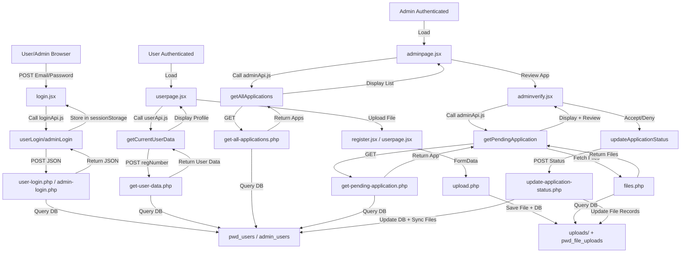

# PWD Automated Application System - PHP API Documentation

> **API Framework:** PHP 8.2 with MySQLi  
> **Base URL:** `http://localhost/webdev_finals/PWD AUTOMATED APPLICATION SYSTEM/PWD-Automated-Application-System/Post-React-Migration/xampp-php-mysql-files/api/`  
> **Frontend:** React 18+ (POST-React-Migration)  
> **Version:** 2.0  
> **Last Updated:** December 12, 2025

---

## Table of Contents

1. [API Overview](#api-overview)
2. [Authentication APIs](#authentication-apis)
3. [User Management APIs](#user-management-apis)
4. [Admin Management APIs](#admin-management-apis)
5. [File Management APIs](#file-management-apis)
6. [Utility APIs](#utility-apis)
7. [Configuration](#configuration)
8. [Error Handling](#error-handling)
9. [Frontend Integration](#frontend-integration)

---

## API Overview

### Architecture

The PHP API serves the React frontend using a **RESTful** architecture with the following characteristics:

| Aspect | Details |
|--------|---------|
| **Request Format** | JSON payload in request body (POST) or query parameters (GET) |
| **Response Format** | JSON with `{success: boolean, message: string, data: object}` structure |
| **CORS** | Enabled for all origins (`Access-Control-Allow-Origin: *`) |
| **HTTP Methods** | POST (mutations), GET (queries) |
| **Authentication** | Session-based (stored in sessionStorage on frontend) |
| **Database** | MySQL (PWDRegistry) via MySQLi prepared statements |

### CORS Headers

All endpoints include standard CORS headers:
```php
header("Access-Control-Allow-Origin: *");
header("Access-Control-Allow-Headers: Content-Type");
header("Access-Control-Allow-Methods: POST, GET, OPTIONS");
header("Content-Type: application/json");
```

### Response Structure

**Success Response:**
```json
{
  "success": true,
  "message": "Operation successful",
  "user": { /* optional data object */ },
  "files": [ /* optional array */ ]
}
```

**Error Response:**
```json
{
  "success": false,
  "message": "Error description here",
  "error": "error_code"
}
```

---

## 🔐 Authentication APIs

### 1. User Login

**Endpoint:** `user-login.php`  
**Method:** POST  
**Description:** Authenticates a user with email and password credentials.

#### Request

```json
{
  "email": "user@example.com",
  "password": "password123"
}
```

#### Response

```json
{
  "success": true,
  "message": "Login successful",
  "user": {
    "id": 1,
    "regNumber": "371771933783",
    "email": "john.delasalle@email.com",
    "firstName": "John",
    "lastName": "De La Salle",
    "status": "pending",
    "rejectionReason": null,
    "createdAt": "2025-11-15 10:30:00",
    "updatedAt": "2025-11-15 10:30:00"
  }
}
```

#### Database Query
```php
SELECT * FROM pwd_users 
WHERE LOWER(TRIM(email)) = ? AND password = ? 
LIMIT 1
```

#### Security Features
- ✅ Email normalization (lowercase, trim)
- ✅ Password plain text comparison (⚠️ upgrade to hashing in production)
- ✅ Prepared statements (SQL injection protection)
- ✅ Case-insensitive email matching

#### Frontend Integration

**Called from:** [loginApi.js → login.jsx](#called-from-jsx-files)

```javascript
export const userLogin = async (email, password) => {
    const res = await api.post('/user-login.php', {
        email: email.trim().toLowerCase(),
        password: password
    });
    return res.data;
};
```

**Implemented in:** [login.jsx](#user-login-component)

---

### 2. Admin Login

**Endpoint:** `admin-login.php`  
**Method:** POST  
**Description:** Authenticates an admin with email and password credentials.

#### Request

```json
{
  "adminEmail": "admin@dasma.gov.ph",
  "adminPassword": "admin123"
}
```

#### Response

```json
{
  "success": true,
  "message": "Login successful",
  "admin": {
    "id": 1,
    "adminEmail": "admin@dasma.gov.ph",
    "adminName": "System Administrator",
    "createdAt": "2025-11-15 09:00:00"
  }
}
```

#### Database Query
```php
SELECT * FROM admin_users 
WHERE LOWER(TRIM(adminEmail)) = ? AND adminPassword = ? 
LIMIT 1
```

#### Special Features
- ✅ Separate admin_users table
- ✅ Admin name stored for review tracking
- ✅ Used to identify who reviewed applications/files
- ⚠️ **Security Note:** Default password is `admin123` - change in production!

#### Frontend Integration

**Called from:** [loginApi.js → login.jsx](#called-from-jsx-files)

```javascript
export const adminLogin = async (adminEmail, adminPassword) => {
    const res = await api.post('/admin-login.php', {
        adminEmail: adminEmail.trim().toLowerCase(),
        adminPassword: adminPassword
    });
    return res.data;
};
```

**Implemented in:** [login.jsx](#admin-login-component)

---

### 3. Forgot Password

**Endpoint:** `forgot-password.php`  
**Method:** POST  
**Description:** Sends password reset link to user's email (currently returns temp password).

#### Request

```json
{
  "email": "user@example.com"
}
```

#### Response

```json
{
  "success": true,
  "message": "Check your email for password reset instructions"
}
```

#### Database Query
```php
SELECT * FROM pwd_users WHERE LOWER(TRIM(email)) = ? LIMIT 1
UPDATE pwd_users SET password = ? WHERE id = ?
```

#### Current Implementation
- ⚠️ **Development Mode:** Returns temporary password in response
- 🔧 **TODO:** Implement actual email sending with reset token
- 🔐 **Security:** Temporary password should be generated and sent via email only

#### Frontend Integration

**Called from:** [loginApi.js → login.jsx](#called-from-jsx-files)

```javascript
export const forgotPassword = async (email) => {
    const res = await api.post('/forgot-password.php', {
        email: email.trim().toLowerCase()
    });
    return res.data;
};
```

**Implemented in:** [login.jsx → Forgot Password Modal](#forgot-password-component)

---

## User Management APIs

### 4. User Registration

**Endpoint:** `register.php`  
**Method:** POST  
**Description:** Creates a new user account with comprehensive profile information.

#### Request

```json
{
  "regNumber": "371771933783",
  "regDate": "2025-11-15",
  "lastName": "De La Salle",
  "firstName": "John",
  "middleName": "Optional",
  "disability": "Cerebral Palsy",
  "street": "123 Sample Street",
  "barangay": "Putatan",
  "municipality": "Dasmariñas",
  "province": "Cavite",
  "region": "IV-A",
  "tel": "02-123-4567",
  "mobile": "09171234567",
  "email": "john.delasalle@email.com",
  "dob": "1995-06-15",
  "sex": "Male",
  "nationality": "Filipino",
  "blood": "O+",
  "civil": "Single",
  "emergencyName": "Jane De La Salle",
  "emergencyPhone": "09171111111",
  "emergencyRelationship": "Sister",
  "proofIdentity": "",
  "proofDisability": "",
  "password": "password123",
  "status": "pending"
}
```

#### Response

```json
{
  "success": true,
  "message": "User registered successfully",
  "user": {
    "id": 2,
    "regNumber": "371771933783",
    "email": "john.delasalle@email.com"
  }
}
```

#### Database Query
```php
INSERT INTO pwd_users (
  regNumber, regDate, lastName, firstName, middleName, disability,
  street, barangay, municipality, province, region, tel, mobile,
  email, dob, sex, nationality, blood, civil, emergencyName,
  emergencyPhone, emergencyRelationship, proofIdentity,
  proofDisability, password, status
) VALUES (?, ?, ?, ?, ?, ?, ?, ?, ?, ?, ?, ?, ?, ?, ?, ?, ?, ?, ?, ?, ?, ?, ?, ?, ?, ?)
```

#### Validation
- ✅ Required fields: regNumber, lastName, firstName, email, password, etc.
- ✅ Unique constraints: regNumber, email
- ✅ Default values: municipality, province, region, nationality
- ❌ Error if regNumber or email already exists

#### Special Fields
- **proofIdentity/proofDisability:** Legacy fields from file upload feature
- **status:** Defaults to 'pending'
- **rejectionReason:** Can be NULL for new registrations

#### Frontend Integration

**Called from:** [registrationApi.js → register.jsx](#called-from-jsx-files)

```javascript
export const registerUser = async (userData) => {
    const res = await api.post('/register.php', userData);
    return res.data;
};
```

**Implemented in:** [register.jsx](#registration-component)

---

### 5. Get User Data

**Endpoint:** `get-user-data.php`  
**Method:** POST  
**Description:** Retrieves current user's profile information by registration number.

#### Request

```json
{
  "regNumber": "371771933783"
}
```

#### Response

```json
{
  "success": true,
  "message": "User data retrieved",
  "user": {
    "id": 1,
    "regNumber": "371771933783",
    "lastName": "De La Salle",
    "firstName": "John",
    "email": "john.delasalle@email.com",
    "status": "pending",
    "rejectionReason": null,
    "createdAt": "2025-11-15 10:30:00",
    "updatedAt": "2025-11-15 10:30:00"
  }
}
```

#### Database Query
```php
SELECT * FROM pwd_users WHERE regNumber = ? LIMIT 1
```

#### Usage
- Used after login to display user profile
- Provides all profile information for editing
- Checks current application status
- Returns rejection reason if denied

#### Frontend Integration

**Called from:** [userApi.js → userpage.jsx](#called-from-jsx-files)

```javascript
export const getCurrentUserData = async () => {
    const userId = sessionStorage.getItem('userId');
    const res = await api.post('/get-user-data.php', {
        regNumber: userId
    });
    return res.data;
};
```

**Implemented in:** [userpage.jsx](#user-profile-component)

---

### 6. Update User Profile

**Endpoint:** `update-profile.php`  
**Method:** POST  
**Description:** Updates user profile information (name, address, contact details, etc.).

#### Request

```json
{
  "regNumber": "371771933783",
  "lastName": "De La Salle",
  "firstName": "John",
  "street": "456 New Street",
  "barangay": "Putatan",
  "mobile": "09171234567",
  "email": "newemail@example.com"
}
```

#### Response

```json
{
  "success": true,
  "message": "Profile updated successfully"
}
```

#### Database Query
```php
UPDATE pwd_users 
SET lastName = ?, firstName = ?, street = ?, barangay = ?, mobile = ?, email = ?
WHERE regNumber = ?
```

#### Restrictions
- ✅ Can update: name, address, contact information
- ❌ Cannot update: regNumber (primary identifier), status, rejectionReason
- ⚠️ Email uniqueness enforced

#### Frontend Integration

**Called from:** [userApi.js → userpage.jsx](#called-from-jsx-files)

```javascript
export const updateUserProfile = async (userData) => {
    const res = await api.post('/update-profile.php', userData);
    return res.data;
};
```

**Implemented in:** [userpage.jsx → Edit Profile Section](#edit-profile-component)

---

### 7. Change Password

**Endpoint:** `change-password.php`  
**Method:** POST  
**Description:** Changes user's password with old password verification.

#### Request

```json
{
  "email": "user@example.com",
  "oldPassword": "oldpassword123",
  "newPassword": "newpassword123"
}
```

#### Response

```json
{
  "success": true,
  "message": "Password changed successfully"
}
```

#### Database Query
```php
SELECT * FROM pwd_users WHERE email = ? AND password = ? LIMIT 1
UPDATE pwd_users SET password = ? WHERE email = ?
```

#### Security Features
- ✅ Old password verification required
- ✅ Email-based identification
- ⚠️ Plain text passwords (upgrade to hashing in production)

#### Frontend Integration

**Called from:** [userApi.js → userpage.jsx](#called-from-jsx-files)

```javascript
export const changePassword = async (email, oldPassword, newPassword) => {
    const res = await api.post('/change-password.php', {
        email,
        oldPassword,
        newPassword
    });
    return res.data;
};
```

**Implemented in:** [userpage.jsx → Change Password Modal](#change-password-component)

---

## Admin Management APIs

### 8. Get All Applications

**Endpoint:** `get-all-applications.php`  
**Method:** GET  
**Description:** Retrieves all user applications for admin dashboard.

#### Request

```
GET /get-all-applications.php
```

#### Response

```json
{
  "success": true,
  "applications": [
    {
      "id": 1,
      "regNumber": "371771933783",
      "firstName": "John",
      "lastName": "De La Salle",
      "email": "john.delasalle@email.com",
      "status": "pending",
      "rejectionReason": null,
      "createdAt": "2025-11-15 10:30:00",
      "updatedAt": "2025-11-15 10:30:00"
    },
    {
      "id": 2,
      "regNumber": "409853541380",
      "firstName": "Michel",
      "lastName": "Montaigne",
      "email": "michel.montaigne@email.com",
      "status": "pending",
      "rejectionReason": null,
      "createdAt": "2025-11-15 11:00:00",
      "updatedAt": "2025-11-15 11:00:00"
    }
  ]
}
```

#### Database Query
```php
SELECT id, regNumber, firstName, lastName, email, status, rejectionReason, createdAt, updatedAt
FROM pwd_users
ORDER BY status, createdAt DESC
```

#### Admin Panel Integration
- Lists all applications in dashboard
- Supports filtering by status
- Shows rejection reasons for denied applications

#### Frontend Integration

**Called from:** [adminApi.js → adminpage.jsx](#called-from-jsx-files)

```javascript
export const getAllApplications = async () => {
    const res = await api.get('/get-all-applications.php');
    return res.data;
};
```

**Implemented in:** [adminpage.jsx](#admin-dashboard-component)

---

### 9. Get Pending Application

**Endpoint:** `get-pending-application.php`  
**Method:** GET  
**Description:** Retrieves the oldest pending application for admin review workflow.

#### Request

```
GET /get-pending-application.php
```

#### Response

```json
{
  "success": true,
  "application": {
    "id": 1,
    "regNumber": "371771933783",
    "firstName": "John",
    "lastName": "De La Salle",
    "email": "john.delasalle@email.com",
    "disability": "Cerebral Palsy",
    "status": "pending",
    "createdAt": "2025-11-15 10:30:00"
  }
}
```

#### Database Query
```php
SELECT * FROM pwd_users 
WHERE status = 'pending' 
ORDER BY createdAt ASC 
LIMIT 1
```

#### Workflow
- ✅ Fetches oldest pending application (FIFO)
- ✅ Used in admin verification workflow
- ✅ Displays applicant details for admin review
- ✅ Admin can then accept or deny

#### Frontend Integration

**Called from:** [adminApi.js → adminverify.jsx](#called-from-jsx-files)

```javascript
export const getPendingApplication = async () => {
    const res = await api.get('/get-pending-application.php');
    return res.data;
};
```

**Implemented in:** [adminverify.jsx](#admin-verify-component)

---

### 10. Update Application Status

**Endpoint:** `update-application-status.php`  
**Method:** POST  
**Description:** Updates application status (accept/deny) and syncs file upload records.

#### Request

```json
{
  "regNumber": "371771933783",
  "status": "accepted",
  "rejectionReason": null,
  "adminName": "John Admin"
}
```

**For Denial:**
```json
{
  "regNumber": "371771933783",
  "status": "denied",
  "rejectionReason": "Incomplete or incorrect documents",
  "adminName": "John Admin"
}
```

#### Response

```json
{
  "success": true,
  "message": "Application status updated successfully"
}
```

#### Database Queries

**Update pwd_users table:**
```php
UPDATE pwd_users 
SET status = ?, rejectionReason = ?, updatedAt = NOW() 
WHERE regNumber = ?
```

**Sync pwd_file_uploads table:**
```php
UPDATE pwd_file_uploads pf
INNER JOIN pwd_users pu ON pf.regNumber = pu.regNumber
SET 
    pf.status = CASE WHEN pu.status = 'denied' THEN 'rejected' ELSE 'approved' END,
    pf.admin_notes = CASE WHEN pu.rejectionReason IS NOT NULL THEN pu.rejectionReason ELSE pf.admin_notes END,
    pf.reviewed_by = ?,
    pf.reviewed_at = NOW()
WHERE pf.regNumber = ?
```

#### Special Features (v2.0)
- ✅ **NEW:** Accepts `adminName` parameter to identify reviewer
- ✅ **NEW:** Updates `reviewed_by` in file uploads with admin name
- ✅ **NEW:** Sets `reviewed_at` timestamp
- ✅ **NEW:** Syncs rejection reason to file upload notes
- ✅ Automatically updates related file records
- ✅ Prevents manual file status updates after this operation

#### Frontend Integration

**Called from:** [adminApi.js → adminverify.jsx](#called-from-jsx-files)

```javascript
export const updateApplicationStatus = async (regNumber, status, rejectionReason) => {
    // Get admin name from sessionStorage
    const adminData = sessionStorage.getItem('adminData');
    const admin = JSON.parse(adminData);
    const adminName = admin.adminName || 'System Administrator';
    
    const res = await api.post('/update-application-status.php', {
        regNumber,
        status,
        rejectionReason,
        adminName
    });
    return res.data;
};
```

**Implemented in:** [adminverify.jsx → Approval/Denial Buttons](#admin-decision-component)

---

## File Management APIs

### 11. Upload File

**Endpoint:** `upload.php`  
**Method:** POST (multipart/form-data)  
**Description:** Uploads document files (medical certificates, identity proofs) to server.

#### Request

```
Content-Type: multipart/form-data

File fields:
- file (binary): The file to upload
- regNumber (text): User's registration number
- fileType (text): 'medical_certificate' or 'identity_proof'
```

#### Response

```json
{
  "success": true,
  "message": "File uploaded successfully",
  "fileId": 5,
  "filename": "medical_certificate_1702651800_a1b2c3d4.png",
  "filePath": "uploads/certificates/medical_certificate_1702651800_a1b2c3d4.png"
}
```

#### File Storage

**Directory Structure:**
```
xampp-php-mysql-files/uploads/
├── certificates/          # Medical certificates
├── identity/             # Identity proofs
└── thumbnails/           # Generated thumbnails (optional)
```

**Filename Generation:**
```php
$timestamp = time();
$random = bin2hex(random_bytes(4));
$filename = "{$fileType}_{$timestamp}_{$random}.{$extension}";
// Example: medical_certificate_1702651800_a1b2c3d4.png
```

#### Database Query
```php
INSERT INTO pwd_file_uploads (
  regNumber, file_type, original_filename, stored_filename,
  file_path, file_size, mime_type, status
) VALUES (?, ?, ?, ?, ?, ?, ?, 'pending')
```

#### Validation
- ✅ File type: PNG, JPG, JPEG, PDF
- ✅ Max file size: 5 MB
- ✅ Directory write permissions required
- ✅ Virus/malware scanning (optional enhancement)

#### Frontend Integration

**Called from:** [register.jsx → Upload Section](#called-from-jsx-files)

```javascript
const uploadFile = async (file, regNumber, fileType) => {
    const formData = new FormData();
    formData.append('file', file);
    formData.append('regNumber', regNumber);
    formData.append('fileType', fileType);
    
    const res = await api.post('/upload.php', formData, {
        headers: { 'Content-Type': 'multipart/form-data' }
    });
    return res.data;
};
```

**Implemented in:** [register.jsx → File Upload Component](#file-upload-component)

---

### 12. Get Files

**Endpoint:** `files.php`  
**Method:** GET  
**Description:** Retrieves all uploaded files for a specific user.

#### Request

```
GET /files.php?regNumber=371771933783
```

#### Response

```json
{
  "success": true,
  "files": [
    {
      "id": 1,
      "type": "medical_certificate",
      "originalFilename": "my_certificate.png",
      "storedFilename": "medical_certificate_1702651800_a1b2c3d4.png",
      "filePath": "uploads/certificates/medical_certificate_1702651800_a1b2c3d4.png",
      "size": 2048576,
      "mimeType": "image/png",
      "status": "pending",
      "adminNotes": null,
      "uploadedAt": "2025-11-15 12:30:00",
      "reviewedAt": null,
      "reviewedBy": null
    },
    {
      "id": 2,
      "type": "identity_proof",
      "originalFilename": "id_photo.jpg",
      "storedFilename": "identity_proof_1702651900_b2c3d4e5.jpg",
      "filePath": "uploads/identity/identity_proof_1702651900_b2c3d4e5.jpg",
      "size": 1024000,
      "mimeType": "image/jpeg",
      "status": "approved",
      "adminNotes": "ID verified successfully",
      "uploadedAt": "2025-11-15 12:35:00",
      "reviewedAt": "2025-11-16 09:15:00",
      "reviewedBy": "admin@dasma.gov.ph"
    }
  ]
}
```

#### Database Query
```php
SELECT id, file_type, original_filename, stored_filename, file_path,
       file_size, mime_type, status, admin_notes, uploaded_at,
       reviewed_at, reviewed_by
FROM pwd_file_uploads
WHERE regNumber = ?
ORDER BY uploaded_at DESC
```

#### File Status Values
- `pending` - Awaiting admin review
- `approved` - ✅ Accepted by admin
- `rejected` - ❌ Rejected by admin (includes admin_notes)

#### Frontend Integration

**Called from:** [userpage.jsx & adminverify.jsx](#called-from-jsx-files)

```javascript
// In userpage.jsx
const fetchUserFiles = useCallback(async () => {
    const response = await fetch(
        `http://localhost/webdev_finals/.../api/files.php?regNumber=${userData.regNumber}`
    );
    const data = await response.json();
    setFiles(data.files);
}, [userData.regNumber]);
```

**Implemented in:**
- [userpage.jsx → My Documents Section](#user-documents-component)
- [adminverify.jsx → File Review Section](#admin-file-review-component)

---

### 13. View File

**Endpoint:** `file-view.php`  
**Method:** GET  
**Description:** Serves file inline in browser for viewing (PDF, images).

#### Request

```
GET /file-view.php?fileId=1
```

#### Response

**Headers:**
```
Content-Type: image/png (or application/pdf, etc.)
Content-Disposition: inline
Content-Length: 2048576
```

**Body:** Binary file data

#### Database Query
```php
SELECT file_path, mime_type FROM pwd_file_uploads WHERE id = ?
```

#### Use Cases
- ✅ View images inline in browser
- ✅ View PDFs inline
- ✅ Preview documents before download
- ✅ Embedded in modal dialogs

#### Security Features
- ✅ File ID-based access (not path traversal)
- ✅ Verifies file exists before serving
- ✅ Sets correct MIME type
- ⚠️ Consider adding user-specific access control

#### Frontend Integration

**Called from:** [userpage.jsx & adminverify.jsx](#called-from-jsx-files)

```javascript
// In userpage.jsx
const viewUrl = `http://localhost/webdev_finals/.../api/file-view.php?fileId=${fileId}`;
// Used in iframe or modal
<iframe src={viewUrl} />
```

**Implemented in:**
- [userpage.jsx → View File Modal](#file-view-modal-component)
- [adminverify.jsx → File Preview Modal](#admin-file-preview-component)

---

### 14. Download File

**Endpoint:** `file-download.php`  
**Method:** GET  
**Description:** Serves file as attachment for download with original filename.

#### Request

```
GET /file-download.php?fileId=1
```

#### Response

**Headers:**
```
Content-Type: application/octet-stream
Content-Disposition: attachment; filename="my_certificate.png"
Content-Length: 2048576
```

**Body:** Binary file data

#### Database Query
```php
SELECT original_filename, file_path, mime_type 
FROM pwd_file_uploads WHERE id = ?
```

#### Use Cases
- ✅ Download files with original name
- ✅ User downloads their own files
- ✅ Admin downloads applicant documents
- ✅ Triggered by download button click

#### Frontend Integration

**Called from:** [userpage.jsx & adminverify.jsx](#called-from-jsx-files)

```javascript
// In userpage.jsx
<a href={`http://localhost/.../api/file-download.php?fileId=${file.id}`}>
  Download
</a>
```

**Implemented in:**
- [userpage.jsx → Document List Download Button](#user-download-button-component)
- [adminverify.jsx → Document Review Download Button](#admin-download-button-component)

---

### 15. Update File Status

**Endpoint:** `update-file-status.php`  
**Method:** POST  
**Description:** Updates individual file status (approval/rejection).

#### Request

```json
{
  "fileId": 1,
  "status": "approved",
  "adminNotes": "Document accepted"
}
```

#### Response

```json
{
  "success": true,
  "message": "File status updated successfully"
}
```

#### Database Query
```php
UPDATE pwd_file_uploads 
SET status = ?, admin_notes = ?, reviewed_at = NOW() 
WHERE id = ?
```

#### Notes
- ⚠️ **Deprecated:** Use `update-application-status.php` instead
- **Reason:** Bulk operation is more efficient
- **Alternative:** Update all files at once via application status change

#### Frontend Integration

⚠️ **Not actively used** - Replaced by batch update in `update-application-status.php`

---

### 16. Update All Files Status

**Endpoint:** `update-all-files-status.php`  
**Method:** POST  
**Description:** Bulk updates all files for a user based on application status change.

#### Request

```json
{
  "regNumber": "371771933783",
  "status": "approved",
  "adminNotes": "Application approved"
}
```

#### Response

```json
{
  "success": true,
  "message": "All files updated successfully",
  "filesUpdated": 2
}
```

#### Database Query
```php
UPDATE pwd_file_uploads 
SET status = ?, admin_notes = ?, reviewed_at = NOW() 
WHERE regNumber = ?
```

#### Use Cases
- ✅ Called when application status changes
- ✅ Ensures all files match application status
- ✅ Bulk operation more efficient than individual updates

#### Frontend Integration

**Called from:** [adminverify.jsx](#called-from-jsx-files)

```javascript
// Typically called within updateApplicationStatus workflow
// No direct React component call
```

---

## 🛠️ Utility APIs

### 17. Check Email

**Endpoint:** `check-email.php`  
**Method:** POST  
**Description:** Validates if email is already registered (for signup form validation).

#### Request

```json
{
  "email": "user@example.com"
}
```

#### Response

```json
{
  "success": true,
  "exists": false,
  "message": "Email is available"
}
```

**If Email Exists:**
```json
{
  "success": true,
  "exists": true,
  "message": "Email already registered"
}
```

#### Database Query
```php
SELECT COUNT(*) as count 
FROM pwd_users 
WHERE LOWER(TRIM(email)) = ?
```

#### Use Cases
- ✅ Real-time email validation during registration
- ✅ Prevents duplicate email submissions
- ✅ Used in registration form field validation

#### Frontend Integration

**Called from:** [registrationApi.js → register.jsx](#called-from-jsx-files)

```javascript
export const checkEmailAvailability = async (email) => {
    const res = await api.post('/check-email.php', {
        email: email.trim().toLowerCase()
    });
    return res.data;
};
```

**Implemented in:** [register.jsx → Email Input Field](#email-validation-component)

---

### 18. Check Registration Number

**Endpoint:** `check-regnumber.php`  
**Method:** POST  
**Description:** Validates if registration number is already registered.

#### Request

```json
{
  "regNumber": "371771933783"
}
```

#### Response

```json
{
  "success": true,
  "exists": false,
  "message": "Registration number is available"
}
```

**If Registration Number Exists:**
```json
{
  "success": true,
  "exists": true,
  "message": "Registration number already registered"
}
```

#### Database Query
```php
SELECT COUNT(*) as count 
FROM pwd_users 
WHERE regNumber = ?
```

#### Use Cases
- ✅ Real-time regNumber validation during registration
- ✅ Ensures unique registration numbers
- ✅ Used in registration form field validation

#### Frontend Integration

**Called from:** [registrationApi.js → register.jsx](#called-from-jsx-files)

```javascript
export const checkRegNumberAvailability = async (regNumber) => {
    const res = await api.post('/check-regnumber.php', {
        regNumber
    });
    return res.data;
};
```

**Implemented in:** [register.jsx → RegNumber Input Field](#regnumber-validation-component)

---

## ⚙️ Configuration

### config.php

**Location:** `xampp-php-mysql-files/config.php`

**Purpose:** Database connection configuration file

**Content:**
```php
<?php
$servername = "localhost";
$username = "root";
$password = "";
$database = "PWDRegistry";

// Create connection
$conn = new mysqli($servername, $username, $password, $database);

// Check connection
if ($conn->connect_error) {
    die("Connection failed: " . $conn->connect_error);
}

// Set charset to utf8mb4
$conn->set_charset("utf8mb4");
?>
```

**Usage:**
```php
// In any PHP API file
require_once "../config.php";
```

**Environment Variables (Production):**
```php
$servername = getenv('DB_HOST') ?? 'localhost';
$username = getenv('DB_USER') ?? 'root';
$password = getenv('DB_PASSWORD') ?? '';
$database = getenv('DB_NAME') ?? 'PWDRegistry';
```

---

### axiosConfig.js

**Location:** `pwd-application-system/src/api/axiosConfig.js`

**Purpose:** Axios HTTP client configuration

**Content:**
```javascript
import axios from 'axios';

const api = axios.create({
    baseURL: 'http://localhost/webdev_finals/PWD AUTOMATED APPLICATION SYSTEM/PWD-Automated-Application-System/Post-React-Migration/xampp-php-mysql-files/api',
    headers: {
        'Content-Type': 'application/json',
    }
});

// Add request interceptor for authentication
api.interceptors.request.use(config => {
    // Can add auth token if needed
    return config;
}, error => {
    return Promise.reject(error);
});

// Add response interceptor for error handling
api.interceptors.response.use(response => {
    return response;
}, error => {
    // Handle errors
    console.error('API Error:', error);
    return Promise.reject(error);
});

export default api;
```

**Usage:**
```javascript
import api from './axiosConfig';

const res = await api.post('/endpoint.php', data);
const res = await api.get('/endpoint.php');
```

---

## Error Handling

### HTTP Status Codes

| Status | Meaning | Example |
|--------|---------|---------|
| 200 | Success | Login successful, file uploaded |
| 400 | Bad Request | Missing required fields |
| 404 | Not Found | User not found, file not found |
| 500 | Server Error | Database connection error |

### PHP Error Response Pattern

```php
// Missing required data
http_response_code(400);
echo json_encode([
    "success" => false,
    "message" => "Email and password are required",
    "error" => "MISSING_FIELDS"
]);

// User not found
http_response_code(404);
echo json_encode([
    "success" => false,
    "message" => "User not found",
    "error" => "USER_NOT_FOUND"
]);

// Database error
http_response_code(500);
echo json_encode([
    "success" => false,
    "message" => "Database error occurred",
    "error" => "DB_ERROR"
]);
```

### Frontend Error Handling

```javascript
try {
    const res = await api.post('/endpoint.php', data);
    if (!res.data.success) {
        console.error('API Error:', res.data.message);
        // Show user-friendly error message
        return;
    }
    // Process success
} catch (error) {
    console.error('Network Error:', error);
    // Handle network/server errors
}
```

---

## Frontend Integration

### API Wrapper Files

#### 1. loginApi.js

**Purpose:** Handles all authentication-related API calls

**Exports:**
- `userLogin(email, password)` → user-login.php
- `adminLogin(adminEmail, adminPassword)` → admin-login.php
- `forgotPassword(email)` → forgot-password.php

**Implementation Location:**
```
Post-React-Migration/pwd-application-system/src/api/loginApi.js
```

---

#### 2. registrationApi.js

**Purpose:** Handles user registration and validation

**Exports:**
- `registerUser(userData)` → register.php
- `checkEmailAvailability(email)` → check-email.php
- `checkRegNumberAvailability(regNumber)` → check-regnumber.php

**Implementation Location:**
```
Post-React-Migration/pwd-application-system/src/api/registrationApi.js
```

---

#### 3. userApi.js

**Purpose:** Handles user data and profile management

**Exports:**
- `getCurrentUserData()` → get-user-data.php
- `updateUserProfile(userData)` → update-profile.php
- `changePassword(email, oldPassword, newPassword)` → change-password.php
- `getUserFiles(regNumber)` → files.php
- `uploadFile(file, regNumber, fileType)` → upload.php
- `downloadFile(fileId)` → file-download.php

**Implementation Location:**
```
Post-React-Migration/pwd-application-system/src/api/userApi.js
```

---

#### 4. adminApi.js

**Purpose:** Handles admin dashboard and review operations

**Exports:**
- `getAllApplications()` → get-all-applications.php
- `getPendingApplication()` → get-pending-application.php
- `updateApplicationStatus(regNumber, status, rejectionReason)` → update-application-status.php

**Implementation Location:**
```
Post-React-Migration/pwd-application-system/src/api/adminApi.js
```

---

### Called from JSX Files

#### User Authentication

**File:** [login.jsx](Post-React-Migration/pwd-application-system/src/pages/login.jsx)

```jsx
// User login
const result = await userLogin(email, password);
if (result.success) {
    sessionStorage.setItem('userId', result.user.regNumber);
    sessionStorage.setItem('userData', JSON.stringify(result.user));
}

// Admin login
const result = await adminLogin(adminEmail, adminPassword);
if (result.success) {
    sessionStorage.setItem('adminEmail', result.admin.adminEmail);
    sessionStorage.setItem('adminData', JSON.stringify(result.admin));
}
```

**Calls:**
- `user-login.php` - User authentication
- `admin-login.php` - Admin authentication
- `forgot-password.php` - Password recovery

---

#### User Registration

**File:** [register.jsx](Post-React-Migration/pwd-application-system/src/pages/homepage/register.jsx)

```jsx
// Check email availability
const emailAvailable = await checkEmailAvailability(email);

// Check registration number availability
const regNumAvailable = await checkRegNumberAvailability(regNumber);

// Register user
const result = await registerUser(userData);

// Upload files
const uploadResult = await uploadFile(file, regNumber, fileType);
```

**Calls:**
- `check-email.php` - Email validation
- `check-regnumber.php` - RegNumber validation
- `register.php` - User registration
- `upload.php` - File upload

---

#### User Dashboard

**File:** [userpage.jsx](Post-React-Migration/pwd-application-system/src/pages/userpage/userpage.jsx)

```jsx
// Get user profile
const userData = await getCurrentUserData();

// Fetch user files
const filesData = await fetch(`/api/files.php?regNumber=${userData.regNumber}`);

// Update profile
const result = await updateUserProfile(updatedData);

// Change password
const result = await changePassword(email, oldPassword, newPassword);

// View file inline
const viewUrl = `/api/file-view.php?fileId=${fileId}`;
// <iframe src={viewUrl} />

// Download file
window.location.href = `/api/file-download.php?fileId=${fileId}`;
```

**Calls:**
- `get-user-data.php` - Fetch user profile
- `files.php` - List user files
- `update-profile.php` - Update profile information
- `change-password.php` - Change password
- `file-view.php` - View files inline
- `file-download.php` - Download files
- `Refresh Button` - Refetch files with useCallback

---

#### Admin Dashboard

**File:** [adminpage.jsx](Post-React-Migration/pwd-application-system/src/pages/adminpage/adminpage.jsx)

```jsx
// Get all applications
const applications = await getAllApplications();

// Display in table with filters
applications.filter(app => app.status === selectedStatus);
```

**Calls:**
- `get-all-applications.php` - List all applications

---

#### Admin Application Verification

**File:** [adminverify.jsx](Post-React-Migration/pwd-application-system/src/pages/adminpage/adminverify.jsx)

```jsx
// Get pending application
const pendingApp = await getPendingApplication();

// View applicant files
const filesData = await fetch(`/api/files.php?regNumber=${pendingApp.regNumber}`);

// View file inline
const viewUrl = `/api/file-view.php?fileId=${fileId}`;

// Update application status
const result = await updateApplicationStatus(
    regNumber,
    'accepted' | 'denied',
    rejectionReason
);
```

**Calls:**
- `get-pending-application.php` - Fetch pending application
- `files.php` - List applicant files
- `file-view.php` - Preview files inline
- `file-download.php` - Download applicant documents
- `update-application-status.php` - Accept/deny application

---

## API Call Flow Diagram



---

## Summary

| Endpoint | Method | Called From | Database Table | Purpose |
|----------|--------|-------------|---|---------|
| `user-login.php` | POST | login.jsx | pwd_users | User authentication |
| `admin-login.php` | POST | login.jsx | admin_users | Admin authentication |
| `forgot-password.php` | POST | login.jsx | pwd_users | Password reset |
| `register.php` | POST | register.jsx | pwd_users | New user registration |
| `get-user-data.php` | POST | userpage.jsx | pwd_users | Fetch user profile |
| `update-profile.php` | POST | userpage.jsx | pwd_users | Update user info |
| `change-password.php` | POST | userpage.jsx | pwd_users | Change password |
| `get-all-applications.php` | GET | adminpage.jsx | pwd_users | List all applications |
| `get-pending-application.php` | GET | adminverify.jsx | pwd_users | Fetch next pending app |
| `update-application-status.php` | POST | adminverify.jsx | pwd_users, pwd_file_uploads | Accept/deny application |
| `upload.php` | POST | register.jsx, userpage.jsx | pwd_file_uploads | Upload documents |
| `files.php` | GET | userpage.jsx, adminverify.jsx | pwd_file_uploads | List user files |
| `file-view.php` | GET | userpage.jsx, adminverify.jsx | pwd_file_uploads | View file inline |
| `file-download.php` | GET | userpage.jsx, adminverify.jsx | pwd_file_uploads | Download file |
| `update-file-status.php` | POST | (deprecated) | pwd_file_uploads | Update single file |
| `update-all-files-status.php` | POST | (internal) | pwd_file_uploads | Bulk update files |
| `check-email.php` | POST | register.jsx | pwd_users | Validate email unique |
| `check-regnumber.php` | POST | register.jsx | pwd_users | Validate regNumber unique |

---

**Last Updated:** December 12, 2025  
**Maintained By:** Keanu Bembo
**API Version:** 2.0  
**PHP Version:** 8.2+  
**Database:** MySQL (XAMPP)
